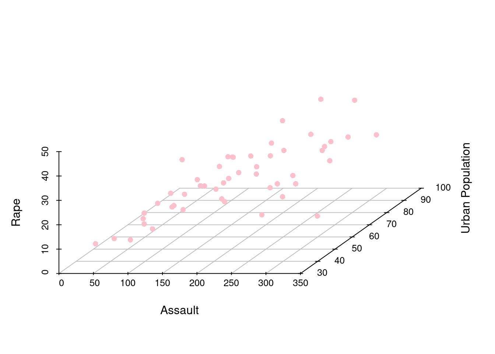
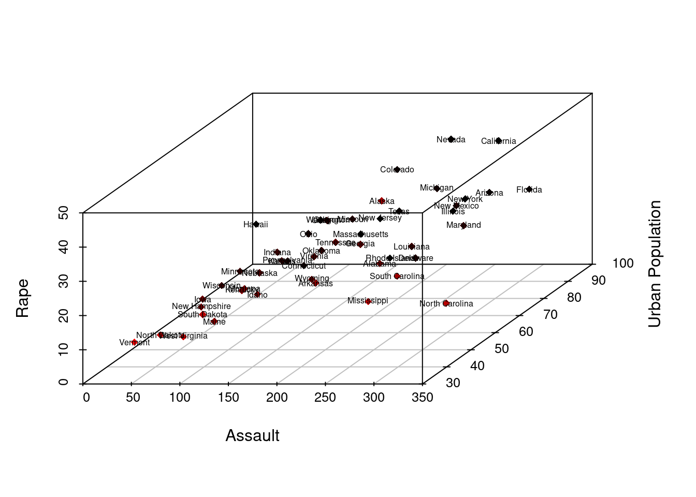

# 3D Visualization in R

Tianyu Han and Shijia Huang 


## Motivation

As an important part of data visualization, 3D plotting makes the data exploration part easier for users and allow a visual display of datasets.By plotting data points on three axes, 3D plots describe the relationship between these three variables and are useful to identify underlying patterns and interactions that are not shown on 2D graphs.

In this tutorial, we will introduce different packages for 3D plots, including package Scatterplot3D, package plot3D, and also plotly. By the end of the tutorial, one will be able to choose the most suitable package for his/her project. 

What we can learn from this project is that there are always different ways to tackle the same problem using different R libraries and packages. It will require extensive research and trials in order to determine which one works best in the given scenario. 


## Scatterplot3D
Scatterplot3d is an R package that displays multidimensional data in 3D space.There is only one function scatterplot3d() in this package.The usage of scatterplot3d() will be discussed  with examples as below.

### Load Data

We use the preloaded dataset USArrests as an example to show what information can be draw from 3D plot using scatterplot3d.


```r
data("USArrests")
head(USArrests)
```

```
##            Murder Assault UrbanPop Rape
## Alabama      13.2     236       58 21.2
## Alaska       10.0     263       48 44.5
## Arizona       8.1     294       80 31.0
## Arkansas      8.8     190       50 19.5
## California    9.0     276       91 40.6
## Colorado      7.9     204       78 38.7
```
### Create matrix

For Scatterplot3d, the dataframe provided must be converted into a matrix. Here we select Assault, Urban Population, and Rape as our three axes.


```r
USArrestsMatrix <- as.matrix(USArrests)
x1 <- USArrestsMatrix[,2] ## Assault
y1 <- USArrestsMatrix[,3] ## Urban Population
z1 <- USArrestsMatrix[,4] ## Rape
```

### Generate 3d scatter plot 
Creating a graph using scatterplot3d. "highlight" gives a color scale that enables users to understand the relative position of each data point. "pch" specifies a plotting shape, here we set pch = 16, which is a small dot.

```r
sp1 <- scatterplot3d(x1,y1,z1, highlight.3d = TRUE, pch = 16, angle = 45,
                     xlab = "Assault",
                     ylab = "Urban Population",
                     zlab = "Rape")
```


We can also remove the box (or grid) of the graph and change the color of the points. Note that when setting color, the "highlight.3d" argument should be specified as FALSE

```r
sp2 <- scatterplot3d(x1,y1,z1,  pch = 16, angle = 45,highlight.3d = FALSE,
                     xlab = "Assault",
                     ylab = "Urban Population",
                     zlab = "Rape",
                     grid = TRUE,
                     box = FALSE,
                     color = c("pink")) 
```



Adding labels to the graph, "cex" specifies the font size.

```r
sp3 <- scatterplot3d(x1,y1,z1, highlight.3d = TRUE, pch = 18, angle = 45,
                     xlab = "Assault",
                     ylab = "Urban Population",
                     zlab = "Rape")
text(sp3$xyz.convert(USArrests[2:4]),labels = rownames(USArrests), cex = 0.5, color = 'pink')
```




### 3D scatter plot with x-y plane position

Use the "Type = 'h'"  to create vertical lines between each data point and the x-y plane.

```r
sp4 <- scatterplot3d(x1,y1,z1, highlight.3d = TRUE, pch = 18, angle = 45,
                     xlab = "Assault",
                     ylab = "Urban Population",
                     zlab = "Rape",
                     type = "h")
```


## 3D plot and PCA

In data science, 3D plot can also be used for machine learning steps. For example, by plotting principal components in a 3D space, we could efficiently observe the interaction between the  important vectors of an input data.

We use the preloaded data "Glass" to perform the principal component analysis and 3D visualization of components.

### Load Package "mlbench" and use the Glass dataset.

```r
data(Glass)
head(Glass)
```

```
##        RI    Na   Mg   Al    Si    K   Ca Ba   Fe Type
## 1 1.52101 13.64 4.49 1.10 71.78 0.06 8.75  0 0.00    1
## 2 1.51761 13.89 3.60 1.36 72.73 0.48 7.83  0 0.00    1
## 3 1.51618 13.53 3.55 1.54 72.99 0.39 7.78  0 0.00    1
## 4 1.51766 13.21 3.69 1.29 72.61 0.57 8.22  0 0.00    1
## 5 1.51742 13.27 3.62 1.24 73.08 0.55 8.07  0 0.00    1
## 6 1.51596 12.79 3.61 1.62 72.97 0.64 8.07  0 0.26    1
```

### Data Cleaning
Perform PCA on the dataset and convert the pca result into a dataframe. Here we plot three components of the PCA results.Specify three colors for them."shape" specifies three different shapes for each component.


```r
results <- prcomp(Glass[,2:4], scale = TRUE)
results$rotation <- -1*results$rotation
results$rotation
```

```
##           PC1        PC2       PC3
## Na  0.4381565 -0.8763587 0.2000358
## Mg -0.6582364 -0.1612544 0.7353380
## Al  0.6121632  0.4538639 0.6475058
```

```r
results$x <- -1*results$x
head(results$x)
```

```
##          PC1         PC2       PC3
## 1 -1.1222507 -0.76451910 0.5299814
## 2 -0.2631728 -0.69696062 0.4746961
## 3 -0.2128159 -0.14139775 0.5944634
## 4 -0.7549327 -0.04089696 0.2632213
## 5 -0.7521008 -0.14291459 0.1773877
## 6 -0.5391614  0.71876865 0.5475329
```

```r
pca.result <- results$x
pca.result <-data.frame(pca.result)
head(pca.result)
```

```
##          PC1         PC2       PC3
## 1 -1.1222507 -0.76451910 0.5299814
## 2 -0.2631728 -0.69696062 0.4746961
## 3 -0.2128159 -0.14139775 0.5944634
## 4 -0.7549327 -0.04089696 0.2632213
## 5 -0.7521008 -0.14291459 0.1773877
## 6 -0.5391614  0.71876865 0.5475329
```

```r
pca.result$Type <- (Glass$Type)
```


### Define color and shape parameter. 


```r
## choose 6 colors for 6 glass types
colors <- c("#E69F00", "#56B4E9","#B2182B","#D1E5F0","#92C5DE","#2166AC")
colors <- colors[as.numeric(pca.result$Type)]
## choose 6 shapes for 6 glass types
shape<-10:15
shape<-shape[as.numeric(pca.result$Type)]
```

### Generate graph
Plot the result of our PCA analysis following the step in the previous part. Adjust angle for best visualization. Below is an example of how a 3D plot can help us see the contribution of each component in classifying types of glass.

```r
PCA3D <- scatterplot3d(pca.result[,1:3],
                     color=colors,
                     pch = shape, 
                     cex.symbols = 3,
                     angle = 100)
legend("top", legend = levels(pca.result$Type),
       col =   c("#E69F00", "#56B4E9","#B2182B","#D1E5F0","#92C5DE","#2166AC"),
       pch = c(10,11,12,13,14), 
       inset = -0.1, xpd = TRUE, horiz = TRUE)
```


## Other usage of the scatterplot3d function

Sometimes it is hard to imagine the relationship between two functions or graph, by plotting them on a 3D space, we could visualize the interaction on a dynamic environment. 

Here is a simple example of how we could graph the interaction of cos and sin function. 

```r
z <- seq(-15, 15, 0.05)
x <- cos(z)
y <- sin(z)
scatterplot3d(x, y, z, highlight.3d=TRUE, col.axis ="blue",col.grid ="lightblue", main="an example of cosine and sine interaction", pch=20)
```


## 3D Histogram 

If we were to generate a histogram in 3d, we can use the plot 3D package. We first initiate the x-axis and the y-axis. Then, we need to create z as matrix that has the dimension |x| * |y|. We can then use hist3D function in the package to help us generate the 3D histogram that we need. 


```r
x = c(1, 2)
y = c(1, 2)
z = c(1, 2, 2, 3)
mat1 <- matrix(z,nrow=2,ncol=2,byrow=TRUE)
hist3D(z=mat1, x = x, y= y)
```


## 3D scatter plot using plotly 

### Demo Data
In order to better demonstrate the different features of plotly 3D Scatterplot, we selected a sample data which includes 40 observations on household expenditure for single men and women. There are 5 variables for each observation: 

Housing: money(usd) spent on housing 

Food: money(usd) spent on food 

Goods: money(usd) spent on goods 

Service: money(usd) spent on service 

Gender: female or male


```r
household
```

```
##    housing food goods service gender
## 1      820  114   183     154 female
## 2      184   74     6      20 female
## 3      921   66  1686     455 female
## 4      488   80   103     115 female
## 5      721   83   176     104 female
## 6      614   55   441     193 female
## 7      801   56   357     214 female
## 8      396   59    61      80 female
## 9      864   65  1618     352 female
## 10     845   64  1935     414 female
## 11     404   97    33      47 female
## 12     781   47  1906     452 female
## 13     457  103   136     108 female
## 14    1029   71   244     189 female
## 15    1047   90   653     298 female
## 16     552   91   185     158 female
## 17     718  104   583     304 female
## 18     495  114    65      74 female
## 19     382   77   230     147 female
## 20    1090   59   313     177 female
## 21     497  591   153     291   male
## 22     839  942   302     365   male
## 23     798 1308   668     584   male
## 24     892  842   287     395   male
## 25    1585  781  2476    1740   male
## 26     755  764   428     438   male
## 27     388  655   153     233   male
## 28     617  879   757     719   male
## 29     248  438    22      65   male
## 30    1641  440  6471    2063   male
## 31    1180 1243   768     813   male
## 32     619  684    99     204   male
## 33     253  422    15      48   male
## 34     661  739    71     188   male
## 35    1981  869  1489    1032   male
## 36    1746  746  2662    1594   male
## 37    1865  915  5184    1767   male
## 38     238  522    29      75   male
## 39    1199 1095   261     344   male
## 40    1524  964  1739    1410   male
```

### The classic 3D Scatterplot 


```r
fig <- plot_ly(household, x = ~housing, y = ~food, z = ~goods + service)
fig <- fig %>% layout(scene = list(xaxis = list(title = 'housing'),
                                   yaxis = list(title = 'food'),
                                   zaxis = list(title = 'goods and services')))
fig
```

```{=html}
<div id="htmlwidget-89087dc6b652a3434340" style="width:80%;height:480px;" class="plotly html-widget"></div>
<script type="application/json" data-for="htmlwidget-89087dc6b652a3434340">{"x":{"visdat":{"3e616c0ba4de":["function () ","plotlyVisDat"]},"cur_data":"3e616c0ba4de","attrs":{"3e616c0ba4de":{"x":{},"y":{},"z":{},"alpha_stroke":1,"sizes":[10,100],"spans":[1,20]}},"layout":{"margin":{"b":40,"l":60,"t":25,"r":10},"scene":{"xaxis":{"title":"housing"},"yaxis":{"title":"food"},"zaxis":{"title":"goods and services"}},"hovermode":"closest","showlegend":false},"source":"A","config":{"modeBarButtonsToAdd":["hoverclosest","hovercompare"],"showSendToCloud":false},"data":[{"x":[820,184,921,488,721,614,801,396,864,845,404,781,457,1029,1047,552,718,495,382,1090,497,839,798,892,1585,755,388,617,248,1641,1180,619,253,661,1981,1746,1865,238,1199,1524],"y":[114,74,66,80,83,55,56,59,65,64,97,47,103,71,90,91,104,114,77,59,591,942,1308,842,781,764,655,879,438,440,1243,684,422,739,869,746,915,522,1095,964],"z":[337,26,2141,218,280,634,571,141,1970,2349,80,2358,244,433,951,343,887,139,377,490,444,667,1252,682,4216,866,386,1476,87,8534,1581,303,63,259,2521,4256,6951,104,605,3149],"type":"scatter3d","mode":"markers","marker":{"color":"rgba(31,119,180,1)","line":{"color":"rgba(31,119,180,1)"}},"error_y":{"color":"rgba(31,119,180,1)"},"error_x":{"color":"rgba(31,119,180,1)"},"line":{"color":"rgba(31,119,180,1)"},"frame":null}],"highlight":{"on":"plotly_click","persistent":false,"dynamic":false,"selectize":false,"opacityDim":0.2,"selected":{"opacity":1},"debounce":0},"shinyEvents":["plotly_hover","plotly_click","plotly_selected","plotly_relayout","plotly_brushed","plotly_brushing","plotly_clickannotation","plotly_doubleclick","plotly_deselect","plotly_afterplot","plotly_sunburstclick"],"base_url":"https://plot.ly"},"evals":[],"jsHooks":[]}</script>
```
### Adding colors to 3D Scatterplot
In order differentiate the observations of opposite genders, we will need to add colors to our 3D scatter plot. It is done as followed: 


```r
fig <- plot_ly(household, x = ~housing, y = ~food, z = ~goods + service,
               color = ~gender, colors = c('#17becf', '#d62728'))
fig <- fig %>% add_markers()
fig <- fig %>% layout(scene = list(xaxis = list(title = 'housing'),
                                   yaxis = list(title = 'food'),
                                   zaxis = list(title = 'goods and services')))
fig
```

```{=html}
<div id="htmlwidget-2f48a94652080ed3d729" style="width:80%;height:480px;" class="plotly html-widget"></div>
<script type="application/json" data-for="htmlwidget-2f48a94652080ed3d729">{"x":{"visdat":{"3e61a2a4980":["function () ","plotlyVisDat"]},"cur_data":"3e61a2a4980","attrs":{"3e61a2a4980":{"x":{},"y":{},"z":{},"color":{},"colors":["#17becf","#d62728"],"alpha_stroke":1,"sizes":[10,100],"spans":[1,20],"type":"scatter3d","mode":"markers","inherit":true}},"layout":{"margin":{"b":40,"l":60,"t":25,"r":10},"scene":{"xaxis":{"title":"housing"},"yaxis":{"title":"food"},"zaxis":{"title":"goods and services"}},"hovermode":"closest","showlegend":true},"source":"A","config":{"modeBarButtonsToAdd":["hoverclosest","hovercompare"],"showSendToCloud":false},"data":[{"x":[820,184,921,488,721,614,801,396,864,845,404,781,457,1029,1047,552,718,495,382,1090],"y":[114,74,66,80,83,55,56,59,65,64,97,47,103,71,90,91,104,114,77,59],"z":[337,26,2141,218,280,634,571,141,1970,2349,80,2358,244,433,951,343,887,139,377,490],"type":"scatter3d","mode":"markers","name":"female","marker":{"color":"rgba(23,190,207,1)","line":{"color":"rgba(23,190,207,1)"}},"textfont":{"color":"rgba(23,190,207,1)"},"error_y":{"color":"rgba(23,190,207,1)"},"error_x":{"color":"rgba(23,190,207,1)"},"line":{"color":"rgba(23,190,207,1)"},"frame":null},{"x":[497,839,798,892,1585,755,388,617,248,1641,1180,619,253,661,1981,1746,1865,238,1199,1524],"y":[591,942,1308,842,781,764,655,879,438,440,1243,684,422,739,869,746,915,522,1095,964],"z":[444,667,1252,682,4216,866,386,1476,87,8534,1581,303,63,259,2521,4256,6951,104,605,3149],"type":"scatter3d","mode":"markers","name":"male","marker":{"color":"rgba(214,39,40,1)","line":{"color":"rgba(214,39,40,1)"}},"textfont":{"color":"rgba(214,39,40,1)"},"error_y":{"color":"rgba(214,39,40,1)"},"error_x":{"color":"rgba(214,39,40,1)"},"line":{"color":"rgba(214,39,40,1)"},"frame":null}],"highlight":{"on":"plotly_click","persistent":false,"dynamic":false,"selectize":false,"opacityDim":0.2,"selected":{"opacity":1},"debounce":0},"shinyEvents":["plotly_hover","plotly_click","plotly_selected","plotly_relayout","plotly_brushed","plotly_brushing","plotly_clickannotation","plotly_doubleclick","plotly_deselect","plotly_afterplot","plotly_sunburstclick"],"base_url":"https://plot.ly"},"evals":[],"jsHooks":[]}</script>
```

### Adding sizes to 3D Scatterplot
It is interesting to note that size is available as a fifth parameter if it helps us plot our findings. In our example, we used size to plot the overall expenditure of the household. It help us visualize the overall trend better. 


```r
fig <- plot_ly(household, x = ~housing, y = ~food, z = ~goods + service,
               color = ~gender, colors = c('#2ca02c', '#8c564b'), size = ~ housing + food + goods + service, sizes = c(500, 5000))
fig <- fig %>% add_markers()
fig <- fig %>% layout(scene = list(xaxis = list(title = 'housing'),
                                   yaxis = list(title = 'food'),
                                   zaxis = list(title = 'goods and services')))
fig
```

```{=html}
<div id="htmlwidget-0f4e2257d1613a8018d1" style="width:80%;height:480px;" class="plotly html-widget"></div>
<script type="application/json" data-for="htmlwidget-0f4e2257d1613a8018d1">{"x":{"visdat":{"3e61490edcdb":["function () ","plotlyVisDat"]},"cur_data":"3e61490edcdb","attrs":{"3e61490edcdb":{"x":{},"y":{},"z":{},"color":{},"size":{},"colors":["#2ca02c","#8c564b"],"alpha_stroke":1,"sizes":[500,5000],"spans":[1,20],"type":"scatter3d","mode":"markers","inherit":true}},"layout":{"margin":{"b":40,"l":60,"t":25,"r":10},"scene":{"xaxis":{"title":"housing"},"yaxis":{"title":"food"},"zaxis":{"title":"goods and services"}},"hovermode":"closest","showlegend":true},"source":"A","config":{"modeBarButtonsToAdd":["hoverclosest","hovercompare"],"showSendToCloud":false},"data":[{"x":[820,184,921,488,721,614,801,396,864,845,404,781,457,1029,1047,552,718,495,382,1090],"y":[114,74,66,80,83,55,56,59,65,64,97,47,103,71,90,91,104,114,77,59],"z":[337,26,2141,218,280,634,571,141,1970,2349,80,2358,244,433,951,343,887,139,377,490],"type":"scatter3d","mode":"markers","name":"female","marker":{"color":"rgba(44,160,44,1)","size":[929.919659277901,500,1738.79585712903,718.662278579034,848.46578259607,943.858290581744,998.30606911238,635.901655212467,1639.0475268609,1795.42154680089,629.367921788791,1764.05962636724,726.502758687446,1044.04220307811,1285.79033975414,805.778724228051,1120.70467524925,702.110153905721,740.441389991288,1090.21391927209],"sizemode":"area","line":{"color":"rgba(44,160,44,1)"}},"textfont":{"color":"rgba(44,160,44,1)","size":[929.919659277901,500,1738.79585712903,718.662278579034,848.46578259607,943.858290581744,998.30606911238,635.901655212467,1639.0475268609,1795.42154680089,629.367921788791,1764.05962636724,726.502758687446,1044.04220307811,1285.79033975414,805.778724228051,1120.70467524925,702.110153905721,740.441389991288,1090.21391927209]},"error_y":{"color":"rgba(44,160,44,1)","width":[]},"error_x":{"color":"rgba(44,160,44,1)","width":[]},"line":{"color":"rgba(44,160,44,1)"},"frame":null},{"x":[497,839,798,892,1585,755,388,617,248,1641,1180,619,253,661,1981,1746,1865,238,1199,1524],"y":[591,942,1308,842,781,764,655,879,438,440,1243,684,422,739,869,746,915,522,1095,964],"z":[444,667,1252,682,4216,866,386,1476,87,8534,1581,303,63,259,2521,4256,6951,104,605,3149],"type":"scatter3d","mode":"markers","name":"male","marker":{"color":"rgba(140,86,75,1)","size":[1043.60662084987,1442.59994192237,1838.9797696254,1428.66131061853,3243.29687348756,1415.15826154293,998.741651340625,1670.8450295228,712.999709611848,5000,2120.36588907173,1075.83970574001,697.75433162327,1098.925563837,2715.80679508276,3315.60352337625,4614.94531023134,752.637692382151,1639.0475268609,2831.67166779595],"sizemode":"area","line":{"color":"rgba(140,86,75,1)"}},"textfont":{"color":"rgba(140,86,75,1)","size":[1043.60662084987,1442.59994192237,1838.9797696254,1428.66131061853,3243.29687348756,1415.15826154293,998.741651340625,1670.8450295228,712.999709611848,5000,2120.36588907173,1075.83970574001,697.75433162327,1098.925563837,2715.80679508276,3315.60352337625,4614.94531023134,752.637692382151,1639.0475268609,2831.67166779595]},"error_y":{"color":"rgba(140,86,75,1)","width":[]},"error_x":{"color":"rgba(140,86,75,1)","width":[]},"line":{"color":"rgba(140,86,75,1)"},"frame":null}],"highlight":{"on":"plotly_click","persistent":false,"dynamic":false,"selectize":false,"opacityDim":0.2,"selected":{"opacity":1},"debounce":0},"shinyEvents":["plotly_hover","plotly_click","plotly_selected","plotly_relayout","plotly_brushed","plotly_brushing","plotly_clickannotation","plotly_doubleclick","plotly_deselect","plotly_afterplot","plotly_sunburstclick"],"base_url":"https://plot.ly"},"evals":[],"jsHooks":[]}</script>
```

## Conclusion 
In our tutorial, we have introduced scatterplot3d, plot3d, and also plotly. They each have their respective advantages. If you need a more interactive graph that allows zooming in and rotating, plotly would be your better choice. However, if you were to perform principal component analysis and better visualize your results, it would be easier to use scatterplot3d. 

## Works Cited
Ligges, Uwe, and Martin Mächler. “Scatterplot3d - an R Package for Visualizing Multivariate Data.” Journal of Statistical Software, vol. 8, no. 11, Foundation for Open Access Statistic, 2003, https://doi.org/10.18637/jss.v008.i11.

http://www.sthda.com/english/wiki/scatterplot3d-3d-graphics-r-software-and-data-visualization

http://www.sthda.com/english/wiki/colors-in-r#:~:text=In%20R%2C%20colors%20can%20be,taken%20from%20the%20RColorBrewer%20package.

https://www.statology.org/principal-components-analysis-in-r/

https://plotly.com/r/3d-scatter-plots/

http://www.countbio.com/web_pages/left_object/R_for_biology/R_fundamentals/3D_histograms_R.html

