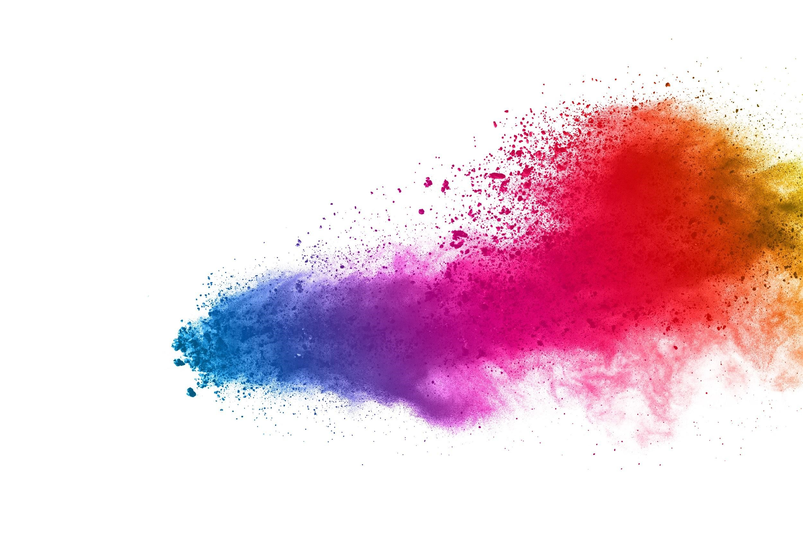

# Color in R, Python, and JS/HTML/CSS

Shujie Hu

Color choice matters. Either for simple visualization or user interface design, a good color selection is the easiest way to achieve incredible results. The right color selection supports better information readability and enhances viewer navigation capabilities. It can also fulfill subconscious aesthetic user needs and even stimulate intuitive interactions. In User interface design, color is a central part of the online marketing strategy. Researchers in various fields have been investigating the impacts that color brought to the viewer, and numerous amount of color palettes have been created in all programming languages, so that no matter which programming language we use, we always can find plenty of packages to use.

However, if you don’t know the name of a specific color palette, it’s hard to even look for it on the internet. Therefore, the motivation for this project is to collect some beautiful color palettes in the visualization languages we have used so far.   This cheatsheet addresses the need to find a good color scheme for presenting data that some students may encounter during their visualization projects, either in R, Python, or JS/HTML/CSS. It also serves as a brief tutorial for using each package. By presenting the colors with their name, it is easy to locate the colors you want and help you compare all the colors in that package, thereby saving time on browsing the internet.

As for my evaluation of this project, I think this cheatsheet serves the purpose well. I've learned many color packages. From these color packages I picked the ones that I think are most beautiful and cover almost every possible colors to be presented in this cheatsheet. I also learned how hexadecimal triplets represent the colors in web programming languages, and found several useful resources that I may need in future projects. This cheasheet presents only part of the research I have done, since in order to create a cheatsheet I need to know a lot more while being able to summarize the findings briefly. 

The cheatsheet is available here:
https://github.com/tracyhsj/Color/blob/main/Colors%20palettes%20in%20R%2C%20Python%2C%20and%20HTML:CSS%20.pdf

