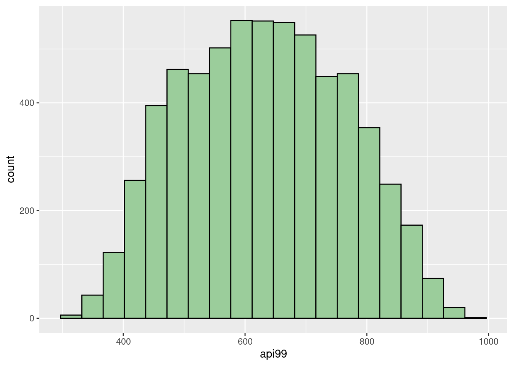

# Introduction to common sampling techniques in r

Yuanyi Hu


```r
#load packages:
library(survey)
library(srvyr)
library(tidyverse)
library(sampling)
```

### Motivation

This semester, we have learned a lot of valuable techniques for analyzing the potential information behind large-scale data. Sometimes, the entire population data are not accessible due to the cost of data collection. It's also quite efficient to analyze the key information by finding a proper sample to estimate the population. This tutorial introduces how to conduct common sampling methods in R and different scenarios to use them.

### Simple random sampling

Simple random sampling is one of the most popular and frequently used methods in research and social survey. In a simple random sampling, every element in the population has an equal probability of being selected. The package `survey` is very helpful to realize this method, and the package `srvyr` will calculate summary statistics on survey data. To illustrate this process, we will use the `api` dataset from `survey`. The `api` dataset records information about student performance in California schools based on the academic performance index (that's why it's named as `api`) computed from standardized testing and other relevant information about schools.

In this example, we will use a sample of $600$ schools, to estimate the total `api99` (academic performance index in 1999) in the entire population. In other words, this process will show the precision of using simple random sampling to select approximately $10%$ of population data to estimate the target information. As shown below, `apipop` has $6194$ rows and $37$ columns. Since we are focusing on `api99`, we should first check whether there are missing values (`NA`) in that column.


```r
#load data, we use the population data in it, apipop
data(api)
#check number of rows and columns:
dim(apipop)
```

```
## [1] 6194   37
```

```r
#take a look at its situation of missing values in api99:
sum(is.na(apipop$api99))
```

```
## [1] 0
```

Based on the above check, there is no `NA` in `api99`. We can first sum up all `api99` in the population data, and denoted as `total_api99`. `total_api99` is equal to $3914069$. Then, we can use the function `sample` to select a sample of $600$ out of $6194$. Since we want to use each element only once, we should set `replace=F`, but of course you can choose to make a SRS with replacement in other situations.


```r
#real sum of all api99 in population data:
apipop %>% summarise(total_api99 = sum(api99))
```

```
##   total_api99
## 1     3914069
```

```r
#if removed random seed, then we will get different results each time
#here is just for reproducibility of results
set.seed(100)
#make a SRS with size of 600 without replacement
api_sample = apipop %>% 
  slice(sort(sample(1:6194,size=600, replace=F)))
dim(api_sample)
```

```
## [1] 600  37
```

With the help of histograms, we can see that our sample reflects a similar distribution as the entire population. It's reasonable to see the slight difference between them since the sample only contains around $10\%$ data.


```r
ggplot(api_sample,aes(x=api99)) + 
  geom_histogram(fill="darkseagreen3",col="black",bins = 20) 
```


```r
ggplot(apipop,aes(x=api99)) + 
  geom_histogram(fill="darkseagreen3",col="black", bins = 20)
```


Then, we can summarize the sample mean, variance, standard deviation, estimated total, and the standard error of estimated total. Recall that sample mean is an unbiased estimator for the population mean. Hence, calculating the total `api99` in population by using the product of population size and sample mean is still unbiased because of the property of expectation, $E[aX]=aE[X]$. Then, the standard error of this estimate can be calculated by $N\sqrt{1-\frac{n}{N}}\frac{s}{\sqrt{n} }$, where $N=6194$ and $n=600$ in our case.


```r
api_sample %>%
summarise(sample_mean=mean(api99),
sample_variance = var(api99),
sample_std = sd(api99),
estimated_total_api99 = mean(api99)*6194,
se_estimated_total = 6194*sqrt((1 - 600/6194))*sd(api99)/sqrt(600))
```

```
##   sample_mean sample_variance sample_std estimated_total_api99
## 1    632.6017         18159.5   134.7572               3918335
##   se_estimated_total
## 1           32383.45
```

The estimated total `api99` is $3918335$, which is relatively precise compared with the real value at $3914069$. The other way to find the estimated total is using the functions `svydesign` and `svytotal` of the `survey` package, we can see that the results are same as above. Also, we can use `confint` to find a confidence interval for our estimate. By default, it will calculate the $95\%$ confidence interval, and in our example, the real total `api99`, $3914069$, is in this interval. 


```r
api_sample_d = svydesign(id=~1, data=api_sample, fpc=rep(6194,600))

svytotal(x=~api99,design=api_sample_d)
```

```
##         total    SE
## api99 3918335 32383
```

```r
confint(svytotal(~api99,api_sample_d))
```

```
##         2.5 %  97.5 %
## api99 3854864 3981805
```


### Stratified sampling

The other common sampling method is stratified sampling. We can use it when a population can be partitioned into subgroups, each subgroup having a distinct pattern. In our previous example, we can see that all schools can be classified into three levels:


```r
unique(apipop$stype)
```

```
## [1] H M E
## Levels: E H M
```

These labels represent the high school, middle school, and elementary school. Hence, we can draw a proportional number of schools as the sample size for each level according to the size of each stratum in the entire population and then combine them as a whole sample. This sample has a similar data structure as the population data in terms of `stype` and `api99`. Then, we should first calculate the proportion for each level, and then find the matched size of stratum in sample, and then get a entire sample of $600$ schools.


```r
#we can see that there is no NA in the stype
sum(is.na(apipop$stype))
```

```
## [1] 0
```

```r
#calculate the proportion for each level
(table = (apipop %>% count(stype) %>% 
            mutate(proportion=n/sum(n), 
                  stratum_sample_size = round(proportion*600, 0))))
```

```
##   stype    n proportion stratum_sample_size
## 1     E 4421  0.7137552                 428
## 2     H  755  0.1218922                  73
## 3     M 1018  0.1643526                  99
```
Before we apply this method, it's important to reorder the data by grouping each level together.

```r
#set the random seed for reproducibility
set.seed(180)
#reorder the population according to the labels:
apipop_reorder<-inner_join(apipop,table,by="stype") %>% arrange(stype)
```

Then, we can apply the stratified sampling without replacement by using `strata`.

```r
#use the strata method from package sampling
apipop_sample <-strata(apipop_reorder,
                       c("stype"),size=c(428,73,99), method="srswor")
dim(apipop_sample)
```

```
## [1] 600   4
```

```r
names(apipop_sample)
```

```
## [1] "stype"   "ID_unit" "Prob"    "Stratum"
```

We can see that there is a variable named `ID_unit`. This is the identifier of the selected units. We can slice the selected rows from the entire population.


```r
apipop_sample <- apipop_reorder %>% slice(apipop_sample$ID_unit)
```

After we have our sample, we can find the estimated total `api99` and the $95\%$ confidence interval by using `svydesign`, `svytotal`, and `confint`. We can see that the estimated total `api99` is $3912987$. It's precise compared with the real value at $3914069$, and makes a closer estimate to real value compared with the previous result by using simple random sampling. Also, the standard error for this estimate is smaller than the previous. Hence, we can see that stratified sampling may be more helpful if we can divide the population into subgroups.


```r
api_sample_d = svydesign(id=~1,strata=~stype,data=apipop_sample,fpc=~n)

svytotal(~api99,api_sample_d)
```

```
##         total    SE
## api99 3912987 31953
```

```r
confint(svytotal(~api99,api_sample_d))
```

```
##         2.5 %  97.5 %
## api99 3850360 3975614
```

### Source:

https://www.rdocumentation.org/packages/survey/versions/4.1-1

https://r-survey.r-forge.r-project.org/survey/html/api.html

https://cran.r-project.org/web/packages/srvyr/srvyr.pdf

https://online.stat.psu.edu/stat506/book/export/html/630

https://en.wikipedia.org/wiki/Stratified_sampling

https://www.rdocumentation.org/packages/sampling/versions/2.9/topics/strata

https://zacharylhertz.github.io/posts/2021/06/survey-package
