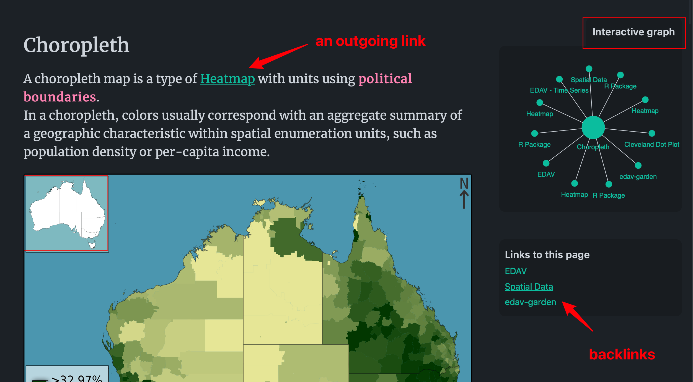

# EDAV Garden

Chenyu Zhang

<center>
<input type="checkbox" id="logo" checked>
<label for="logo">
<div class="logo-wrapper">
<div class="logo">
</div>
</div>
</label>
</center>

> 🌐Address: [edav-garden.netlify.app](https://edav-garden.netlify.app)

EDAV Garden is a [digital garden](https://github.com/MaggieAppleton/digital-gardeners) about EDAV.
In simple words, it is a collection of published notes, like [edav.info](https://edav.info).
However, EDAV Garden has some special features:

- It captures **my journey** of learning EDAV. It is a practice of [learning in public](https://www.swyx.io/learn-in-public/), learning for the public.
- The notes are not a collection of external information; instead, they are **my notes** containing my thoughts and interpretation.
- Therefore, there may be mistakes and question marks scattered around. But they may be fixed when you come back later.
- This is not a frozen garden; it is an **evolving garden** that I will continue gardening as I learn.
- This site is not only for you to reference, but also for you to **roam**.

## How to Explore the Garden

A significant difference between this garden and a traditional book/wiki/website is that notes here are **not linear**: they are not in chronological or logical order. Instead, they are connected to each other through contextual links and form a knowledge graph, making this garden explorable. This also matches the fundamental problem of EDAV: exploratory vs. explanatory. To navigate through different notes, you can follow different types of links, as illustrated below

- an outgoing link points to another note;
- a backlink points to a note which mentions the current note;
- the interactive graph presents all the connections the current note has.



## Main Sections

Right now, there are three main sections of EDAV garden:

- [Plots Gallery](https://edav-garden.netlify.app/#plots-gallery): A gallery of graphs categorized by data type.
- [R Garden](https://edav-garden.netlify.app/#r-garden): notes on R.
- [Git Garden](https://edav-garden.netlify.app/#git-garden): notes on Git.

```{css, echo=FALSE}
    /* Logo */
    input#logo {
      height: 0;
      width: 0;
      border: none;
      outline: none;
      display: none;
    }
    #logo:checked + label .logo {
        background: url('https://raw.githubusercontent.com/zcysxy/edav-garden/main/logo-tidy.svg');
        background-size: cover;
    }
    #logo + label .logo {
        background: transparent;
    }
    .logo-wrapper, 
    .logo {
        width: 250px;
        height: 250px;
        border: none;
        box-shadow: none;
    }

    .logo-wrapper { position: relative; }
    .logo-wrapper:before {
        content: "";
        position: absolute;
        left: 0;
        right: 0;
        width: 250px;
        height: 250px;
        /*background: url('https://raw.githubusercontent.com/zcysxy/edav-garden/main/logo-3d.png');*/
        animation: logoChange 0.01s infinite;
        animation-play-state: paused;
        background-size: cover;
    }
    #logo:checked + label .logo-wrapper:before {
        animation-play-state: running;
        background-size: cover;
        opacity: 0;
    }

    @keyframes logoChange {
        0.01%, 25% {
            background: url('https://raw.githubusercontent.com/zcysxy/edav-garden/main/logo-3d.png') no-repeat;
            background-size: cover;
        }
        25.01%, 50% {
            background: url('https://raw.githubusercontent.com/zcysxy/edav-garden/main/logo-garden.svg') no-repeat;
            background-size: cover;
        }
        50.01%, 75% {
            background: url('https://raw.githubusercontent.com/zcysxy/edav-garden/main/logo-ggplot.svg') no-repeat;
            background-size: cover;
        }
            75.01%, 100% {
            background: url('https://raw.githubusercontent.com/zcysxy/edav-garden/main/logo.svg') no-repeat;
            background-size: cover;
        }
    }
    
    .logo-wrapper {
      filter: drop-shadow(0px 10px 10px rgba(0,0,0, 0.5)) drop-shadow(0px 10px 30px rgba(100,100,100,0.2)) ;
    }
```
