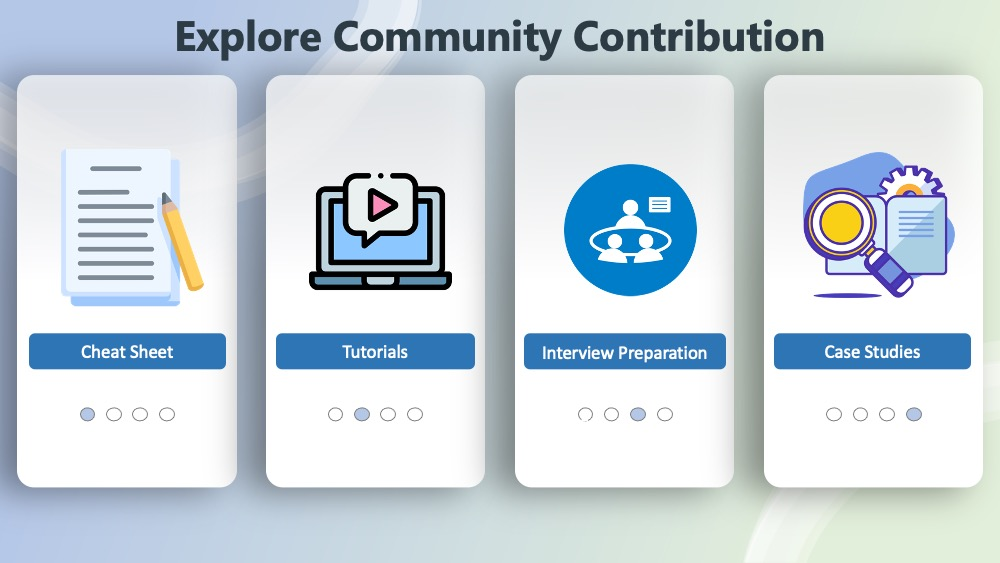

# Homepage Artwork

Xingye Feng

I was interested in creating the artwork for the community contribution welcome page, because it is a fun way to contribute to the EDAV class if I can create something informative and catchy so that people understand what the class is about and what contents we have in the community contribution.

I created two artworks, the first one is the summary info page of the EDAV course content. It includes the R graphics we have learned so far in EDAV class. The background has an R studio logo, and a ggplot2 logo which are the emphasizes of the class.

The second artwork is a cover sheet of the community contribution contents. Which includes four topics: Cheat sheet, tutorials, interview questions and case studies. Each of them have a corresponding icon that represents its feature. 

The theme of the artworks is blue, since the most frequently used color in data visualization universally is blue. Also, blue is the theme color for R studio, which is the major development environment we use for this class. In addition, Blue color is professional which suits the topic of the class. 

This is a display artwork for the community contribution welcome page, where all my classmates' good contribution works will disclose in the following pages. 

Resources:
1. EDAV info website: https://edav.info/
2. Flaticon website: https://Flaticon.com/

