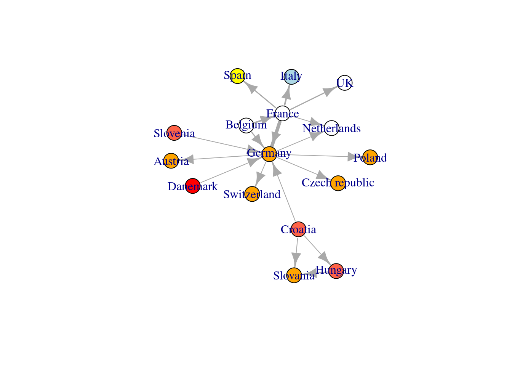
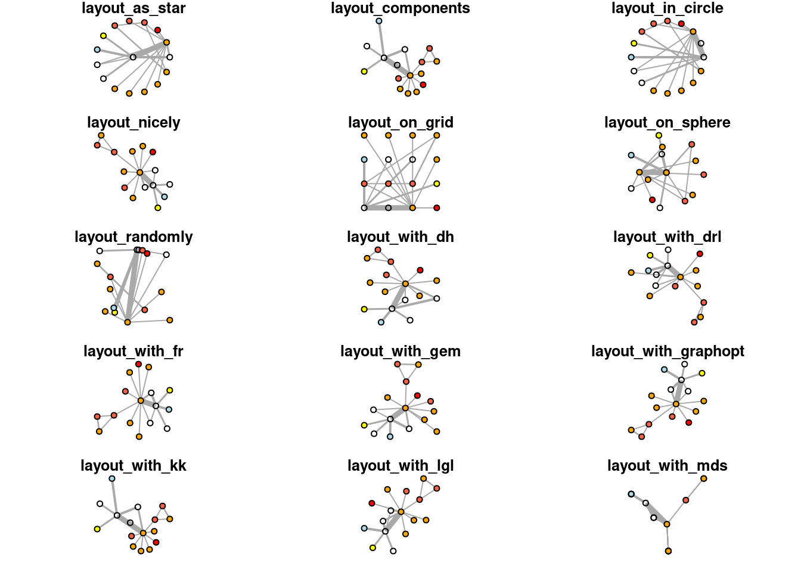
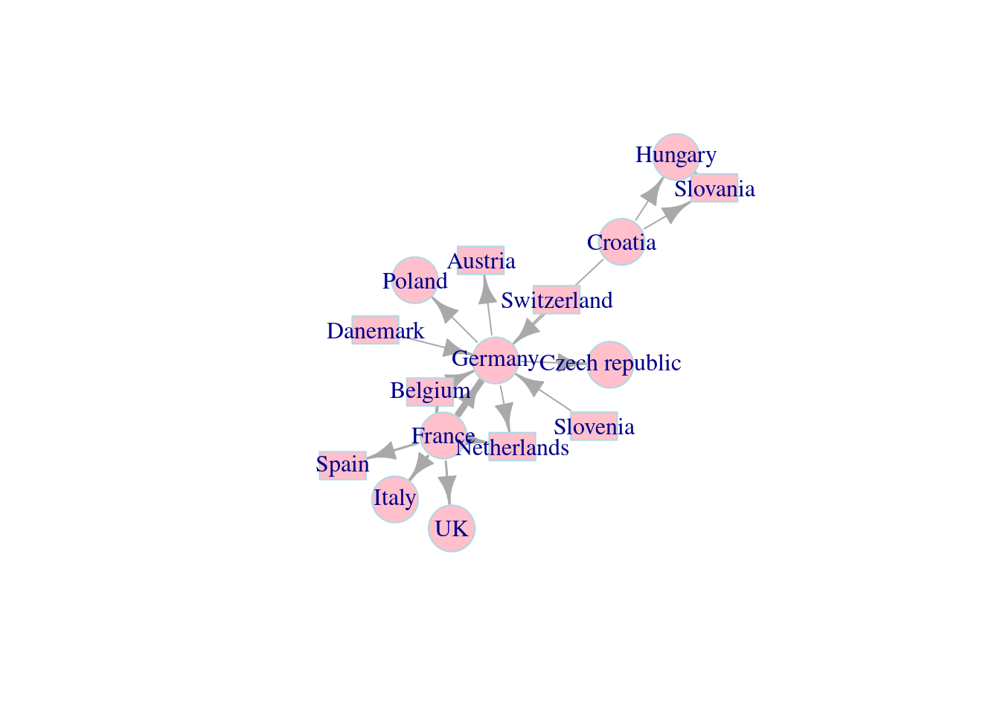
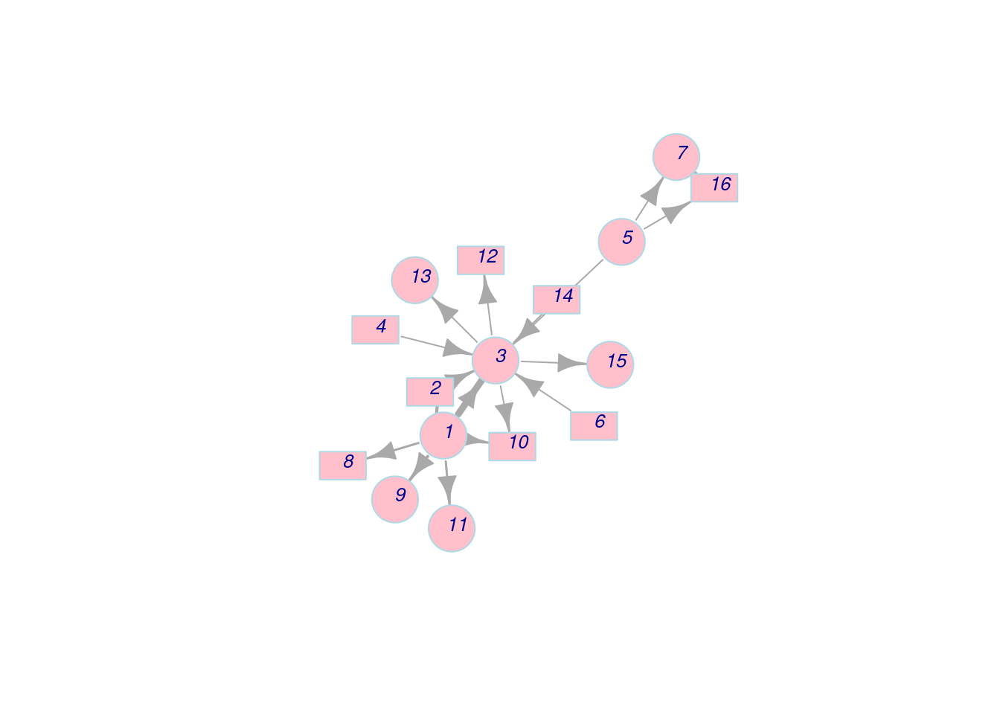
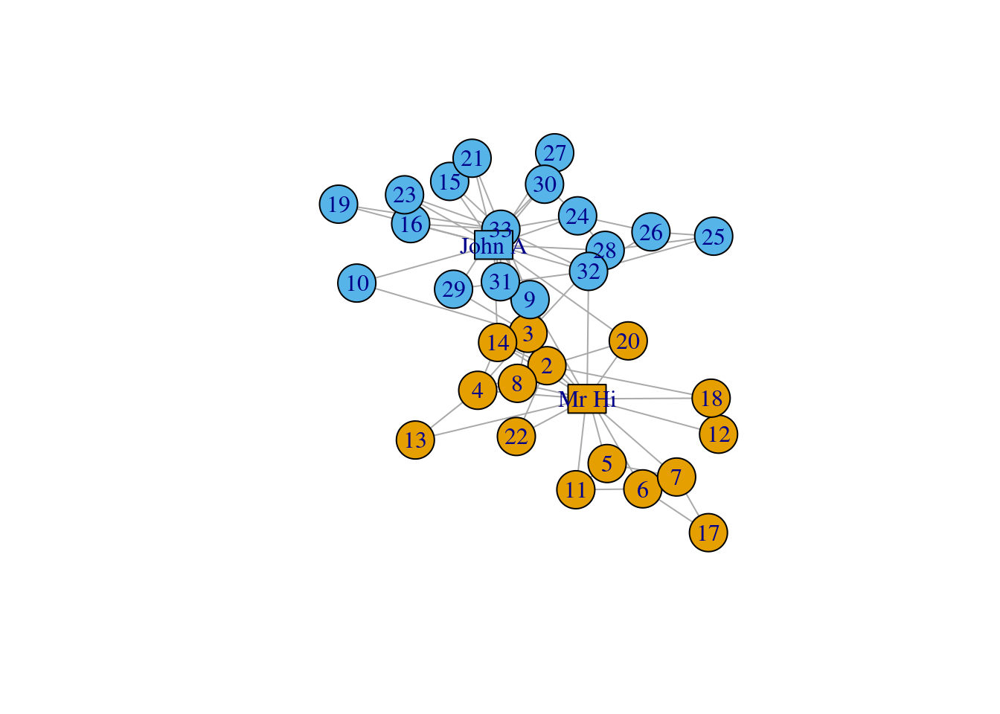

# igraph in r

Mouwei Lin (lm3756) and Linhao Yu (ly2590)

This will be a very brief introduction about a R package called igraph, which is a complex network analysis tool in R. It will contain commonly used and important functions. We believe if you look at this cheat sheet, you can handle most of the network visualization problems.


## 1. igraph Basics

First we download and install the package.


```r
#install.packages('igraph')
library(igraph) #this is a must install package

#install.packages('devtools')
#library(devtools) #this is a must install package
#install_github('kassambara/navdata') 
library(navdata) #this is a must install package

#install.packages('tidyverse')
library(tidyverse) #this is a must install package

#install.packages('igraphdata')
library(igraphdata) #this is a must install package
```


We will use an open source data set named **phone.call** from **navdata**.


```r
data("phone.call")
head(phone.call)
```

```
## # A tibble: 6 × 3
##   source  destination n.call
##   <chr>   <chr>        <dbl>
## 1 France  Germany          9
## 2 Belgium France           4
## 3 France  Spain            3
## 4 France  Italy            4
## 5 France  Netherlands      2
## 6 France  UK               3
```
### 1.1 Create igraph Network Object

igraph has its specific network (graph) object called 'igraph'. The simplest way to create an 'igraph' object is to use **graph.formula()** and specify every node and edge individually.

```r
graph.formula(A-B-C-D,A-E-F,Z-D-X)
```

```
## IGRAPH 4392828 UN-- 8 7 -- 
## + attr: name (v/c)
## + edges from 4392828 (vertex names):
## [1] A--B A--E B--C C--D D--Z D--X E--F
```

But in real world, we usually have a lot of data. Therefore, it is not a good idea to define every node and edge manually. More generally, we will use these two methods:


```r
# prepare the data
name<-data.frame(c(phone.call$source,phone.call$destination))
nodes<-name%>%
    distinct()%>%
mutate(location=c("western","western","central","nordic","southeastern",
     "southeastern","southeastern","southern","sourthern",
     "western","western","central","central","central","central","central"))
colnames(nodes)<-c("label","location")

edges<-phone.call%>%
    rename(from=source,to=destination,weight=n.call)
```


#### (1) build igraph object from dataframe:
**graph_from_data_frame()**
To use this method, we need two dataframes, one is edge frame, the other is vertices frame.


```r
net_pc<-graph_from_data_frame(
   d=edges,vertices=nodes,
   directed=TRUE)
```

we can see that the graph is created. We can use **V()** or **E()** to visit vertices or edges, and **as_edgelist(net, names=T)**, **as_adjacency_matrix(net, attr="weight")** to catch edges list and adjacent matrix:

```r
V(net_pc)
```

```
## + 16/16 vertices, named, from 6e93970:
##  [1] France         Belgium        Germany        Danemark       Croatia       
##  [6] Slovenia       Hungary        Spain          Italy          Netherlands   
## [11] UK             Austria        Poland         Switzerland    Czech republic
## [16] Slovania
```

```r
V(net_pc)$location
```

```
##  [1] "western"      "western"      "central"      "nordic"       "southeastern"
##  [6] "southeastern" "southeastern" "southern"     "sourthern"    "western"     
## [11] "western"      "central"      "central"      "central"      "central"     
## [16] "central"
```

```r
E(net_pc)
```

```
## + 18/18 edges from 6e93970 (vertex names):
##  [1] France  ->Germany        Belgium ->France         France  ->Spain         
##  [4] France  ->Italy          France  ->Netherlands    France  ->UK            
##  [7] Germany ->Austria        Germany ->Poland         Belgium ->Germany       
## [10] Germany ->Switzerland    Germany ->Czech republic Germany ->Netherlands   
## [13] Danemark->Germany        Croatia ->Germany        Croatia ->Slovania      
## [16] Croatia ->Hungary        Slovenia->Germany        Hungary ->Slovania
```

```r
as_edgelist(net_pc, names=T) 
```

```
##       [,1]       [,2]            
##  [1,] "France"   "Germany"       
##  [2,] "Belgium"  "France"        
##  [3,] "France"   "Spain"         
##  [4,] "France"   "Italy"         
##  [5,] "France"   "Netherlands"   
##  [6,] "France"   "UK"            
##  [7,] "Germany"  "Austria"       
##  [8,] "Germany"  "Poland"        
##  [9,] "Belgium"  "Germany"       
## [10,] "Germany"  "Switzerland"   
## [11,] "Germany"  "Czech republic"
## [12,] "Germany"  "Netherlands"   
## [13,] "Danemark" "Germany"       
## [14,] "Croatia"  "Germany"       
## [15,] "Croatia"  "Slovania"      
## [16,] "Croatia"  "Hungary"       
## [17,] "Slovenia" "Germany"       
## [18,] "Hungary"  "Slovania"
```

```r
as_adjacency_matrix(net_pc, attr="weight")
```

```
## 16 x 16 sparse Matrix of class "dgCMatrix"
##                                                 
## France         . . 9 . . . . 3 4 2 3 . . . . .  
## Belgium        4 . 3 . . . . . . . . . . . . .  
## Germany        . . . . . . . . . 2 . 2 2 2 2 .  
## Danemark       . . 2 . . . . . . . . . . . . .  
## Croatia        . . 2 . . . 2 . . . . . . . . 2.0
## Slovenia       . . 2 . . . . . . . . . . . . .  
## Hungary        . . . . . . . . . . . . . . . 2.5
## Spain          . . . . . . . . . . . . . . . .  
## Italy          . . . . . . . . . . . . . . . .  
## Netherlands    . . . . . . . . . . . . . . . .  
## UK             . . . . . . . . . . . . . . . .  
## Austria        . . . . . . . . . . . . . . . .  
## Poland         . . . . . . . . . . . . . . . .  
## Switzerland    . . . . . . . . . . . . . . . .  
## Czech republic . . . . . . . . . . . . . . . .  
## Slovania       . . . . . . . . . . . . . . . .
```


#### (2) build igraph object from adjacent matrix:
**graph_from_adjacency_matrix()**
If the graph is using 


```r
adjacent_matrix<-as_adjacency_matrix(net_pc, attr="weight")
net_am<-graph_from_adjacency_matrix(adjacent_matrix)
```

now we simply plot it to take a look

```r
plot(net_pc)
```


```r
plot(net_am)
```


### 1.2 Basic igraph Visualization Instructions

The plot function in igraph is very strong and it has a lot of parameters to make the network beautiful and clear. In this section we will only give a general introduction to important visualization methods, we will have a more detailed introduction in the next section.

A large number of parameters are used to display various properties of nodes, edges and graphs. The parameters related to nodes start with **vertex.XXX**, and the parameters related to edges start with **edge.XXX**

In addition to specifying the parameters of nodes and edges in **plot()**, you can also use the previously mentioned **V()** and **E()** to add the corresponding properties directly into the igraph object. The difference between the two methods is that the parameters specified in **plot()** do not change the properties of the plot. For example, we first specify the color of the node according to the position, and the width of the edge according to the weight (these two attributes will be saved in the net_pc object), and then specify the size of the node in the parameters of **plot()** (proportional to the degree of the node, The node degree is the number of edges connected to this node), the size and position of the node marker, the color of the edge, the size of the arrow, and the degree of curvature of the edge.

```r
# Calculate node's degree
deg<-degree(net_pc,mode="all")
# Set up the color
vcolor<-c("orange","red","lightblue","tomato","yellow")
# Set specific node's Color
V(net_pc)$color<-vcolor[factor(V(net_pc)$location)]
# Set specific edge's weight
E(net_pc)$width<-E(net_pc)$weight/2

# Set up vertex.size, vertex.label.cex & dist, edge color & arrow size & curve in graph
plot(net_pc,vertex.size=3*deg,
     vertex.label.cex=.7,vertex.label.dist=1,
     edge.color="gray50",edge.arrow.size=.4, edge.curved=.1)
# Add legend
legend(x=-1.5,y=1.5,levels(factor(V(net_pc)$location)),pch=21,col="#777777",pt.bg=vcolor)
```


### 1.3 Network Layout

Network layout refers to the method of determining the coordinates of each node in the network. 

A variety of layout algorithms are provided in igraph. Among them, Force-directed layout algorithms are the most useful. Force-directed layouts try to get an aesthetically pleasing graph where the edges are similar in length and cross as little as possible. They model graphics as a physical system. Nodes are “charged particles” that repel each other when they get too close. These edges act as springs, attracting connected nodes together. As a result, nodes are evenly distributed in the illustrated area, and the layout is intuitive as nodes that share more connections are closer to each other. The disadvantage of these algorithms is that they are slow and therefore less frequently used in graphs larger than **1000** vertices.

When using force-directed layout, you can use the **niter** parameter to control the number of iterations to perform. The default setting is 500 iterations. For large graphs, you can lower this number to get results faster and check that they are reasonable.

**Fruchterman-Reingold** is the most widely used Force-directed layout method:


```r
# Fruchterman-Reingold layout method
l <- layout_with_fr(net_pc) 
plot(net_pc, layout=l)
```




The Fruchterman Reingold layout is random and different every run will result in slightly different layout configurations. Saving the layout in the object l allows us to obtain the exact same result multiple times (it is also possible to specify a random state by setting seed **seed()**)


```r
# All the layout methods in igraph
layouts <- grep("^layout_", ls("package:igraph"), value=TRUE)[-1]
layouts
```

```
##  [1] "layout_as_bipartite"  "layout_as_star"       "layout_as_tree"      
##  [4] "layout_components"    "layout_in_circle"     "layout_nicely"       
##  [7] "layout_on_grid"       "layout_on_sphere"     "layout_randomly"     
## [10] "layout_with_dh"       "layout_with_drl"      "layout_with_fr"      
## [13] "layout_with_gem"      "layout_with_graphopt" "layout_with_kk"      
## [16] "layout_with_lgl"      "layout_with_mds"      "layout_with_sugiyama"
```


There are 18 methods of layout in igraph, we won't go into detail for each layout method because most of them are not widely used except Fruchterman Reingold layout. However, we will give an example to show how those layouts look like:


```r
layouts <- grep("^layout_", ls("package:igraph"), value=TRUE)[-1]
# Remove layouts that do not apply to our graph.
layouts <- layouts[!grepl("bipartite|merge|norm|sugiyama|tree", layouts)]
par(mfrow=c(5,3), mar=c(1,1,1,1)) 
for (layout in layouts) {
  print(layout)
  l <- do.call(layout, list(net_pc))
  plot(net_pc, vertex.label="",edge.arrow.mode=0,
       layout=l,main=layout) }
```

```
## [1] "layout_as_star"
```

```
## [1] "layout_components"
```

```
## [1] "layout_in_circle"
```

```
## [1] "layout_nicely"
```

```
## [1] "layout_on_grid"
```

```
## [1] "layout_on_sphere"
```

```
## [1] "layout_randomly"
```

```
## [1] "layout_with_dh"
```

```
## [1] "layout_with_drl"
```

```
## [1] "layout_with_fr"
```

```
## [1] "layout_with_gem"
```

```
## [1] "layout_with_graphopt"
```

```
## [1] "layout_with_kk"
```

```
## [1] "layout_with_lgl"
```

```
## [1] "layout_with_mds"
```



### 2. Decorating igraph visualizations

### 2.1 Details for decorating igraph visualization
In this section, we still use the example above, but we customize several parameters to see their influence for visualization. \

First, we customize the nodes parameters. 

```r
set.seed(111)
l <- layout_with_fr(net_pc) 
plot(net_pc, 
     vertex.color = 'pink',                   # The color of nodes
     vertex.frame.color = 'lightblue',        # The color of node frames
     vertex.shape = c('circle','rectangle'),  # The color of node shapes
     vertex.size = 25,                        # The size of a node
     vertex.size2 = 15,                       # For rectangle, we need two parameters to specify its shape
     
     layout = l)
```


Next, we customize the node labels.

```r
plot(net_pc, 
     vertex.color = 'pink',                    
     vertex.frame.color = 'lightblue',        
     vertex.shape = c('circle','rectangle'),  
     vertex.size = 25,                        
     vertex.size2 = 15,                       
     
     vertex.label = 1:length(V(net_pc)), # Change labels to numbers
     vertex.label.family = 'Helvetica',  # Change the font family of labels
     vertex.label.font = 3,              # Change the font to italic
     vertex.label.cex = 0.8,             # Change the size of labels
     vertex.label.dist = 0.5,            # Change the distance between labels and node frames
  
     layout = l)
```


Apart from nodes, we can also modify edge features while plotting.

```r
plot(net_pc, 
     vertex.color = 'pink',                    
     vertex.frame.color = 'lightblue',        
     vertex.shape = c('circle','rectangle'),  
     vertex.size = 25,                        
     vertex.size2 = 15,                       
     
     vertex.label = 1:length(V(net_pc)), 
     vertex.label.family = 'Helvetica',  
     vertex.label.font = 3,              
     vertex.label.cex = 0.8,             
     vertex.label.dist = 0.5,   
     
     edge.color = 'lightblue',  # Color of edges
     edge.width = 3,            # Width of edges
     edge.arrow.size = 0.8,     # Size of arrows
     edge.arrow.width = 0.8,    # Width of arrows
     edge.lty = 4,              # Line types of edges (4: dot dash)
     edge.curved = 0.5,         # Curvature of edges
     
     layout = l)
```


### 2.2 Example for advanced igraph visualization

In this section, we introduce an advanced network visualization using Zachary's karate club network dataset. This is a widely-used dataset for network analysis. In this dataset, every node represents a member of the karate club and edges represent members' social connection. During Zachary's study, the administrator "John. A." and the coach "Mr. Hi" had a conflict which led to a split of the club. Now, we want to use igraph to visualize the social network of this karate club. \

First, we plot the network without further decoration.


```r
set.seed(111)
data(karate)
l <- layout_with_fr(karate) 

igraph.options(vertex.size = 10)
par(mfrow = c(1,1))
plot(karate,
     layout = l)
```


Next, we highlight the two leaders ("John. A." and "Mr. Hi") in the network by using rectangles.

```r
# Decoration
V(karate)$label <- sub("Actor ","", V(karate)$name)

# Two leaders get shapes different from club members
V(karate)$shape <- "circle"
V(karate)[c("Mr Hi", "John A")]$shape <- "rectangle"

V(karate)$size  <- 20
V(karate)$size2 <- 15

plot(karate, 
     vertex.label = V(karate)$label,
     layout  = l)
```


Finally, we divide the edges into three categories and use different colors for them. Remember the karate club is split into two factions, so the edges can be divided into: edges inside faction 1, edges inside faction 2, and edges connecting both factions. \
Besides, we also set up the edge width according to its weight.

```r
# Define factions
F1<-V(karate)[Faction==1]
F2<-V(karate)[Faction==2]

# Set up edge colors according to factions
E(karate)[F1 %--% F1]$color<-"darkgoldenrod2"
E(karate)[F2 %--% F2]$color<-"lightblue"
E(karate)[F1 %--% F2]$color<-"brown"

# Set up edge width according to weights
E(karate)$width=E(karate)$weight

# Plot the decorated graph, using same layout.
plot(karate,layout=l)
```


