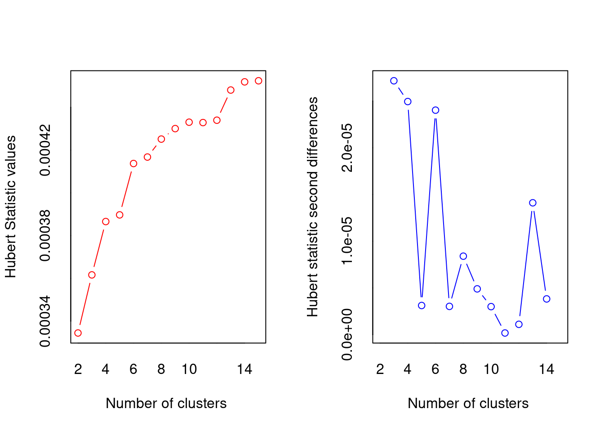

# Machine Learning in R

Wanling Bai and Yancheng Zhang


```r
# load packages
library(class)
library(rpart)
library('NbClust')
# install_github("vqv/ggbiplot")
library(ggbiplot)
```


## 1. Contribution

We've learned exploratory data analysis and visualization in R. It is naturally for us to explore the next step for data analyze: machine learning. Since loading data from one platform to another can be time-costing, doing data analyze in one platform simplify our work flow and improve efficiency. 

Unlike Python, different machine learning methods are in different R packages. Some machines learning models are implemented with certain parameter in the functions. If we change the parameter, we change the method. Finding the packages and the right parameter for machine learning methods can be laborious. For this tutorial, we go through some machine learning methods with brief description, pros and cons, and application examples. By composing this tutorial, we gain a systematic knowledge of how to implement machine learning in R and experience the difference between platforms. Hopefully, this tutorial can help you get start with machine learning in R.

## 2. Evaluation

We learned how to process Machine Learning in R, especially how to interpret the corresponding parameters when using functions. However, in this tutorial we just explained "Supervised Machine Learning" and "Unsupervised Machine Learning", there are also other models/methods such as meta-algorithms, time series models, model validation and etc. For further improvements, we can add these parts to tutorial and make it more straightforward to beginners to perform Machine Learning in R.

## 3. Supervised Learning in R

### 3.1 Linear Regression

Linear regression fits a linear relationship between inputs and a numerical output.

To implement linear regression in R, use function 'lm()' in package 'stats'.

Reference:
https://www.edureka.co/blog/linear-regression-for-machine-learning/

**Linear Regression Advantages: ** \
1. Easy to train and interpret \
2. Handles overfitting well using dimensional reduction techniques, regularization, and cross-validation \
3. Can increase model flexible with modifications that don't affect estimation

**Linear Regression Disadvantages: ** \
1. The assumption of linearity between input and output variables does not always hold \
2. Sensitive to outliers \
3. Prone to multicollinearity

Reference:
https://www.tutorialspoint.com/r/r_linear_regression.htm


```r
x <- c(151, 174, 138, 186, 128, 136, 179, 163, 152, 131)
y <- c(63, 81, 56, 91, 47, 57, 76, 72, 62, 48)

# fit the model
relation <- lm(y~x) 
print(class(relation)) # 'lm()' returns an object of class 'lm'
```

```
## [1] "lm"
```

```r
print(relation) 
```

```
## 
## Call:
## lm(formula = y ~ x)
## 
## Coefficients:
## (Intercept)            x  
##    -38.4551       0.6746
```

```r
# interpret the model and see accuracy
print(summary(relation))
```

```
## 
## Call:
## lm(formula = y ~ x)
## 
## Residuals:
##     Min      1Q  Median      3Q     Max 
## -6.3002 -1.6629  0.0412  1.8944  3.9775 
## 
## Coefficients:
##              Estimate Std. Error t value Pr(>|t|)    
## (Intercept) -38.45509    8.04901  -4.778  0.00139 ** 
## x             0.67461    0.05191  12.997 1.16e-06 ***
## ---
## Signif. codes:  0 '***' 0.001 '**' 0.01 '*' 0.05 '.' 0.1 ' ' 1
## 
## Residual standard error: 3.253 on 8 degrees of freedom
## Multiple R-squared:  0.9548,	Adjusted R-squared:  0.9491 
## F-statistic: 168.9 on 1 and 8 DF,  p-value: 1.164e-06
```

```r
print('prediction:')
```

```
## [1] "prediction:"
```

```r
a <- data.frame(x = 170) # new inpput data 
# predict with new input data
result <-  predict(relation,a)
print(result)
```

```
##        1 
## 76.22869
```

### 3.2 Logistic Regression

Logistic regression fits a linear relationship between inputs and a categorical output.

To implement logistic regression in R, use function 'glm()' in package 'stats'.

**Logistic Regression Advantages: ** \
1. Easy to train and interpret \
2. Handles overfitting well using dimensional reduction techniques, regularization, and cross-validation \
3. Can increase model flexible with modifications that don't affect estimation

**Logistic Regression Disadvantages: ** \
1. The assumption of linearity between input and output variables does not always hold and is hard to check\
2. Can overfit with small, high-dimensional data

Reference:
https://www.tutorialspoint.com/r/r_logistic_regression.htm


```r
input <- mtcars[,c("am","cyl","hp","wt")]
# fit the model
am.data = glm(formula = am ~ cyl + hp + wt, data = input, family = binomial) 
# formula expression am ~ cyl + hp + wt specifies the model
# interpret the model and see accuracy
print(summary(am.data))
```

```
## 
## Call:
## glm(formula = am ~ cyl + hp + wt, family = binomial, data = input)
## 
## Deviance Residuals: 
##      Min        1Q    Median        3Q       Max  
## -2.17272  -0.14907  -0.01464   0.14116   1.27641  
## 
## Coefficients:
##             Estimate Std. Error z value Pr(>|z|)  
## (Intercept) 19.70288    8.11637   2.428   0.0152 *
## cyl          0.48760    1.07162   0.455   0.6491  
## hp           0.03259    0.01886   1.728   0.0840 .
## wt          -9.14947    4.15332  -2.203   0.0276 *
## ---
## Signif. codes:  0 '***' 0.001 '**' 0.01 '*' 0.05 '.' 0.1 ' ' 1
## 
## (Dispersion parameter for binomial family taken to be 1)
## 
##     Null deviance: 43.2297  on 31  degrees of freedom
## Residual deviance:  9.8415  on 28  degrees of freedom
## AIC: 17.841
## 
## Number of Fisher Scoring iterations: 8
```

```r
print('prediction:')
```

```
## [1] "prediction:"
```

```r
# predict 
result <-  predict(am.data,input)
print(result)
```

```
##           Mazda RX4       Mazda RX4 Wag          Datsun 710      Hornet 4 Drive 
##          2.24194025         -0.09117492          3.45752720         -3.20199515 
##   Hornet Sportabout             Valiant          Duster 360           Merc 240D 
##         -2.16697131         -5.60657399         -1.07498527         -5.51285476 
##            Merc 230            Merc 280           Merc 280C          Merc 450SE 
##         -4.07135061         -4.83693440         -4.83693440         -7.76817983 
##          Merc 450SL         Merc 450SLC  Cadillac Fleetwood Lincoln Continental 
##         -4.65735960         -5.11483316        -17.74976403        -19.01585528 
##   Chrysler Imperial            Fiat 128         Honda Civic      Toyota Corolla 
##        -17.80417191          3.67548850          8.57164573          6.98245384 
##       Toyota Corona    Dodge Challenger         AMC Javelin          Camaro Z28 
##          2.26122057         -3.71372091         -2.93601585         -3.54534251 
##    Pontiac Firebird           Fiat X1-9       Porsche 914-2        Lotus Europa 
##         -5.87250717          6.10009839          5.03924867         11.49298403 
##      Ford Pantera L        Ferrari Dino       Maserati Bora          Volvo 142E 
##          3.20404508          2.98797849          1.85826556         -0.22976277
```

### 3.3 k-Nearest Neighboors

KNN which stand for K Nearest Neighbor, is a Supervised Machine Learning algorithm that classifies a new data point into the target class, depending on the features of its neighboring data points. 

To use KNN algorithm in R, we must first install the ‘class’ package provided by R. This package has the KNN function in it.

Success and failure modes for KNN:

**KNN generally performs well when:**

- the data are concentrated in the feature space
- the classes appear in separable clusters

**KNN generally performs poorly when:**

- the feature space is high-dimensional (many predictors)
- there are superfluous features (unrelated to calss membreships)

Reference: 

https://www.edureka.co/blog/knn-algorithm-in-r/


```r
warnings('off')
# install.packages('class')       #Install class package
# library(class)                    # Load class package
train <- rbind(iris3[1:25,,1], iris3[1:25,,2], iris3[1:25,,3])    # X_train
test <- rbind(iris3[26:50,,1], iris3[26:50,,2], iris3[26:50,,3])  # X_test
cl <- factor(c(rep("s",25), rep("c",25), rep("v",25)))            # y_train
cl_test <- factor(c(rep("s",25), rep("c",25), rep("v",25)))       # y_test
cl_hat = knn(train, test, cl, k = 3, prob=TRUE)                   # k: 'k' in KNN model
str(cl_hat)                                                       # Output
```

```
##  Factor w/ 3 levels "c","s","v": 2 2 2 2 2 2 2 2 2 2 ...
##  - attr(*, "prob")= num [1:75] 1 1 1 1 1 1 1 1 1 1 ...
```

```r
table(cl_test, cl_hat)                                            # cross-tabulate
```

```
##        cl_hat
## cl_test  c  s  v
##       c 23  0  2
##       s  0 25  0
##       v  4  0 21
```

```r
mean(cl_test != cl_hat)                                           # misclassification error 
```

```
## [1] 0.08
```

### 3.4 Tree-Based Models

Tree-Based models, such as decision tree model can be used to visually represent the “decisions” and are widely used to generate predictions. To use tree-based models algorithm in R, we must first install the 'rpart' package provided by R. This package has the rpart function in it.

Here are some parameters explanations while we are operating 'rpart' to generate tree-based models:

`maxdepth`: The maximum depth level of tree. For single split, you can just set maxdepth argument to 1.
`minsplit`: The minimum number of observations that must exist in a node in order for a split to be attempted.
`minbucket`: The minimum number of observations in any terminal node.
`cp`: Complexity parameter - setting cp to a negative amount ensures that the tree will be fully grown.
`method`:  The method argument defines the algorithms. It can be one of anova, poisson, class or exp. In this case, the target variables is categorical, so you will use the method as class.

Success and failure modes for Tree-Based Models:

**Advanages for Tree-Based Models:**

- Does not require normalization/scaling of data.
- Missing values in the data also do NOT affect the process of building a decision tree to any considerable extent.
- Straightward and easy to explain to company's stakeholders.

**Advanages for Tree-Based Models:**

- Sensitive to small change in the data, which might generate a large change in the structure of the decision tree.
- High time-complexity.
- DInadequate for applying regression and predicting continuous values.

Reference:

https://blog.dataiku.com/tree-based-models-how-they-work-in-plain-english
https://www.pluralsight.com/guides/explore-r-libraries:-rpart


```r
warnings('off')
# install.packages('rpart')       #Install class package
# library(rpart)                    # Load class package
train <- data.frame(
  ClaimID = 1:7,
  RearEnd = c(TRUE, TRUE, FALSE, FALSE, FALSE, FALSE, FALSE),
  Whiplash = c(TRUE, TRUE, TRUE, TRUE, TRUE, FALSE, FALSE),
  Fraud = c(TRUE, TRUE, TRUE, FALSE, FALSE, FALSE, FALSE)
)
mytree <- rpart(
  Fraud ~ RearEnd + Whiplash,   # y ~ feature1 + feature2 + feature3 + ...
  data = train, 
  method = "class",            
  maxdepth = 1, 
  minsplit = 2, 
  minbucket = 1
)
predict_Fraud = predict(mytree, data=train, type = "class")
table(train$Fraud, predict_Fraud)
```

```
##        predict_Fraud
##         FALSE TRUE
##   FALSE     4    0
##   TRUE      1    2
```


## 4. Unsupervised Learning
### 4.1 K-means

K-means clustering finds k (a chosen parameter) center points that produce clusters minimizing the within-cluster sum of squares.

To implement K-means in R, use function 'kmeans()' in package 'stats'.

**K-means Advantages: ** \
1. Intuitive cluster structure \
2. easy to compute \
3. Can increase algorithm flexible with extension to other measures, such as Eucliean distance

**K-means Disadvantages: ** \
1. Hard to interpret \
2. Problematic with high-dimensional data

Reference:
https://www.guru99.com/r-k-means-clustering.html


```r
df <- data.frame(age = c(18, 21, 22, 24, 26, 26, 27, 30, 31, 35, 39, 40, 41, 42, 44, 46, 47, 48, 49, 54),
    spend = c(10, 11, 22, 15, 12, 13, 14, 33, 39, 37, 44, 27, 29, 20, 28, 21, 30, 31, 23, 24)
)

kmeans_out <- kmeans(df, centers=3, nstart=5) 
# centers: number of centers, i.e. k, nstart: number of runs
print(str(kmeans_out)) 
```

```
## List of 9
##  $ cluster     : int [1:20] 3 3 3 3 3 3 3 2 2 2 ...
##  $ centers     : num [1:3, 1:2] 45.7 33.8 23.4 25.9 38.2 ...
##   ..- attr(*, "dimnames")=List of 2
##   .. ..$ : chr [1:3] "1" "2" "3"
##   .. ..$ : chr [1:2] "age" "spend"
##  $ totss       : num 4086
##  $ withinss    : num [1:3] 287 114 159
##  $ tot.withinss: num 559
##  $ betweenss   : num 3527
##  $ size        : int [1:3] 9 4 7
##  $ iter        : int 2
##  $ ifault      : int 0
##  - attr(*, "class")= chr "kmeans"
## NULL
```

```r
# choose parameter k
print('one option to choose k:')
```

```
## [1] "one option to choose k:"
```

```r
# library('NbClust')
NbClust(df, method='kmeans')
```



```
## *** : The Hubert index is a graphical method of determining the number of clusters.
##                 In the plot of Hubert index, we seek a significant knee that corresponds to a 
##                 significant increase of the value of the measure i.e the significant peak in Hubert
##                 index second differences plot. 
## 
```


```
## *** : The D index is a graphical method of determining the number of clusters. 
##                 In the plot of D index, we seek a significant knee (the significant peak in Dindex
##                 second differences plot) that corresponds to a significant increase of the value of
##                 the measure. 
##  
## ******************************************************************* 
## * Among all indices:                                                
## * 5 proposed 2 as the best number of clusters 
## * 8 proposed 3 as the best number of clusters 
## * 2 proposed 6 as the best number of clusters 
## * 1 proposed 9 as the best number of clusters 
## * 1 proposed 13 as the best number of clusters 
## * 3 proposed 14 as the best number of clusters 
## * 3 proposed 15 as the best number of clusters 
## 
##                    ***** Conclusion *****                            
##  
## * According to the majority rule, the best number of clusters is  3 
##  
##  
## *******************************************************************
```

```
## $All.index
##        KL      CH Hartigan    CCC    Scott   Marriot       TrCovW    TraceW
## 2  1.2431 35.4703  26.2896 8.6322  96.5441 1360896.9 1105591.3021 1375.3407
## 3  4.1320 53.6282   2.6252 7.2987 126.4970  684840.9   55337.6534  558.9603
## 4  1.8704 39.6689   2.6613 5.4159 131.7934  934235.7   55238.6391  484.1889
## 5  0.3264 33.1553   7.6439 4.3631 138.4340 1047319.3   30612.3893  415.1389
## 6  1.7737 38.7983   0.2593 4.5180 171.1657  293548.5    4564.6250  275.0000
## 7  1.8848 30.6186   2.9304 4.9900 171.7046  388931.4    4280.1250  270.0000
## 8  0.3588 30.0730   4.9036 4.5055 169.2846  573330.7    3215.1250  220.3333
## 9  4.1470 34.5395   0.5218 4.6757 187.5561  291038.1     858.2951  156.4167
## 10 1.4384 29.2873   0.5785 3.4977 193.2832  269837.5     499.8472  149.3333
## 11 0.5166 25.1472   0.1403 2.3311 197.9108  259061.0     305.8889  141.1667
## 12 0.1263 20.6491  11.1175 0.9160 198.3678  301338.0     305.1250  139.0000
## 13 6.0055 40.3892   2.4324 3.2335 221.4263  111652.7     333.0139   58.1667
## 14 4.2570 43.2212   0.0703 2.8244 234.0614   68845.0     127.1806   43.1667
## 15 1.3375 33.8411   0.1200 0.9070 234.6244   76837.5     120.7222   42.6667
##     Friedman    Rubin Cindex     DB Silhouette     Duda Pseudot2   Beale
## 2    80.9009  29.7781 0.3921 0.5914     0.5914   1.7158  -3.7545 -0.3476
## 3   149.6540  73.2700 0.4819 0.5632     0.6190   0.5285   4.4613  0.7436
## 4   170.8682  84.5848 0.4732 0.7032     0.5108   1.0340  -0.3616 -0.0288
## 5   197.4042  98.6537 0.4607 0.4901     0.5842   0.5115   6.6846  0.8356
## 6   602.4613 148.9273 0.3345 0.6424     0.5027   0.7643   0.9251  0.2056
## 7   609.6454 151.6852 0.3406 0.5304     0.5304   0.9958   0.0167  0.0031
## 8   520.7992 185.8775 0.3223 0.4990     0.5055   0.1986  12.1071  2.6905
## 9   861.1014 261.8327 0.2736 0.4105     0.5578   0.2735   5.3125  1.7708
## 10 1096.0498 274.2522 0.2950 0.3885     0.5726   0.3281   4.0952  1.0238
## 11 1330.3576 290.1181 0.3097 0.3804     0.5750  32.0625  -0.9688 -0.4844
## 12 1337.2837 294.6403 0.3546 0.3614     0.5899   0.3979   3.0258  1.0086
## 13 1665.2066 704.0974 0.5282 0.3129     0.6254  35.1154  -0.9715  0.0000
## 14 2596.5348 948.7645 0.4816 0.2639     0.6786 365.0000   0.0000  0.0000
## 15 2630.5486 959.8828 0.5618 0.2361     0.7363 229.0000   0.0000  0.0000
##    Ratkowsky     Ball Ptbiserial    Frey McClain   Dunn Hubert SDindex Dindex
## 2     0.5739 687.6703     0.7746  0.5608  0.4002 0.4953  3e-04  0.7367 7.0787
## 3     0.5359 186.3201     0.8160  9.9687  0.6255 0.6984  4e-04  0.4144 4.8537
## 4     0.4690 121.0472     0.7282  2.2944  0.8296 0.3492  4e-04  0.4912 4.3689
## 5     0.4238  83.0278     0.7004  0.9228  0.9179 0.3492  4e-04  0.4373 3.8278
## 6     0.3946  45.8333     0.5808 -1.3492  1.4477 0.3518  4e-04  0.4092 3.0061
## 7     0.3656  38.5714     0.5654  2.1054  1.5392 0.2225  4e-04  0.7252 2.8480
## 8     0.3437  27.5417     0.5014  0.4345  1.9911 0.2225  4e-04  0.7344 2.4716
## 9     0.3269  17.3796     0.4701 -1.0099  2.2176 0.2225  4e-04  0.7077 2.0351
## 10    0.3104  14.9333     0.4167 -0.9334  2.9156 0.1990  4e-04  0.7371 1.8780
## 11    0.2962  12.8333     0.3802 -0.3310  3.5696 0.1990  4e-04  0.7401 1.7159
## 12    0.2837  11.5833     0.3323  0.0779  4.8127 0.0995  4e-04  1.2537 1.6364
## 13    0.2754   4.4744     0.3214  0.2922  4.5949 0.2209  4e-04  1.2893 1.1840
## 14    0.2658   3.0833     0.3050 -0.2257  4.9542 0.2209  5e-04  1.2708 0.9032
## 15    0.2568   2.8444     0.2734 -0.1804  6.5449 0.1562  5e-04  2.3150 0.8532
##      SDbw
## 2  0.2844
## 3  0.1359
## 4  0.1000
## 5  0.0645
## 6  0.0617
## 7  0.0507
## 8  0.0574
## 9  0.0272
## 10 0.0238
## 11 0.0204
## 12 0.0184
## 13 0.0104
## 14 0.0058
## 15 0.0053
## 
## $All.CriticalValues
##    CritValue_Duda CritValue_PseudoT2 Fvalue_Beale
## 2         -0.2510           -44.8510       1.0000
## 3         -0.2510           -24.9172       0.5000
## 4         -0.1409           -89.0698       1.0000
## 5         -0.1409           -56.6808       0.4541
## 6         -0.5522            -8.4329       0.8223
## 7         -0.4219           -13.4803       0.9969
## 8         -0.5522            -8.4329       0.1818
## 9         -0.5522            -5.6219       0.2813
## 10        -0.7431            -4.6915       0.4941
## 11        -0.7431            -2.3458       1.0000
## 12        -0.5522            -5.6219       0.4419
## 13        -1.0633            -1.9405          NaN
## 14        -1.0633             0.0000          NaN
## 15        -1.0633             0.0000          NaN
## 
## $Best.nc
##                      KL      CH Hartigan    CCC   Scott  Marriot  TrCovW
## Number_clusters 13.0000  3.0000   3.0000 2.0000  6.0000      3.0       3
## Value_Index      6.0055 53.6282  23.6644 8.6322 32.7318 925450.8 1050254
##                   TraceW Friedman     Rubin Cindex      DB Silhouette   Duda
## Number_clusters   3.0000  14.0000   14.0000 9.0000 15.0000    15.0000 2.0000
## Value_Index     741.6089 931.3281 -233.5487 0.2736  0.2361     0.7363 1.7158
##                 PseudoT2   Beale Ratkowsky     Ball PtBiserial Frey McClain
## Number_clusters       14  2.0000    2.0000   3.0000      3.000    1  2.0000
## Value_Index            0 -0.3476    0.5739 501.3502      0.816   NA  0.4002
##                   Dunn Hubert SDindex Dindex    SDbw
## Number_clusters 3.0000      0  6.0000      0 15.0000
## Value_Index     0.6984      0  0.4092      0  0.0053
## 
## $Best.partition
##  [1] 3 3 3 3 3 3 3 1 1 1 1 2 2 2 2 2 2 2 2 2
```

### 4.2 Principle Component Analysis

The main feature of unsupervised learning algorithms, when compared to classification and regression methods, is that input data are unlabeled (i.e. no labels or classes given) and that the algorithm learns the structure of the data without any assistance. This creates two main differences. First, it allows us to process large amounts of data because the data does not need to be manually labeled. Second, it is difficult to evaluate the quality of an unsupervised algorithm due to the absence of an explicit goodness metric as used in supervised learning.

One of the most common tasks in unsupervised learning is dimensionality reduction. On one hand, dimensionality reduction may help with data visualization. On the other hand, it may help deal with the multicollinearity of our data and prepare the data for a supervised learning method (e.g. decision trees).

To use PCA models algorithm in R, we can use "princomp" provided by R. This package has the "PCA" function in it. 

Success and failure modes for Principle Component Analysis (PCA):

**Advanages for PCA:**

- Removes correlated features
- Improves algorithm performance by reducing overfitting
- Improves visualization by transforming high dimensional data to low dimensional data

**Advanages for PCA:**

- May miss some information as compared to the original list of features.
- Independent principal components are not as readable and interpretable as original features sometimes.

Reference:

https://www.i2tutorials.com/what-are-the-pros-and-cons-of-the-pca/
https://www.datacamp.com/tutorial/pca-analysis-r
https://www.r-bloggers.com/2021/05/principal-component-analysis-pca-in-r/


```r
#warnings('off')
#install.packages('usethis')
#library(usethis)
# install.packages('devtools')
#library(devtools)
# install_github("vqv/ggbiplot")
# library(ggbiplot)
iris1<-iris[,-5]
basePCA<-princomp(iris1)     # Default: center = TRUE, scale. = TRUE
summary(basePCA)
```

```
## Importance of components:
##                           Comp.1     Comp.2     Comp.3      Comp.4
## Standard deviation     2.0494032 0.49097143 0.27872586 0.153870700
## Proportion of Variance 0.9246187 0.05306648 0.01710261 0.005212184
## Cumulative Proportion  0.9246187 0.97768521 0.99478782 1.000000000
```

```r
# PCA Visualization
ggbiplot(basePCA)
```


