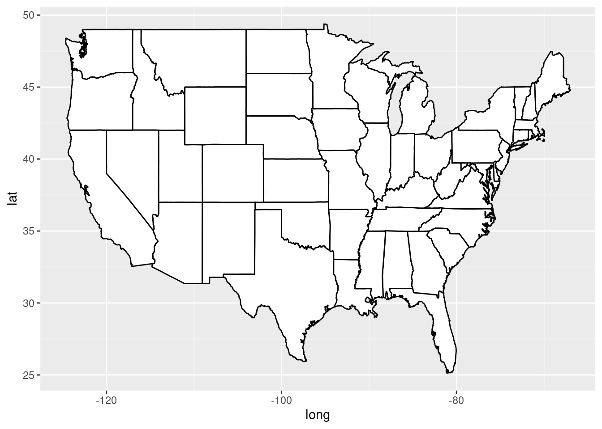
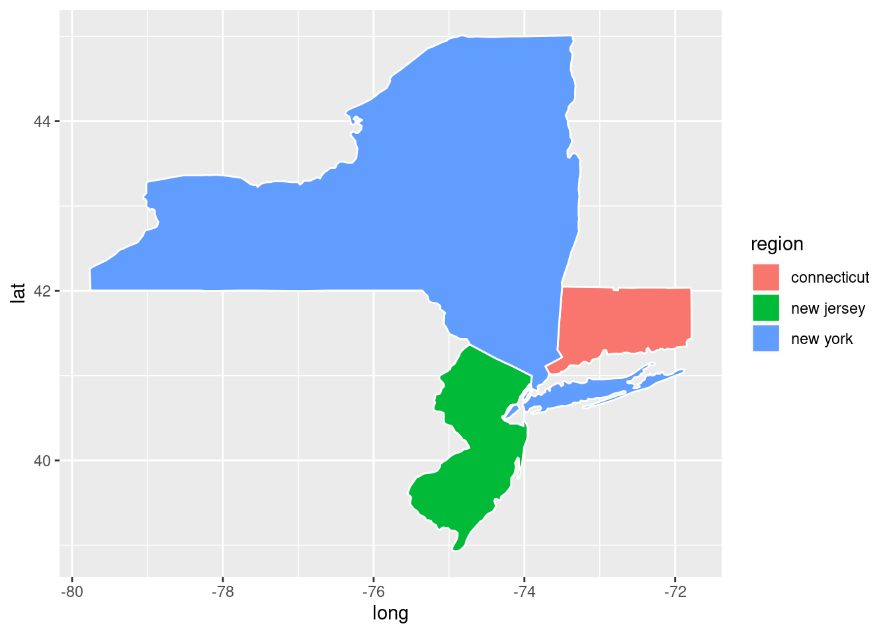
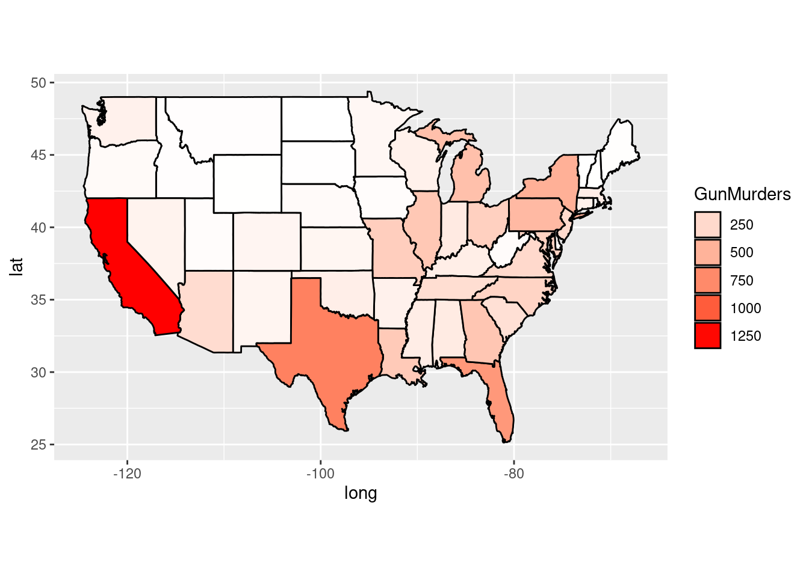

# Make Geographical Maps with Different Packages

Xindi Deng


```r
library(readr)
library(ggplot2)
library(sf)
library(osmextract)
```

## Introduction

When we do spacial analysis, we always focus on the map of USA and extract the dataset from maps package in R. However, the number of datasets in maps package is limited and it does not contain the information of sub-regions for many other countries, such as China, Japan and so on. 

In this tutorial, I first introduce a common way to plot a map by extracting coordinates from "maps" package, then I will talk about "osmextract" package which contains more information of geographical maps.

## Make geographical maps with "map" package 

To make a geographical map, we first need to know the coordinates of all region boundaries for the target country. Here I introduce two ways to extract the data. The first one is more user-friendly while the second one contains more data sets.

### Import dataset with function "map_data"

One of the most common and user-friendly functions to extract map data from maps package is "map_data". It can turn data from the maps package into a data frame suitable for plotting with ggplot2.


#### Usage of "map_data"
map_data(map, region = ".", exact = FALSE, ...)

 - map: the name of map provided by the maps package.
        
        The choices of map include a world map, three USA databases (usa, state, county), and more (including Italy database, France database, New Zealand database and so on). 
        We can use help(package='maps') to check what map data sets can be used by "map_data".

 - region: select sub-regions in the map. Default is ".".
 
#### Dataset exploration

Here we use map="state" as an example to see the format of function return


```r
statesMap <- map_data("state")
head(statesMap)
```

```
##        long      lat group order  region subregion
## 1 -87.46201 30.38968     1     1 alabama      <NA>
## 2 -87.48493 30.37249     1     2 alabama      <NA>
## 3 -87.52503 30.37249     1     3 alabama      <NA>
## 4 -87.53076 30.33239     1     4 alabama      <NA>
## 5 -87.57087 30.32665     1     5 alabama      <NA>
## 6 -87.58806 30.32665     1     6 alabama      <NA>
```
 The data set of "states" has 15537 coordinates and 6 features. 
 - long: the longitude of a coordinate on the boundaries
 - lat: the latitude of a coordinate on the boundaries
 - group: each minimum closed region has a unique group number
 - region: the name of a region
 

```r
unique(statesMap$region)
```

```
##  [1] "alabama"              "arizona"              "arkansas"            
##  [4] "california"           "colorado"             "connecticut"         
##  [7] "delaware"             "district of columbia" "florida"             
## [10] "georgia"              "idaho"                "illinois"            
## [13] "indiana"              "iowa"                 "kansas"              
## [16] "kentucky"             "louisiana"            "maine"               
## [19] "maryland"             "massachusetts"        "michigan"            
## [22] "minnesota"            "mississippi"          "missouri"            
## [25] "montana"              "nebraska"             "nevada"              
## [28] "new hampshire"        "new jersey"           "new mexico"          
## [31] "new york"             "north carolina"       "north dakota"        
## [34] "ohio"                 "oklahoma"             "oregon"              
## [37] "pennsylvania"         "rhode island"         "south carolina"      
## [40] "south dakota"         "tennessee"            "texas"               
## [43] "utah"                 "vermont"              "virginia"            
## [46] "washington"           "west virginia"        "wisconsin"           
## [49] "wyoming"
```

### Plot maps

#### The logic of ploting maps
To plot maps, we take each minimum closed region as a polygon. Since we know the coordinates on boundaries for each minimum closed region, we can plot each polygon by taking longitude as x-axis and taking latitude as y-axis. Since each minimum closed region has a unique group number, we can group the coordinates by the group number and plot all polygons on one graph.

#### Plot the map

```r
ggplot(statesMap,aes(x=long,y=lat,group=group))+
  geom_polygon(fill="white",color="black")
```


#### Plot sub-regions of a map

```r
NewYorkMap <- subset(statesMap, region %in% c("new jersey", "new york","connecticut"))
ggplot(NewYorkMap,aes(x=long,y=lat, group=group, fill = region))+
  geom_polygon(color="white")
```



#### Data visualization on the map

Step 1: prepare the data frame.

Import the dataset that need to be visualized as a data frame. Combine the new data frame with the data frame of map by region names. Then we can get the data frame suitable for plotting. 

```r
murders <- read_csv("./resources/make_geographical_maps_with_different_packages/murders.csv", show_col_types = FALSE)
murders$region=tolower(murders$State)
murderMap <- merge(statesMap,murders,by="region")
head(murderMap)
```

```
##    region      long      lat group order subregion   State Population
## 1 alabama -87.46201 30.38968     1     1      <NA> Alabama    4779736
## 2 alabama -87.48493 30.37249     1     2      <NA> Alabama    4779736
## 3 alabama -87.52503 30.37249     1     3      <NA> Alabama    4779736
## 4 alabama -87.53076 30.33239     1     4      <NA> Alabama    4779736
## 5 alabama -87.57087 30.32665     1     5      <NA> Alabama    4779736
## 6 alabama -87.58806 30.32665     1     6      <NA> Alabama    4779736
##   PopulationDensity Murders GunMurders GunOwnership
## 1             94.65     199        135        0.517
## 2             94.65     199        135        0.517
## 3             94.65     199        135        0.517
## 4             94.65     199        135        0.517
## 5             94.65     199        135        0.517
## 6             94.65     199        135        0.517
```

Step 2: plot the visualization result

```r
ggplot(murderMap,aes(x=long, y=lat, group=group,fill=GunMurders))+
  geom_polygon(color="black")+
  scale_fill_gradient(low="white",high="red",guide="legend")+
  coord_fixed(1.5)
```



## Make geographical maps with "osmextract" package 

Even though the defined function "map_data" is easy to use, maps package only contains the data of coordinates for a few countries. To extract the coordinates on boundaries for more countries, such as China, we can use "osmextract" package.

### Import dataset with object "openstreetmap_fr_zones"

"openstreetmap_fr_zones" is an sf object of geographical zones taken from download.openstreetmap.fr. 

#### Define a function to extract the coordinations data
I define a function called "extract_map_data", which can turn data from openstreetmap_fr_zones into a data frame suitable for plotting with ggplot2.


```r
library(sf)
library(osmextract) 
#> OpenStreetMap® is open data, licensed under the Open Data Commons Open Database License (ODbL) by the OpenStreetMap Foundation (OSMF).
#> Data (c) OpenStreetMap contributors, ODbL 1.0. https://www.openstreetmap.org/copyright.
#> Check the package website, https://docs.ropensci.org/osmextract/, for more details.

extract_map_data <- function(region_name){
  # get polygons in the target region
  poly_region <- openstreetmap_fr_zones[which(tolower(openstreetmap_fr_zones$parent) == region_name), ]

  # extract the coordinations and save the coordinations in a data.frame
  poly_region_coords <- as.data.frame(st_coordinates(poly_region))

  # extract the region name
  my_times <- vapply(st_geometry(poly_region), function(x) nrow(st_coordinates(x)), numeric(1))
  poly_region_coords$region_name <- rep(tolower(poly_region$name), times = my_times)
  
  # make the format of data frame similar to that from map_data and make it suitable for plotting with ggplot2
  poly_region_coords$group <- paste(poly_region_coords$L1,",",poly_region_coords$L2,",",poly_region_coords$L3)
  colnames(poly_region_coords) <- c("long","lat","group1","group2","group3", "region","group")
  
  # explore the data frame
  print(head(poly_region_coords))
  
  return <- poly_region_coords 
}
```

#### Usage of "extract_map_data"
extract_map_data(map)

 - map: the name of the region. All available regions are shown below.


```r
unique(tolower(openstreetmap_fr_zones$parent))
```

```
##  [1] NA                                 "africa"                          
##  [3] "spain"                            "asia"                            
##  [5] "china"                            "india"                           
##  [7] "indonesia"                        "japan"                           
##  [9] "central-america"                  "europe"                          
## [11] "austria"                          "belgium"                         
## [13] "czech_republic"                   "finland"                         
## [15] "france"                           "alsace"                          
## [17] "aquitaine"                        "auvergne"                        
## [19] "basse_normandie"                  "bourgogne"                       
## [21] "bretagne"                         "centre"                          
## [23] "champagne_ardenne"                "corse"                           
## [25] "franche_comte"                    "haute_normandie"                 
## [27] "ile_de_france"                    "languedoc_roussillon"            
## [29] "limousin"                         "lorraine"                        
## [31] "midi_pyrenees"                    "nord_pas_de_calais"              
## [33] "pays_de_la_loire"                 "picardie"                        
## [35] "poitou_charentes"                 "provence_alpes_cote_d_azur"      
## [37] "rhone_alpes"                      "germany"                         
## [39] "nordrhein_westfalen"              "italy"                           
## [41] "netherlands"                      "norway"                          
## [43] "poland"                           "portugal"                        
## [45] "seas"                             "slovakia"                        
## [47] "sweden"                           "switzerland"                     
## [49] "ukraine"                          "united_kingdom"                  
## [51] "england"                          "north-america"                   
## [53] "canada"                           "ontario"                         
## [55] "quebec"                           "us-west"                         
## [57] "california"                       "oceania"                         
## [59] "australia"                        "russia"                          
## [61] "central_federal_district"         "far_eastern_federal_district"    
## [63] "north_caucasian_federal_district" "northwestern_federal_district"   
## [65] "siberian_federal_district"        "southern_federal_district"       
## [67] "ural_federal_district"            "volga_federal_district"          
## [69] "south-america"                    "argentina"                       
## [71] "brazil"                           "central-west"                    
## [73] "north"                            "northeast"                       
## [75] "south"                            "southeast"
```


### Plot the map of China

```r
map2 = extract_map_data("china")
```

```
##      long    lat group1 group2 group3 region     group
## 1 114.900 32.950      1      1      1  anhui 1 , 1 , 1
## 2 114.930 32.915      1      1      1  anhui 1 , 1 , 1
## 3 115.000 32.920      1      1      1  anhui 1 , 1 , 1
## 4 115.000 32.905      1      1      1  anhui 1 , 1 , 1
## 5 115.015 32.890      1      1      1  anhui 1 , 1 , 1
## 6 115.120 32.885      1      1      1  anhui 1 , 1 , 1
```

```r
ggplot(map2,aes(x=long,y=lat,group=group))+
  geom_polygon(fill="white",color="black")
```


### Plot the map of Japan

```r
map2 = extract_map_data("japan")
```

```
##      long    lat group1 group2 group3 region     group
## 1 135.430 35.510      1      1      1  chubu 1 , 1 , 1
## 2 135.450 35.495      1      1      1  chubu 1 , 1 , 1
## 3 135.440 35.485      1      1      1  chubu 1 , 1 , 1
## 4 135.445 35.450      1      1      1  chubu 1 , 1 , 1
## 5 135.460 35.435      1      1      1  chubu 1 , 1 , 1
## 6 135.470 35.435      1      1      1  chubu 1 , 1 , 1
```

```r
ggplot(map2,aes(x=long,y=lat,group=group))+
  geom_polygon(fill="white",color="black")
```


References:

https://ggplot2.tidyverse.org/reference/map_data.html

https://cran.r-project.org/web/packages/osmextract/vignettes/osmextract.html
