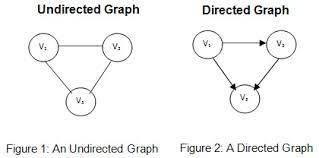
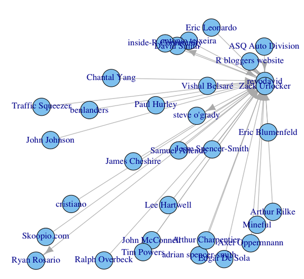
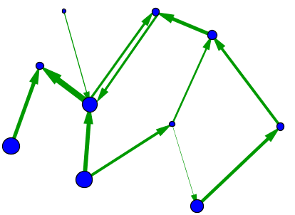
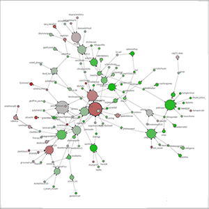
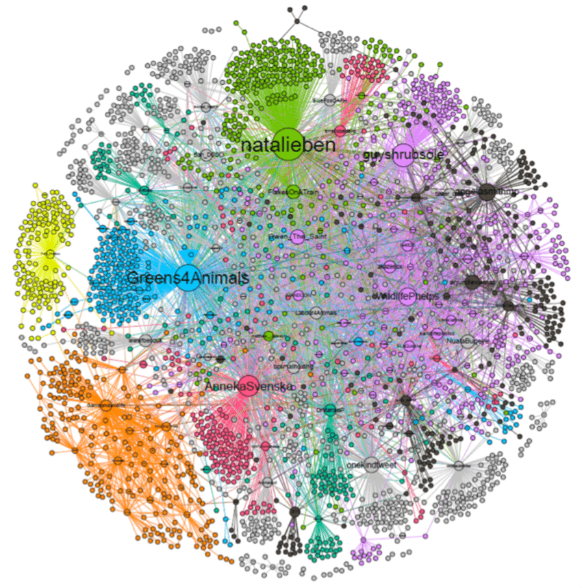

# Network analysis and social network analysis

Sam Fields

## What is a Network?

Network analysis is built upon the concept of a **network** (also referred to as a **graph**), which is constructed upon the definition of **nodes** (i.e. circles) and **edges** which connect the circles. In an **undirected network**, the direction of these edges is irrelevant, the edge simply shows that the connection exists. However, in a **directed network**, each edge will have a **source** and a **target**, the source being which node the edge came from and the target being which node the edge connects to.

(source: [http://omtlab.com/directed-and-undirected-graph/](http://omtlab.com/directed-and-undirected-graph/))

## Network Analysis and Social Network Anlysis

Under the pretense of analysis, a common subset of Network Analysis is the concept of **Social Network Analysis**. In this framework, one might think of the nodes as defined entities (people, organizations, social units of interest, etc) and the edges between the nodes as a defined social connection between the entities. For example, one might wish to define a social graph between Twitter users. In this case, you would likely define a directed graph with the nodes as the individual users and the edges would be directed edges depicting which users they follow.

(source: [https://blog.revolutionanalytics.com/2010/05/how-to-map-your-twitter-social-network.html](https://blog.revolutionanalytics.com/2010/05/how-to-map-your-twitter-social-network.html))

At this point, you might be wondering: "Great! This is amazing, but how do *quantify* things?". Great Question! Well, the easiest way is to introduce **weighting** into your graph. Each node and edge is allowed to have a weight, or a numerical value to it. In our Twitter example, a node weight we might wish to use would be the number of followers a user has. Furthermore, thinking about how we might wish to visualize a node or edge weighting, a common approach is to scale the size of the node or the thickness of an edge in proportion to its respective weighting. 

(source: [https://mathinsight.org/network_introduction](https://mathinsight.org/network_introduction))

This is so cool, right! But now, you might be thinking: "How do we categorize things?". Well, I am glad you asked. Like most other visualization approaches, we can introduce color. Each node and edge can be assigned a color to either depict categorize or a gradient.

(source: [https://www.weblyzard.com/social-network-analysis/](https://www.weblyzard.com/social-network-analysis/))

## Analyzing a Network

Ok, now that we have the properties of a network out of the way, how do we start **analyzing** it? Well, to start with, it might help to go over some quantifiable metrics of a network. 

If you are interested in positionality of the nodes in a network, such as what is most centered and what is most on the fringe, you might be interested in the **centrality** of your network. Centrality, generally, calculates the ranking of the nodes based on some central metric. For example, degree centrality takes into account the number and weighting of edges attached to a node such that nodes with more edges of higher weighting are more central for the network. Another approach to this question might be by calculating each node's **density**, in which density is defined as the number of edges a node has divided by the number of possible edges it could have in the whole network. So, we might think of a density as a normalized metric for node connectivity since each nodes density will be between 0 and 1.

If you are interested in uncovering community in a network, you might be interested in the method of **community detection**. In this genre of analysis, "community" is defined as a subset of nodes in the network such that some aspect of that subset separates them from the other nodes of the network, such as the subset of nodes shares a higher interrelated connectivity. One of the most common approaches is the **Louvain Algorithm**. At a super high level, this algorithm is a greedy algorithm that seeks to optimize the modularity, a measure of relative density of edges inside a community in comparison to outside of the community. It is pretty complicated, so if you wish to understand it in more detail, I would suggest you go here: [https://en.wikipedia.org/wiki/Louvain_method](https://en.wikipedia.org/wiki/Louvain_method). An example of a network in which the nodes were colored by a the result of a community detection workflow is provided below.

(source: [https://www.researchgate.net/figure/Social-network-for-the-Twitter-conversations-on-the-parliamentary-debate-on-banning_fig2_329210578](https://www.researchgate.net/figure/Social-network-for-the-Twitter-conversations-on-the-parliamentary-debate-on-banning_fig2_329210578)

# Network Analysis in R

Luckily, if you are hoping to start your own Network Analysis, there are many libraries and tutorials available to assist you. To start, I would suggest using the **tidygraph** R library. Tidygraph is a tidy framework built over the igraph framework. Meaning, rather than working with convoluted lists to keep track of nodes and edges and their relationship as you would using only the igraph library, tidygraph supports a more tabular framework, which is the standard in other network programming environments, such as NetworkX for python or Gephi for a GUI interface. A really succinct tutorial for working with the tidygraph library can be found here: [https://www.data-imaginist.com/2017/introducing-tidygraph/](https://www.data-imaginist.com/2017/introducing-tidygraph/). This tutorial should empower you with the ability to define and visualize your own network using the tidygraph library.

An advantage for using the tidygraph library is that, because it is built on top of the igraph framework, it also supports tidygraph and igraph network analysis functions, although the igraph functions are supported through a tidygraph wrapper. Meaning that the all of the analysis we went over earlier - centrality, density, community detection - and many other analytical methods are all natively supported and can all be conducted in a "tidy" workflow! While the previous tutorial also has sections on how to perform network analysis with the tidygraph library, another strong tutorial in this task written by Dr. David Garcia can be found here: [https://dgarcia-eu.github.io/SocialDataScience/5_SocialNetworkPhenomena/057_Tidygraph2/tidygraph2.html](https://dgarcia-eu.github.io/SocialDataScience/5_SocialNetworkPhenomena/057_Tidygraph2/tidygraph2.html). Following this tutorial should give you a strong understanding of how to work with the tidygraph api to derive these metrics our of your graph, and also how to incorporate the calculated metrics in the visualization of your graph as well!

Now that you're well equipped with the knowledge and tools of network analysis, I hope you enjoy networking!
