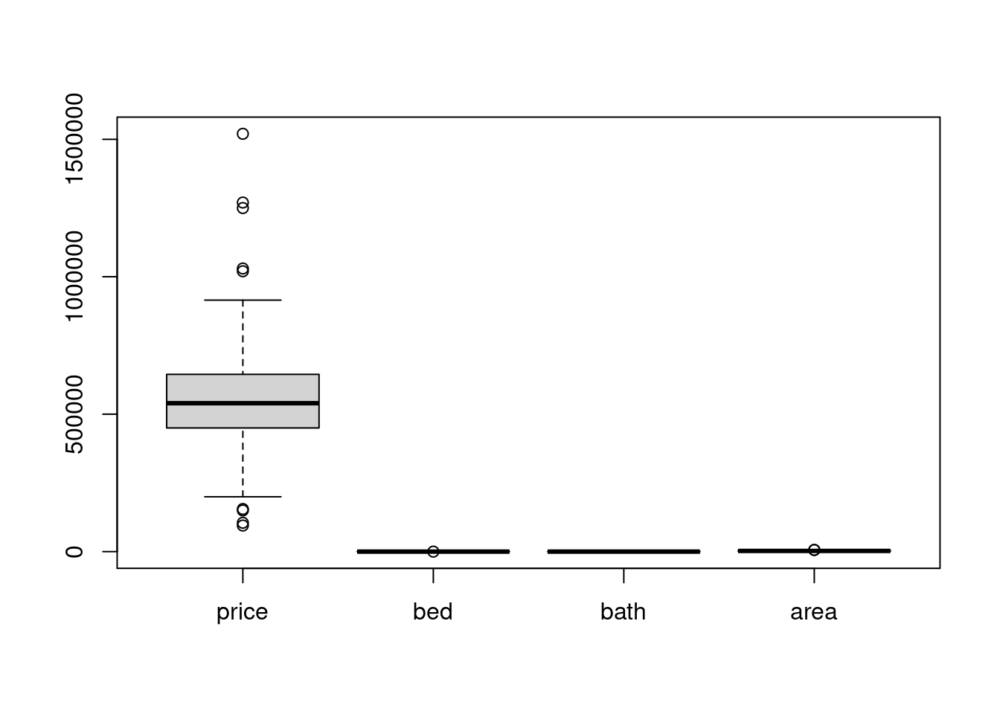
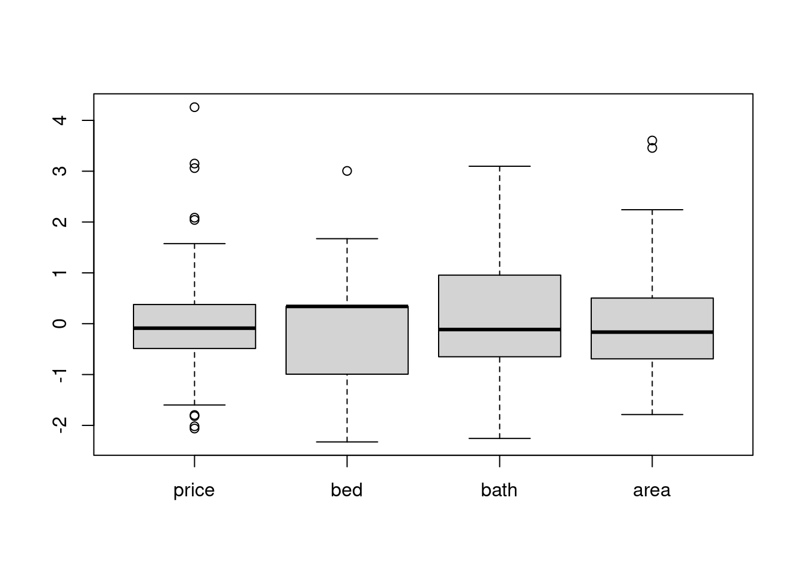
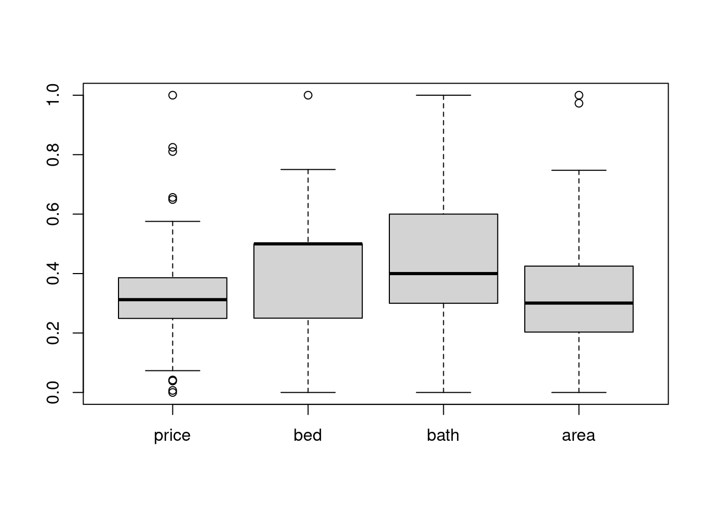

# Data cleaning with r

Jinchen Liu and Yudu Chen


```r
#install.packages(openintro)
library(openintro)

#install.packages('dplyr')
library(dplyr)

#install.packages('tidyr')
library(tidyr)

#install.packages(imputeTS)
library(imputeTS)
```


## Import data set

We will explore techniques of data cleaning using "Airquality" dataset from base R  and duke_forest data set from openintro. The data set is available in baseR and does not require import from outside source.


```r
airQuality_preProcessing <- airquality

head(airQuality_preProcessing, 10)
```

```
##    Ozone Solar.R Wind Temp Month Day
## 1     41     190  7.4   67     5   1
## 2     36     118  8.0   72     5   2
## 3     12     149 12.6   74     5   3
## 4     18     313 11.5   62     5   4
## 5     NA      NA 14.3   56     5   5
## 6     28      NA 14.9   66     5   6
## 7     23     299  8.6   65     5   7
## 8     19      99 13.8   59     5   8
## 9      8      19 20.1   61     5   9
## 10    NA     194  8.6   69     5  10
```

```r
duke_forest_copy <- duke_forest
```
## Introduction 
In the real world, the data sets we are handling are often not data scientists can readily use. They might contain duplicate entries when entries are supposed to be unique. They might contain missing values, which is problematic for tasks such as training predicative modeling. The data features might be at vastly different scale, which both induces instability of float point arithmatics and inaccurate measurement of feature importance in training machine learning model. We will discuss how to use R to clean Data sets where situations above take place. 


## Data frame modification (general modification)
For the most of the time, we will have to engineer our data sets before we do some data analyzation on them. Here I present some tricks to modify our dat sets in R.


### Create DataFrame by arrays
Creating DataFrame by two arrays, These two arrays will by columns of df.Array length should be the same.order matters.

```r
first_column <- c("value_1", "value_2", "value_3")
second_column <- c("value_4", "value_5", "value_6")
third_column <- c("value_7", "value_8", "value_9")
df <- data.frame(first_column, second_column)
df
```

```
##   first_column second_column
## 1      value_1       value_4
## 2      value_2       value_5
## 3      value_3       value_6
```
another way to create dataFrame, both method produce the same result.

```r
df <- data.frame (first_column  = c("value_1", "value_2", "value_3"),
                  second_column = c("value_4", "value_5", "value_6"),
                  third_column = c("value_7", "value_8", "value_9")
                  )
df
```

```
##   first_column second_column third_column
## 1      value_1       value_4      value_7
## 2      value_2       value_5      value_8
## 3      value_3       value_6      value_9
```
### Create DataFrame by combining two dataFrame(using cbind/rbind)

```r
# create a new dataFrame
df1 <- data.frame (first_column  = c("value_1", "value_2", "value_3"),
                  second_column = c("value_4", "value_5", "value_6"),
                  third_column = c("value_7", "value_8", "value_9")
                  )
df2 <- data.frame (third_column  = c("value_7", "value_8", "value_9"),
                  fourth_column = c("value_10", "value_11", "value_12")
                  )
# combine two dataframe by columns
# order matters.
bigger_df <- cbind(df1, df2)
print(bigger_df)
```

```
##   first_column second_column third_column third_column fourth_column
## 1      value_1       value_4      value_7      value_7      value_10
## 2      value_2       value_5      value_8      value_8      value_11
## 3      value_3       value_6      value_9      value_9      value_12
```

```r
# combine two dataframe by rows
# two DataFrames must have the same column name and order.
df3 <- data.frame (third_column = c("value_7", "value_8", "value_9"),
                  fourth_column = c("value_10", "value_11", "value_12")
                  )
bigger_df2 <- rbind(df2,df3)
print(bigger_df2)
```

```
##   third_column fourth_column
## 1      value_7      value_10
## 2      value_8      value_11
## 3      value_9      value_12
## 4      value_7      value_10
## 5      value_8      value_11
## 6      value_9      value_12
```

```r
# order matters.
```
### adding/change row name

```r
print(bigger_df2)
```

```
##   third_column fourth_column
## 1      value_7      value_10
## 2      value_8      value_11
## 3      value_9      value_12
## 4      value_7      value_10
## 5      value_8      value_11
## 6      value_9      value_12
```

```r
rownames(bigger_df2) <- LETTERS[16:21]

bigger_df2 <- data.frame(bigger_df2,
                   row.names = LETTERS[16:21])
# both ways produce the same result
print(bigger_df2)
```

```
##   third_column fourth_column
## P      value_7      value_10
## Q      value_8      value_11
## R      value_9      value_12
## S      value_7      value_10
## T      value_8      value_11
## U      value_9      value_12
```

```r
# rownames can change the row name.
rownames(bigger_df2) <- 1:6
print(bigger_df2)
```

```
##   third_column fourth_column
## 1      value_7      value_10
## 2      value_8      value_11
## 3      value_9      value_12
## 4      value_7      value_10
## 5      value_8      value_11
## 6      value_9      value_12
```

```r
## get row names
rownames(bigger_df2)
```

```
## [1] "1" "2" "3" "4" "5" "6"
```

### changing column names

```r
print(df)
```

```
##   first_column second_column third_column
## 1      value_1       value_4      value_7
## 2      value_2       value_5      value_8
## 3      value_3       value_6      value_9
```

```r
# change all column names
colnames(df) <- c('C1','C2')
print(df)
```

```
##        C1      C2      NA
## 1 value_1 value_4 value_7
## 2 value_2 value_5 value_8
## 3 value_3 value_6 value_9
```

```r
# change specific column name
colnames(df)[1] <- c('new column name')
print(df)
```

```
##   new column name      C2      NA
## 1         value_1 value_4 value_7
## 2         value_2 value_5 value_8
## 3         value_3 value_6 value_9
```

```r
#get column names
colnames(df)
```

```
## [1] "new column name" "C2"              NA
```

### Adding array to to dataFrame as new column

```r
print(bigger_df2)
```

```
##   third_column fourth_column
## 1      value_7      value_10
## 2      value_8      value_11
## 3      value_9      value_12
## 4      value_7      value_10
## 5      value_8      value_11
## 6      value_9      value_12
```

```r
bigger_df_new = bigger_df2

bigger_df_new$new <- c(3, 3, 6, 7, 8, 12)

bigger_df_new['new'] <- c(3, 3, 6, 7, 8, 12)

new <- c(3, 3, 6, 7, 8, 12)
bigger_df_new <- cbind(df, new)
# three ways produce the same result.
print(bigger_df_new)
```

```
##   new column name      C2      NA new
## 1         value_1 value_4 value_7   3
## 2         value_2 value_5 value_8   3
## 3         value_3 value_6 value_9   6
## 4         value_1 value_4 value_7   7
## 5         value_2 value_5 value_8   8
## 6         value_3 value_6 value_9  12
```

### adding column by combination of other columns

```r
# using mutate() from dplyr
df_math <- data.frame (first_column  = c(1, 2, 3),
                  second_column = c(4, 5, 6)
                  )

## add new column as mathematical operation of other columns.
output <- mutate(df_math,
                 sum = (first_column + second_column) / 2)
print(output)
```

```
##   first_column second_column sum
## 1            1             4 2.5
## 2            2             5 3.5
## 3            3             6 4.5
```

```r
## add new column by boolean operation of other columns.
output <- mutate(df_math,
                 divisible_by2 = case_when(
                   first_column%%2 == 0 ~ "yes",
                   TRUE ~ "No" # otherwise not divisiable by 2.
                 ))
print(output)
```

```
##   first_column second_column divisible_by2
## 1            1             4            No
## 2            2             5           yes
## 3            3             6            No
```

### joining two table **[1]**

```r
emp_df=data.frame(
  emp_id=c(1,2,3,4,5,6),
  name=c("Smith","Rose","Williams","Jones","Brown","Brown"),
  superior_emp_id=c(-1,1,1,2,2,2),
  dept_id=c(10,20,10,10,40,50),
  dept_branch_id= c(101,102,101,101,104,105)
)

dept_df=data.frame(
  dept_id=c(10,20,30,40),
  dept_name=c("Finance","Marketing","Sales","IT"),
  dept_branch_id= c(101,102,103,104)
)
# inner join
print(merge(x = emp_df, y = dept_df, by = "dept_id"))
```

```
##   dept_id emp_id     name superior_emp_id dept_branch_id.x dept_name
## 1      10      1    Smith              -1              101   Finance
## 2      10      3 Williams               1              101   Finance
## 3      10      4    Jones               2              101   Finance
## 4      20      2     Rose               1              102 Marketing
## 5      40      5    Brown               2              104        IT
##   dept_branch_id.y
## 1              101
## 2              101
## 3              101
## 4              102
## 5              104
```

```r
# outer join 
print(merge(x = emp_df, y = dept_df, by = "dept_id", all = TRUE)) # all means containing all rows
```

```
##   dept_id emp_id     name superior_emp_id dept_branch_id.x dept_name
## 1      10      1    Smith              -1              101   Finance
## 2      10      3 Williams               1              101   Finance
## 3      10      4    Jones               2              101   Finance
## 4      20      2     Rose               1              102 Marketing
## 5      30     NA     <NA>              NA               NA     Sales
## 6      40      5    Brown               2              104        IT
## 7      50      6    Brown               2              105      <NA>
##   dept_branch_id.y
## 1              101
## 2              101
## 3              101
## 4              102
## 5              103
## 6              104
## 7               NA
```

```r
# left join
print(merge(x = emp_df, y = dept_df, by = "dept_id", all.x = TRUE)) # all.x means containing all rows in x
```

```
##   dept_id emp_id     name superior_emp_id dept_branch_id.x dept_name
## 1      10      1    Smith              -1              101   Finance
## 2      10      3 Williams               1              101   Finance
## 3      10      4    Jones               2              101   Finance
## 4      20      2     Rose               1              102 Marketing
## 5      40      5    Brown               2              104        IT
## 6      50      6    Brown               2              105      <NA>
##   dept_branch_id.y
## 1              101
## 2              101
## 3              101
## 4              102
## 5              104
## 6               NA
```

```r
# right join
print(merge(x = emp_df, y = dept_df, by = "dept_id", all.y = TRUE)) # all.y means containing all rows in y
```

```
##   dept_id emp_id     name superior_emp_id dept_branch_id.x dept_name
## 1      10      1    Smith              -1              101   Finance
## 2      10      3 Williams               1              101   Finance
## 3      10      4    Jones               2              101   Finance
## 4      20      2     Rose               1              102 Marketing
## 5      30     NA     <NA>              NA               NA     Sales
## 6      40      5    Brown               2              104        IT
##   dept_branch_id.y
## 1              101
## 2              101
## 3              101
## 4              102
## 5              103
## 6              104
```

### pivoting dataframe, understanding pivot_longer

```r
# pivot_longer transform a data frame from a wide format to a long format by converting feature names to a categorical feature.

# pivot_longer is from the package tidyr.
needs_pivoting <- data.frame(sticker_type=c('A', 'B', 'C', 'D'),
                 sparrow=c(12, 15, 19, 19),
                 eagle=c(22, 29, 18, 12))

print(needs_pivoting)
```

```
##   sticker_type sparrow eagle
## 1            A      12    22
## 2            B      15    29
## 3            C      19    18
## 4            D      19    12
```

```r
needs_pivoting %>% pivot_longer(cols=c('sparrow', 'eagle'), # the columns(feature names) to be pivoted
                                names_to='species', # the name of the column of features
                                values_to='price') # the name of the column of values
```

```
## # A tibble: 8 × 3
##   sticker_type species price
##   <chr>        <chr>   <dbl>
## 1 A            sparrow    12
## 2 A            eagle      22
## 3 B            sparrow    15
## 4 B            eagle      29
## 5 C            sparrow    19
## 6 C            eagle      18
## 7 D            sparrow    19
## 8 D            eagle      12
```

#### binning using cut()

```r
hour_df <- data.frame(shop_name=c('MAC', 'Tangro', 'cummington', 'Burger King', 'judgement', 'KFC', 'ye', 'Dungeon', 'Razer', 'yeah sir', 'Koban wife', 'string'),
                 operating_hours=c(2, 5, 4, 7, 7, 8, 5, 4, 5, 11, 13, 8),
                 rebounds=c(7, 7, 4, 6, 3, 8, 9, 9, 12, 11, 8, 9))
hour_df
```

```
##      shop_name operating_hours rebounds
## 1          MAC               2        7
## 2       Tangro               5        7
## 3   cummington               4        4
## 4  Burger King               7        6
## 5    judgement               7        3
## 6          KFC               8        8
## 7           ye               5        9
## 8      Dungeon               4        9
## 9        Razer               5       12
## 10    yeah sir              11       11
## 11  Koban wife              13        8
## 12      string               8        9
```

```r
new_hour_df <- hour_df %>% mutate(operating_hours_bin = cut(operating_hours, breaks=c(0,5,9,13)))
new_hour_df
```

```
##      shop_name operating_hours rebounds operating_hours_bin
## 1          MAC               2        7               (0,5]
## 2       Tangro               5        7               (0,5]
## 3   cummington               4        4               (0,5]
## 4  Burger King               7        6               (5,9]
## 5    judgement               7        3               (5,9]
## 6          KFC               8        8               (5,9]
## 7           ye               5        9               (0,5]
## 8      Dungeon               4        9               (0,5]
## 9        Razer               5       12               (0,5]
## 10    yeah sir              11       11              (9,13]
## 11  Koban wife              13        8              (9,13]
## 12      string               8        9               (5,9]
```

####  binning using case()

```r
hour_df2 <- data.frame(shop_name=c('MAC', 'Tangro', 'cummington', 'Burger King', 'judgement', 'KFC', 'ye', 'Dungeon', 'Razer', 'yeah sir', 'Koban wife', 'string'),
                 operating_hours=c(2, 5, 4, 7, 7, 8, 5, 4, 5, 11, 13, 8),
                 rebounds=c(7, 7, 4, 6, 3, 8, 9, 9, 12, 11, 8, 9))
hour_df
```

```
##      shop_name operating_hours rebounds
## 1          MAC               2        7
## 2       Tangro               5        7
## 3   cummington               4        4
## 4  Burger King               7        6
## 5    judgement               7        3
## 6          KFC               8        8
## 7           ye               5        9
## 8      Dungeon               4        9
## 9        Razer               5       12
## 10    yeah sir              11       11
## 11  Koban wife              13        8
## 12      string               8        9
```

```r
new_hour_df <- hour_df2 %>% mutate(operating_hours_bin = case_when( # logistics
                   operating_hours <= 3 ~ 'very short',
                   operating_hours <= 6 & operating_hours > 3 ~ 'short',
                   operating_hours <= 10 & operating_hours > 6 ~ 'median',
                   operating_hours > 10 ~ 'long',
                   TRUE ~ 'what else will this be?'
                 ))
new_hour_df
```

```
##      shop_name operating_hours rebounds operating_hours_bin
## 1          MAC               2        7          very short
## 2       Tangro               5        7               short
## 3   cummington               4        4               short
## 4  Burger King               7        6              median
## 5    judgement               7        3              median
## 6          KFC               8        8              median
## 7           ye               5        9               short
## 8      Dungeon               4        9               short
## 9        Razer               5       12               short
## 10    yeah sir              11       11                long
## 11  Koban wife              13        8                long
## 12      string               8        9              median
```

### ordering

```r
student_result_wild=data.frame(name=c("Ram","Geeta","John","Paul",
                                 "Cassie","Geeta","Paul"),
                          maths=c(7,8,8,9,10,8,9),
                          science=c(5,7,6,8,9,7,8),
                          history=c(7,7,7,7,7,7,7),
                          id = c(9,2,3,5,13,2,5))
student_result_wild # data with out ordering
```

```
##     name maths science history id
## 1    Ram     7       5       7  9
## 2  Geeta     8       7       7  2
## 3   John     8       6       7  3
## 4   Paul     9       8       7  5
## 5 Cassie    10       9       7 13
## 6  Geeta     8       7       7  2
## 7   Paul     9       8       7  5
```

```r
# order data by certain variable (ascending)
student_result_wild[order(student_result_wild$id),]
```

```
##     name maths science history id
## 2  Geeta     8       7       7  2
## 6  Geeta     8       7       7  2
## 3   John     8       6       7  3
## 4   Paul     9       8       7  5
## 7   Paul     9       8       7  5
## 1    Ram     7       5       7  9
## 5 Cassie    10       9       7 13
```

```r
# order data by certain variable (descending)
student_result_wild[order(-student_result_wild$id),]
```

```
##     name maths science history id
## 5 Cassie    10       9       7 13
## 1    Ram     7       5       7  9
## 4   Paul     9       8       7  5
## 7   Paul     9       8       7  5
## 3   John     8       6       7  3
## 2  Geeta     8       7       7  2
## 6  Geeta     8       7       7  2
```

```r
# order data by multiple variable, the second orders the duplicates in first variable
student_result_wild[order(-student_result_wild$id, student_result_wild$science),]
```

```
##     name maths science history id
## 5 Cassie    10       9       7 13
## 1    Ram     7       5       7  9
## 4   Paul     9       8       7  5
## 7   Paul     9       8       7  5
## 3   John     8       6       7  3
## 2  Geeta     8       7       7  2
## 6  Geeta     8       7       7  2
```

### reference
[1] https://sparkbyexamples.com/r-programming/how-to-do-left-join-in-r/#:~:text=How%20to%20do%20left%20join%20on%20data%20frames%20in%20R,join%20data%20frames%20in%20R.


## Duplicated Values
In many cases, we observe duplicated values in a data set where every instances are supposed to be unique. We will now discussed how to handle duplicates.

### Data set with row-wise duplicates
Although the dataset we use in this example, airquality data, does not have duplicate, we will use it illustrate the techniques of handling duplicate data.

```r
data_duplicated_values = airQuality_preProcessing
```
We see the data frame should have no duplicate rows to begin with.

```r
print(paste0('number of duplicated rows in the data is ',sum(duplicated(data_duplicated_values))))
```

```
## [1] "number of duplicated rows in the data is 0"
```

Now we randomly pick 5 instances from the data frame and insert them into the data frame to induce duplication

```r
for (i in 1: 5)
{
  data_duplicated_values[nrow(data_duplicated_values)+1,] = data_duplicated_values[floor(runif(1, min = 1, max = nrow(data_duplicated_values))),]
}
```
We should now have 5 duplicated instances:


```r
print(paste0('number of duplicated rows in the data after insertion is ',sum(duplicated(data_duplicated_values))))
```

```
## [1] "number of duplicated rows in the data after insertion is 5"
```

The "duplicated(df)" returns a boolean array where each value at each index indicates if row at the same index in original data frame is duplicated or not. We can use 'duplicated(df)" to extract duplicated rows:

```r
data_duplicated_values[duplicated(data_duplicated_values),]
```

```
##     Ozone Solar.R Wind Temp Month Day
## 154    NA     255 12.6   75     8  23
## 155    12     120 11.5   73     6  19
## 156     7      48 14.3   80     7  15
## 157    96     167  6.9   91     9   1
## 158    18     313 11.5   62     5   4
```

By adding "!" before "duplicated(df)", we can negate logics in "duplicated(df)" and access non duplicate rows as a data frame:

```r
head(data_duplicated_values[!duplicated(data_duplicated_values),], 10)
```

```
##    Ozone Solar.R Wind Temp Month Day
## 1     41     190  7.4   67     5   1
## 2     36     118  8.0   72     5   2
## 3     12     149 12.6   74     5   3
## 4     18     313 11.5   62     5   4
## 5     NA      NA 14.3   56     5   5
## 6     28      NA 14.9   66     5   6
## 7     23     299  8.6   65     5   7
## 8     19      99 13.8   59     5   8
## 9      8      19 20.1   61     5   9
## 10    NA     194  8.6   69     5  10
```
There should be no duplicates


```r
print(paste0('duplicates in data frame formed by unique rows in original data frame is ',sum(duplicated(data_duplicated_values[!duplicated(data_duplicated_values),]))))
```

```
## [1] "duplicates in data frame formed by unique rows in original data frame is 0"
```

We can create a new reference to the data set with no duplicates. For the purpose of reusing "data_duplicated_values", I will just assign the new reference to itself:

```r
data_duplicated_values <- data_duplicated_values[!duplicated(data_duplicated_values),]
```
Now "data_duplicated_values" should have no duplicates:

```r
print(paste0('number of duplicated value after re setting reference is ', sum(duplicated(data_duplicated_values))))
```

```
## [1] "number of duplicated value after re setting reference is 0"
```

Another way is to use "distinct()" function from tidyverse package.

```r
for (i in 1: 5)
{
  data_duplicated_values[nrow(data_duplicated_values)+1,] = data_duplicated_values[floor(runif(1, min = 1, max = nrow(data_duplicated_values))),]
}
print(paste0('number of duplicate value in data frame before calling distinct is', sum(duplicated(data_duplicated_values))))
```

```
## [1] "number of duplicate value in data frame before calling distinct is5"
```

```r
data_duplicated_values <- data_duplicated_values %>% distinct()
print(paste0('number of duplicate value in data frame after calling distinct is', sum(duplicated(data_duplicated_values))))
```

```
## [1] "number of duplicate value in data frame after calling distinct is0"
```

### Duplicates based on specific columns
Some times duplication of elements in certain column/columns is not desirable. We want to be able to remove rows with duplication in specified columns. We first insert 5 rows with duplicates in "Day" and "Month", we should see "158" rows after insertion:

```r
print(paste0('number of rows before adding 5 duplicated rows on Day and Month is', nrow(data_duplicated_values)))
```

```
## [1] "number of rows before adding 5 duplicated rows on Day and Month is153"
```

```r
for (i in 1: 5)
{
  Ozone <- floor(runif(1,min = 0, max = 50))
  Solor <- floor(runif(1,min = 0, max = 300))
  Wind <- round(runif(1,min = 0, max = 20), 2)
  Temp <- floor(runif(1,min = 0, max = 20))
  
  random_index = floor(runif(1, min = 1, max = nrow(data_duplicated_values)))
  
  Month <- data_duplicated_values[random_index, 'Month']
  Day <- data_duplicated_values[random_index, 'Day']
  data_duplicated_values[nrow(data_duplicated_values)+1,] = c(Ozone, Solor, Wind, Temp, Month, Day)
  
}

print(paste0('number of rows after adding 5 duplicated rows on Day and Month is', nrow(data_duplicated_values)))
```

```
## [1] "number of rows after adding 5 duplicated rows on Day and Month is158"
```

We can remove rows with duplicated "Day" and "Month" combination using "distinct()". The ".keep_all = TRUE" argument makes sure that for each duplicated combination of Day and Month, we keep the first row for every duplicated combination and we keep all variables in the Data. We should observe the number of rows after dropping dupicated columns going back to "153", which is the size of data frame before we insert rows with duplicated "Day" and "Month" combinations.

```r
data_duplicated_values<- data_duplicated_values %>% distinct(Day, Month, .keep_all = TRUE)
print(paste0('number of rows after removing 5 duplicated rows on Dat and Month is', nrow(data_duplicated_values)))
```

```
## [1] "number of rows after removing 5 duplicated rows on Dat and Month is153"
```


## Missing Values
Encountering missing data in dataset is not uncommon. When collecting temperature data the sensor might be broken and unable to measure temperature. When conduct public opinion surveying, the interviewee might forget filling entires on questionaires. Many data science job requires completeness of data, such as training predicative model based on numerical/categorical data. We will now discuss doing data cleaning in R.


### NA in R
In R, a missing value is represented by symbol "NA". 

```r
head(airquality, 10)
```

```
##    Ozone Solar.R Wind Temp Month Day
## 1     41     190  7.4   67     5   1
## 2     36     118  8.0   72     5   2
## 3     12     149 12.6   74     5   3
## 4     18     313 11.5   62     5   4
## 5     NA      NA 14.3   56     5   5
## 6     28      NA 14.9   66     5   6
## 7     23     299  8.6   65     5   7
## 8     19      99 13.8   59     5   8
## 9      8      19 20.1   61     5   9
## 10    NA     194  8.6   69     5  10
```
We can observe, at index 5, the instance has missing value in "Ozone" and "Solar.R" feasure, represented by symbol "NA".
### Dropping rows with missing data
A simple approach is to drop rows with missing data. If our task requires using all features in dataset, we can opt to drop all rows with at least one missing value. However, if our task required using some features, we only need to drop rows with missing values in feastures we specify. We will discuss both cases. 
#### Drop all rows containing missing Data
Suppose we want to use all features in "airquality" dataset and we want to drop all rows with at least 1 missing values. We first check number of rows with missing data in the dataset. The 'is.na(df)' command returns a boolean array, where truth value at each index indicate if data element at the same index in data frame df is NA or not. By summing number of "TRUE" values in the 'is.na(df)', we know total number of missing values in the data set.


```r
print(paste0('total number of missing values is ', sum(is.na(airQuality_preProcessing))))
```

```
## [1] "total number of missing values is 44"
```
We see we have totally 44 missing  with at least 1 missing values.
To know number of rows with missing value, we use "complete.cases(df)". The return an array of boolean where boolean value at each index indicate if data instance/case at the corresponding row index in data frame  df is complete (having no NA the missing value) or not. By summing the number of false in the array, we get the total number of rows that has at least 1 missing value.

```r
print(paste0("number of rows with at least 1 missing value is ", sum(!complete.cases(airQuality_preProcessing))))
```

```
## [1] "number of rows with at least 1 missing value is 42"
```
To visualize all rows with missing value, we can access them using the boolean array from "complete.cases()". Due to large number of rows with missing value, we only put 10 here:

```r
head(airQuality_preProcessing[!complete.cases(airQuality_preProcessing), ], 10)
```
We now remove rows with na. We use "drop_na()" function from tidyr library to remove all rows with missing values. There are multiple ways to drop rows with missing value, but we will not go exhaustive on this.


```r
airQuality_na_droped <- airQuality_preProcessing %>% drop_na()
print(paste0("number of missing values after we drop all NA is ",sum(is.na(airQuality_na_droped))))
```

```
## [1] "number of missing values after we drop all NA is 0"
```

```r
print(paste0("number of rows in data frame after extracting rows with NA is ", nrow(airQuality_na_droped)))
```

```
## [1] "number of rows in data frame after extracting rows with NA is 111"
```
After removing all 42 rows with missing values, we only have 111 rows left, with 42 rows removed from total 153 rows in original data frame. 

#### Drop rows with missing data in specified columns

##### NA in single column
We can see dropping all columns with missing data could be wasteful if we don't use all features in the dataset. For example, if our job does not require feature "Ozone", we don't really care if "Ozone" value is missing or not as it is irrelevant to our task. We will explore how to drop rows with na in specific columns.

We see "is.na(df)" evaluate presence of NA(missing value) in the entire data set. If we change its argument from df, the entire data set, into a specific column, the function will only evaluate specific columns in the data set and return a boolean array that only reflects presence of missing value at the columns. For example, if we want to see number of rows with missing value in "Ozone" column:

```r
print(paste0('number of NA in Ozone column is ', sum(is.na(airQuality_preProcessing$Ozone))))
```

```
## [1] "number of NA in Ozone column is 37"
```
There are 37 rows with NA in "Ozone" column. To drop rows with missing value in "Ozone", we put column name "Ozone" as argument:

```r
airQuality_na_droped_Ozone <- airQuality_preProcessing %>% drop_na(Ozone)
print(nrow(airQuality_na_droped_Ozone))
```

```
## [1] 116
```
37 rows are extracted from 153 columns, resulting in 116 rows.

##### NA in several columns (And)

If we want to drop rows with NA in specific column, for example, rows with NA in both "Ozone" and "Solar.R" columns, we can take advantage of the fact that "is.na(df)" is a boolean array, and we can perform element wise boolean operation in two arrays of same dimension:


```r
sum(is.na(airQuality_preProcessing$Ozone) & is.na(airQuality_preProcessing$Solar.R))
```

```
## [1] 2
```
We see number of rows with missing value in both "Ozone" and "Solar.R" is 2. We now visualize two rows:

```r
airQuality_preProcessing[is.na(airQuality_preProcessing$Ozone) & is.na(airQuality_preProcessing$Solar.R), ]
```

```
##    Ozone Solar.R Wind Temp Month Day
## 5     NA      NA 14.3   56     5   5
## 27    NA      NA  8.0   57     5  27
```
Having the boolean array, we can negate the logics and obtain all rows where we don't have missing values in "Ozone" and "Solar.R" at the same time.


```r
airQuality_NA_Ozone_and_Solor <- airQuality_preProcessing[!(is.na(airQuality_preProcessing$Ozone) & is.na(airQuality_preProcessing$Solar.R)), ]
nrow(airQuality_NA_Ozone_and_Solor)
```

```
## [1] 151
```
We have droped two rows from 153 rows in original dataset, so we have 151 rows left. 

##### NA in several columns (Or)
What if we want to drop columns with NA in "Ozone" or "Solar.R", such that if any of the two columns contains missing values.  We could have used boolean operation between several boolean arrays as we did, but it could be tedious as we have more feastures to consider. We could use "complete.cases()" but use specific columns in dataset as input. The "complete.cases()" returns false if a single column in the rows in data frame we pass in has a missing value, so we could perform "or" operation with it. 

```r
sum(!(complete.cases(airQuality_preProcessing[,c("Ozone","Solar.R")])))
```

```
## [1] 42
```
There are 42 rows with missing values in either "Ozone" or "Solar.R", or both. In fact, missing values only appear in those two columns, such that we get the total number of rows with missing values in the data set. We can obtain all datas that does not having missing value in "Ozone" or "Solar.R".

```r
airQuality_NA_Ozone_or_Solor<- airQuality_preProcessing[(complete.cases(airQuality_preProcessing[,c("Ozone","Solar.R")])), ]
nrow(airQuality_NA_Ozone_or_Solor)
```

```
## [1] 111
```
We have 111 rows after removing 42 rows with missing value on either "Ozone" or "Solar.R"

We can also use drop_na() to with columns specified in function arguement:

```r
airQuality_NA_Ozone_or_Solor<- airQuality_preProcessing %>% drop_na(c("Ozone", "Solar.R"))
nrow(airQuality_NA_Ozone_or_Solor)
```

```
## [1] 111
```
##### Drop columns with certain number of NA
This might be uncommon, but we might want to drop rows with more than certain number of NA, such as rows with more than 3 NA and even rows with number of NA equal to number of columns, which means the row has all column value being NA. To know number of NA in each row, we can use "rowSums()" functions:

```r
head(rowSums(is.na(airQuality_preProcessing)),10)
```

```
##  [1] 0 0 0 0 2 1 0 0 0 1
```
This means for row 1 to row 10, row 5 has 2 NA and row 6 and 10 has 1 NA. We can drop all rows with number of NA above certain threshold. We now insert 3 rows with 3 NA into the data frame.

```r
airQuality_3NA_Inserted <- airQuality_preProcessing
for (i in 1: 3)
{
  Ozone <- floor(runif(1,min = 0, max = 50))
  Solor <- floor(runif(1,min = 0, max = 300))
  Wind <- round(runif(1,min = 0, max = 20), 2)
  Temp <- floor(runif(1,min = 0, max = 20))
  
  random_index = floor(runif(1, min = 1, max = nrow(airQuality_3NA_Inserted)))
  
  Month <- airQuality_3NA_Inserted [random_index, 'Month']
  Day <- airQuality_3NA_Inserted [random_index, 'Day']
  
  
  toInsert <- c(Ozone, Solor, Wind, Temp, Month, Day)
  for (i in 1:3) {
    random_index = floor(runif(1, min = 1, max = 6))
    if (is.na(toInsert[random_index])) {
      random_index = floor(runif(1, min = 1, max = 6))
    }
    toInsert <- replace(toInsert, random_index, NA)
  }

  airQuality_3NA_Inserted [nrow(airQuality_3NA_Inserted )+1,] <- toInsert
  
  
}
tail(airQuality_3NA_Inserted, 3)
```

```
##     Ozone Solar.R  Wind Temp Month Day
## 154    14     133  6.11   NA    NA   8
## 155    24      21    NA   NA    NA  25
## 156    23      NA 13.52   16    NA  10
```

```r
print(paste('number of rows in airQuality_3NA_Inserted is', nrow(airQuality_3NA_Inserted)))
```

```
## [1] "number of rows in airQuality_3NA_Inserted is 156"
```
Now last 3 rows have 3 NA at tail of airQuality_3NA_Inserted. We now check number of rows with more than or equal to 3 NA:


```r
print(paste0("number of rows with at least 3 NA in airQuality_3NA_Inserted is ", sum(rowSums(is.na(airQuality_3NA_Inserted)) >= 3)))
```

```
## [1] "number of rows with at least 3 NA in airQuality_3NA_Inserted is 1"
```
Now we have 3 rows with at least 3 NA. We now drop rows with at least 3 NA from airQuality_3NA_Inserted by selecting rows with NA less than 3 and reset reference of airQuality_3NA_Inserted:

```r
airQuality_3NA_Inserted <- airQuality_3NA_Inserted[!(rowSums(is.na(airQuality_3NA_Inserted)) >= 3), ]

print(paste0("number of rows in airQuality_3NA_Inserted after dropping is ", nrow(airQuality_3NA_Inserted)))
```

```
## [1] "number of rows in airQuality_3NA_Inserted after dropping is 155"
```
We have drop all 3 rows with at least 3 NA, so the size of airQuality_3NA_Inserted drops from 156 to 153.

### Impute
Dropping rows is a straight forward approach. However, dropping too many drows would induce huge data loss, which would be detrimental to our task. We can insert values we specify into entries with missing values. This will minimize data loss. Though we would never know if imputed values could reflect the true pattern of the data.

#### Impute numerical values

##### Impute with constant
For a column with missing value,we select a constant we think will reflect the real data and fill missing entry in the column with the constant we have selected.

Let's say we use constant 30 to fill "Ozone" entries with missing values.

```r
airQuality_const_filled <- airQuality_preProcessing
print(paste0("number of missing values in Ozone column is ", sum(is.na(airQuality_const_filled$Ozone))))
```

```
## [1] "number of missing values in Ozone column is 37"
```

```r
head(airQuality_const_filled , 5)
```

```
##   Ozone Solar.R Wind Temp Month Day
## 1    41     190  7.4   67     5   1
## 2    36     118  8.0   72     5   2
## 3    12     149 12.6   74     5   3
## 4    18     313 11.5   62     5   4
## 5    NA      NA 14.3   56     5   5
```
We now fill:

```r
airQuality_const_filled$Ozone <- na_replace(airQuality_const_filled$Ozone, fill = 30, maxgap = Inf)
print(paste0("number of missing values in Ozone column is ", sum(is.na(airQuality_const_filled$Ozone))))
```

```
## [1] "number of missing values in Ozone column is 0"
```

```r
head(airQuality_const_filled , 5)
```

```
##   Ozone Solar.R Wind Temp Month Day
## 1    41     190  7.4   67     5   1
## 2    36     118  8.0   72     5   2
## 3    12     149 12.6   74     5   3
## 4    18     313 11.5   62     5   4
## 5    30      NA 14.3   56     5   5
```
We see NA in Ozone column of row 5 is imputed by constant 30.

* Pro
    + Easy to understand.
* Con
    + Value assigned by human intuition is too arbitrary and might be unrealistic.
    
##### Impute with Sample statistics
We can impute missing values in a column using sample statistics of the columns such as mean and median. This way we fill the missing value and does not alter data statistics in the column. We now fill "Ozone" column with current "Mean" of "Ozone" column and "Solar.R" with median of "Solar.R" column. Note the "na.rm = True" arguement is to neglect missing value when computing sample statistics so that we get a real value answer.


```r
airQuality_sstat_impute <- airQuality_preProcessing
print(paste0("Mean of Ozone before impute is ", mean(airQuality_sstat_impute$Ozone, na.rm = TRUE)))
```

```
## [1] "Mean of Ozone before impute is 42.1293103448276"
```

```r
print(paste0("Median of Solar.R before impute is ", median(airQuality_sstat_impute$Solar.R, na.rm = TRUE)))
```

```
## [1] "Median of Solar.R before impute is 205"
```

```r
print(paste0("number of missing values in Ozone column before impute is ", sum(is.na(airQuality_sstat_impute$Ozone))))
```

```
## [1] "number of missing values in Ozone column before impute is 37"
```

```r
print(paste0("number of missing values in Solar.R column before impute is ", sum(is.na(airQuality_sstat_impute$Solar.R))))
```

```
## [1] "number of missing values in Solar.R column before impute is 7"
```

```r
airQuality_sstat_impute$Ozone <- na_mean(airQuality_sstat_impute$Ozone, option = "mean", maxgap = Inf)
airQuality_sstat_impute$Solar.R <- na_mean(airQuality_sstat_impute$Solar, option = "median", maxgap = Inf)

print(paste0("Mean of Ozone after impute is ", mean(airQuality_sstat_impute$Ozone)))
```

```
## [1] "Mean of Ozone after impute is 42.1293103448276"
```

```r
print(paste0("Median of Solar.R after impute is ", median(airQuality_sstat_impute$Solar.R)))
```

```
## [1] "Median of Solar.R after impute is 205"
```

```r
print(paste0("number of missing values in Ozone column after impute is ", sum(is.na(airQuality_sstat_impute$Ozone))))
```

```
## [1] "number of missing values in Ozone column after impute is 0"
```

```r
print(paste0("number of missing values in Solar.R column after impute is ", sum(is.na(airQuality_sstat_impute$Solar.R))))
```

```
## [1] "number of missing values in Solar.R column after impute is 0"
```
We see we no longer have missing values in both columns and mean in "Ozone" column and median in "Solar.R" are both unchanging from before the impute.
    
* Pro
    + Easy to understand.
    + Does not change sample statistics 
* Con
    + Maybe the distribution of valid values in columns are skewed to left or right or have many outliers such that sample statistics do not reflect actual pattern of data
    
##### Impute by value adjacent to Missing value
Often in time-series data, value on a time point is highly assosicated with most adjacent valid values. Therefore, we want to fill a missing entries using valid data values before or after it. 

```r
airQuality_Adjacent_impute <- airQuality_preProcessing
head(airQuality_Adjacent_impute, 10)
```

```
##    Ozone Solar.R Wind Temp Month Day
## 1     41     190  7.4   67     5   1
## 2     36     118  8.0   72     5   2
## 3     12     149 12.6   74     5   3
## 4     18     313 11.5   62     5   4
## 5     NA      NA 14.3   56     5   5
## 6     28      NA 14.9   66     5   6
## 7     23     299  8.6   65     5   7
## 8     19      99 13.8   59     5   8
## 9      8      19 20.1   61     5   9
## 10    NA     194  8.6   69     5  10
```
We first fill missing values in Ozone column with last observed valid value:

```r
airQuality_Adjacent_impute$Ozone <- na_locf(airQuality_Adjacent_impute$Ozone, option = "locf")
```
We then fill missing values in Solar.R column with next observed valid value

```r
airQuality_Adjacent_impute$Solar.R <- na_locf(airQuality_Adjacent_impute$Solar.R, option = "nocb")
head(airQuality_Adjacent_impute, 10)
```

```
##    Ozone Solar.R Wind Temp Month Day
## 1     41     190  7.4   67     5   1
## 2     36     118  8.0   72     5   2
## 3     12     149 12.6   74     5   3
## 4     18     313 11.5   62     5   4
## 5     18     299 14.3   56     5   5
## 6     28     299 14.9   66     5   6
## 7     23     299  8.6   65     5   7
## 8     19      99 13.8   59     5   8
## 9      8      19 20.1   61     5   9
## 10     8     194  8.6   69     5  10
```

If we have missing value at beginning or end of data frame, which is rare, we can remedy using "na_remaining" argument in "na_locf()" to handle remaining missing value after filling. More details can be found in imputeTS documentation.

* Pro
    + For time series data, using adjacent value that are close could capture time dependent pattern 
    
* Con
    + If cloested adjacent value is too far away, filling adjacent value would not sustain time dependent pattern. 
    

##### Impute using predicative model
If we believe certain features in the data frame depends on some other features, we can use other features to fit a predicative model to predict missing value in certain feature. We need to make sure the "other features" our prediction is based on are all valid entries, which we need to impute using some method. We now assume "Ozone" and "Solar.R" features depends on climate related features such as "Wind" and "Temperature", and we build linear regression models for "Ozone" and "Solar.R" based on "Wind" and "Temperature".

```r
airQuality_lm_impute <- airQuality_preProcessing


head(airQuality_lm_impute, 10)
```

```
##    Ozone Solar.R Wind Temp Month Day
## 1     41     190  7.4   67     5   1
## 2     36     118  8.0   72     5   2
## 3     12     149 12.6   74     5   3
## 4     18     313 11.5   62     5   4
## 5     NA      NA 14.3   56     5   5
## 6     28      NA 14.9   66     5   6
## 7     23     299  8.6   65     5   7
## 8     19      99 13.8   59     5   8
## 9      8      19 20.1   61     5   9
## 10    NA     194  8.6   69     5  10
```

```r
print(paste0('number of missing values in Ozone column before impute is ', sum(is.na(airQuality_lm_impute$Ozone))))
```

```
## [1] "number of missing values in Ozone column before impute is 37"
```

```r
print(paste0('number of missing values in Solar.R column before impute is ', sum(is.na(airQuality_lm_impute$Solar.R))))
```

```
## [1] "number of missing values in Solar.R column before impute is 7"
```


```r
linear_model_Ozone <- lm(Ozone ~ Wind + Temp, data = airQuality_lm_impute)
linear_model_Solar.R <- lm(Solar.R ~ Wind + Temp, data = airQuality_lm_impute)

airQuality_lm_impute$Ozone[is.na(airQuality_lm_impute$Ozone)] <- predict(linear_model_Ozone, 
                                                                         newdata = airQuality_lm_impute[is.na(airQuality_lm_impute$Ozone),c('Wind', 'Temp')])


airQuality_lm_impute$Solar.R[is.na(airQuality_lm_impute$Solar.R)] <- predict(linear_model_Solar.R, 
                                                                         newdata = airQuality_lm_impute[is.na(airQuality_lm_impute$Solar.R),c('Wind', 'Temp')])

head(airQuality_lm_impute, 10)
```

```
##        Ozone  Solar.R Wind Temp Month Day
## 1   41.00000 190.0000  7.4   67     5   1
## 2   36.00000 118.0000  8.0   72     5   2
## 3   12.00000 149.0000 12.6   74     5   3
## 4   18.00000 313.0000 11.5   62     5   4
## 5  -11.67673 127.4317 14.3   56     5   5
## 6   28.00000 159.5042 14.9   66     5   6
## 7   23.00000 299.0000  8.6   65     5   7
## 8   19.00000  99.0000 13.8   59     5   8
## 9    8.00000  19.0000 20.1   61     5   9
## 10  29.66190 194.0000  8.6   69     5  10
```

Since the original data are integer, We now convert "Ozone" and "Solar.R" back to integer from double.


```r
airQuality_lm_impute$Ozone <- as.integer(airQuality_lm_impute$Ozone)
airQuality_lm_impute$Solar.R <- as.integer(airQuality_lm_impute$Solar.R)
head(airQuality_lm_impute, 10)
```

```
##    Ozone Solar.R Wind Temp Month Day
## 1     41     190  7.4   67     5   1
## 2     36     118  8.0   72     5   2
## 3     12     149 12.6   74     5   3
## 4     18     313 11.5   62     5   4
## 5    -11     127 14.3   56     5   5
## 6     28     159 14.9   66     5   6
## 7     23     299  8.6   65     5   7
## 8     19      99 13.8   59     5   8
## 9      8      19 20.1   61     5   9
## 10    29     194  8.6   69     5  10
```

```r
linear_model_Ozone 
```

```
## 
## Call:
## lm(formula = Ozone ~ Wind + Temp, data = airQuality_lm_impute)
## 
## Coefficients:
## (Intercept)         Wind         Temp  
##     -71.033       -3.055        1.840
```

```r
linear_model_Solar.R
```

```
## 
## Call:
## lm(formula = Solar.R ~ Wind + Temp, data = airQuality_lm_impute)
## 
## Coefficients:
## (Intercept)         Wind         Temp  
##     -76.362        2.211        3.075
```

We have now filled missing values using linear regresison model prediction from valid values from other columns.


```r
print(paste0('number of missing values in Ozone column after impute is ', sum(is.na(airQuality_lm_impute$Ozone))))
```

```
## [1] "number of missing values in Ozone column after impute is 0"
```

```r
print(paste0('number of missing values in Solar.R column after impute is ', sum(is.na(airQuality_lm_impute$Solar.R))))
```

```
## [1] "number of missing values in Solar.R column after impute is 0"
```
* Pro
    + If the feature predict indeed depend on other features of the data set, the missing value will be replace by values that reflect the true pattern.
    
* Con
    + Depending on what predicative model we use, the training and prediction could be computationally expensive. 
    + If the feature we predict does not depend on other features in data set we select to construct predicative model, the filled missing value will be mis leading for our future analysis.


#### Impute categorical features 

As for imputing categorical features, 

Replacing NA in categorical features with string

```r
na_df <- data.frame(A = c(NA, 7, 8, 5, 3),
                     B = c(4, 10, NA, 7, 4), 
                    fantasy = c("sad", "we", NA, 'adf', 'NA'),
                     C = c(1, 0, NA, 9, NA), 
                     D = c("tangro", "ok", NA, 'yes', 'NA'))
i1 <- !sapply(na_df, is.numeric)

na_df[i1] <- lapply(na_df[i1], function(x)
              replace(x, is.na(x), 'MISSING'))
na_df
```

```
##    A  B fantasy  C       D
## 1 NA  4     sad  1  tangro
## 2  7 10      we  0      ok
## 3  8 NA MISSING NA MISSING
## 4  5  7     adf  9     yes
## 5  3  4      NA NA      NA
```

Replacing NA in categorical features with mode **[1]**

```r
na_df <- data.frame(A = c(NA, 7, 8, 5, 3),
                     B = c(4, 10, NA, 7, 4), 
                    fantasy = c("sad", "we", NA, 'adf', 'NA'),
                     C = c(1, 0, NA, 9, NA), 
                     D = c("tangro", "ok", NA, 'yes', 'NA'))
i1 <- !sapply(na_df, is.numeric)
Mode <- function(x) { 
      ux <- sort(unique(x))
      ux[which.max(tabulate(match(x, ux)))] 
}
na_df[i1] <- lapply(na_df[i1], function(x)
              replace(x, is.na(x), Mode(x[!is.na(x)])))
na_df
```

```
##    A  B fantasy  C      D
## 1 NA  4     sad  1 tangro
## 2  7 10      we  0     ok
## 3  8 NA     adf NA     NA
## 4  5  7     adf  9    yes
## 5  3  4      NA NA     NA
```

### Reference
[1]https://stackoverflow.com/questions/36377813/impute-most-frequent-categorical-value-in-all-columns-in-data-frame

## Data scaling
Scaling is important for data analysis and exploration, Data without scaling can produce misleading result. Also scaling is beneficial for mathematics computation and machine learning.


### standardization
Standardization unify all the samples' mean and std to 0 and 1, so we could compare the distribution among the scaled samples.

```r
# we can use the scale from dplyr
library(dplyr)
library(openintro)
scale_df = duke_forest_copy[, 2:5]
# what happen if we did not scale.
boxplot(scale_df)
```



```r
# after scaling
scale_df %>% mutate_all(~(scale(.) %>% as.vector)) %>% boxplot() # apply scale() to every column
```



### Min Max scaling 
MINMAX scaling is good for svm, so don't hesistate to use it :)

```r
minmax <- function(x, na.rm = TRUE) {
    return((x- min(x)) /(max(x)-min(x)))
}
scale_df = duke_forest_copy[, 2:5]
# what happen if we did not scale.
boxplot(scale_df)
```


```r
scale_df %>% mutate_all(~(minmax(.) %>% as.vector)) %>% boxplot() # apply minmax() to every column
```




