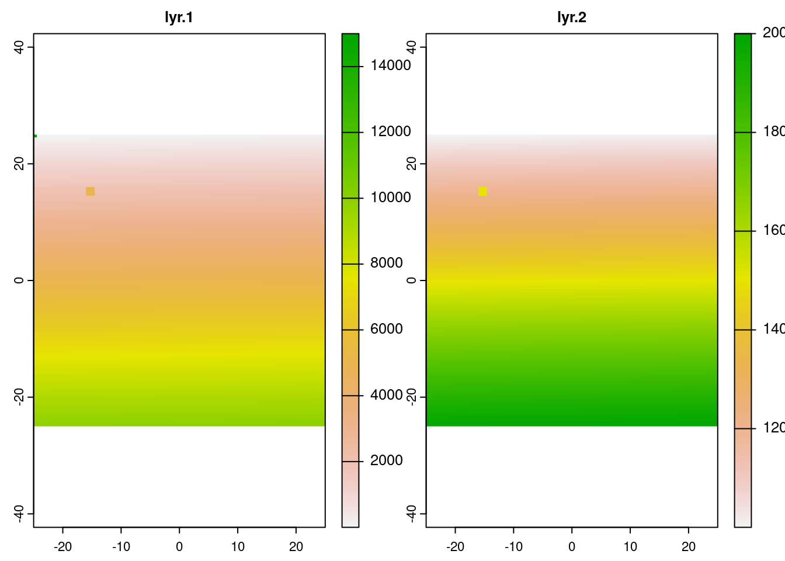
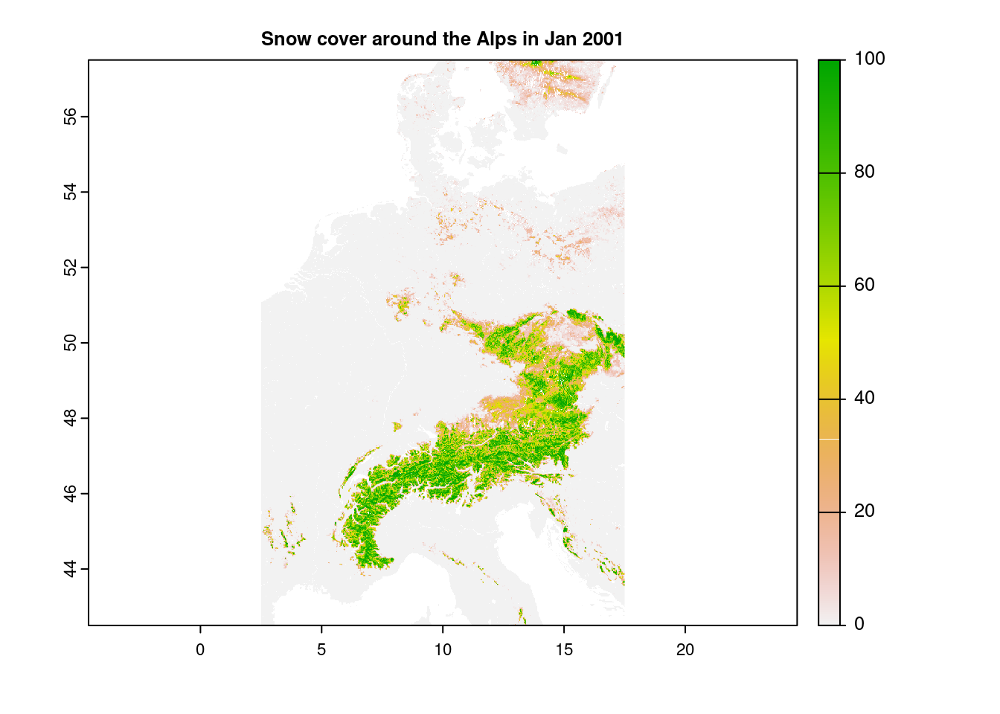
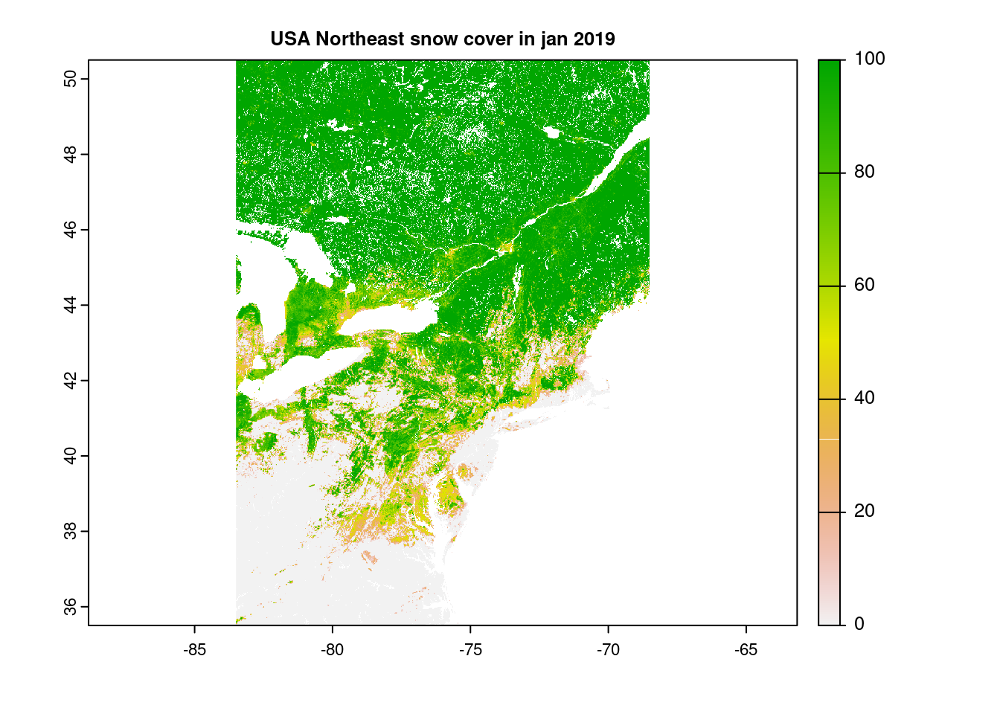
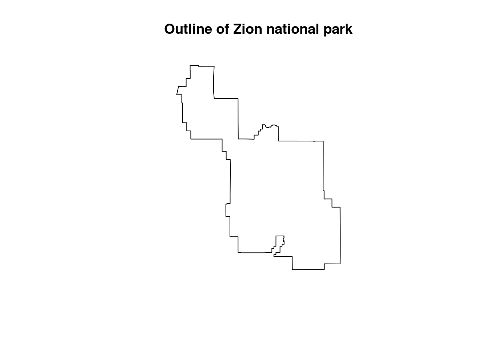
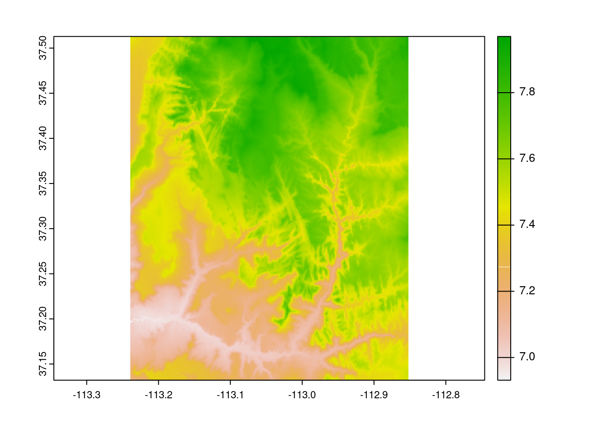
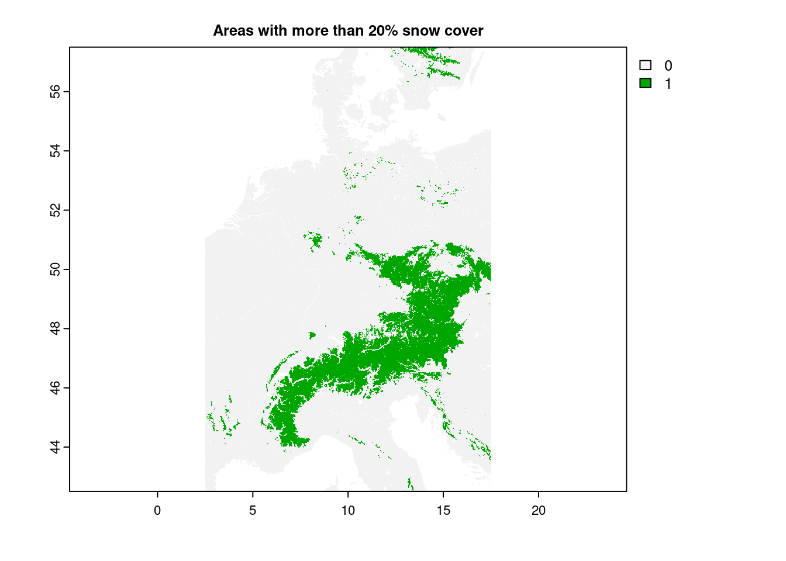
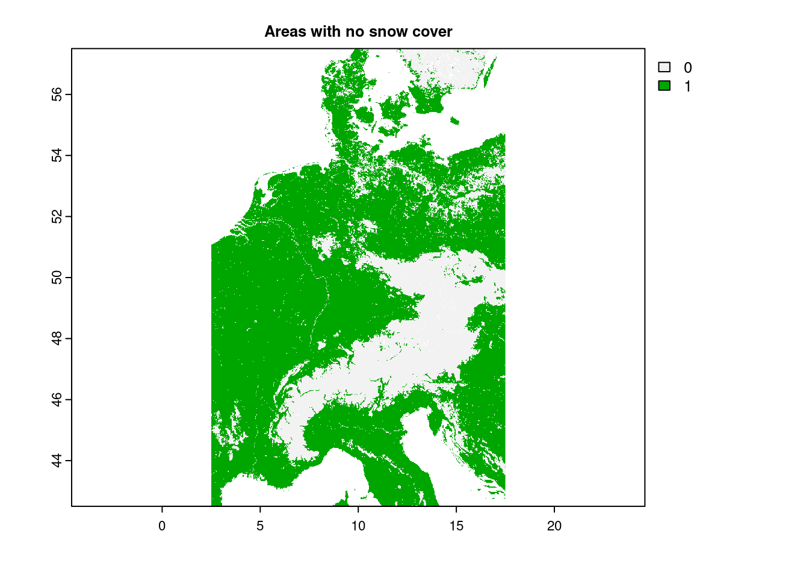
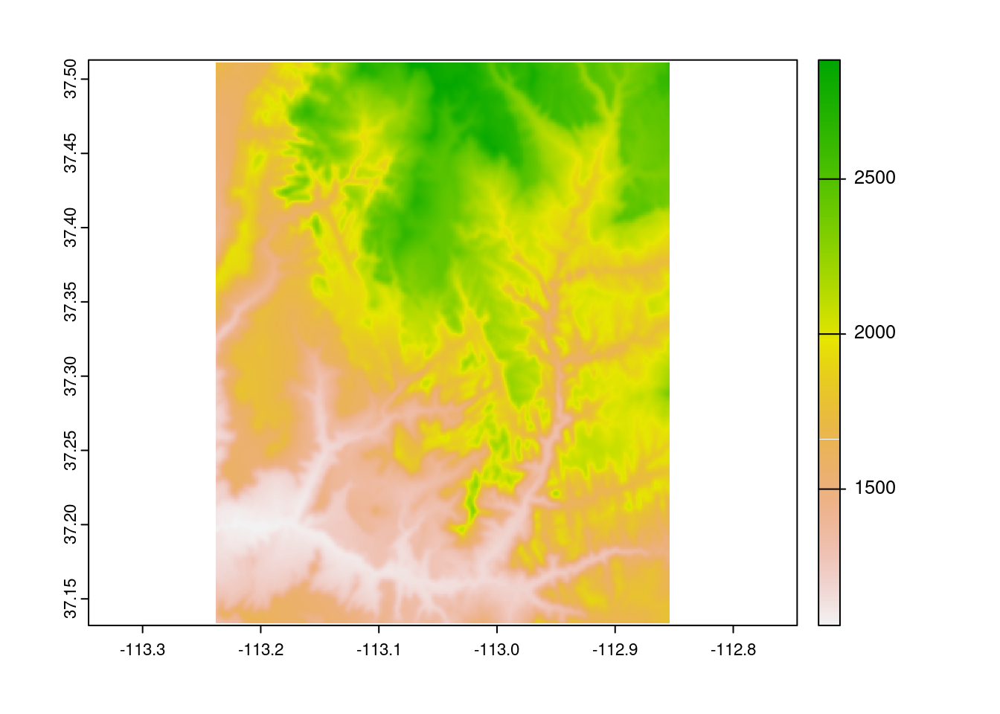

# Using raster data in R

Andre Evard


## Introduction to rasters

This Community Contribution project gives an overview of the online book 
[Geocomputation in R](https://geocompr.robinlovelace.net/index.html),
specifically in regards to the raster type of geographic data representation. 
Please note, the second version of this book is in active development, so some
packages and references may be out-of-date in the near future.

Frequent references to a package called terra are made, which may be read about 
in detail [here](https://rdrr.io/cran/terra/man/terra-package.html). All extra
data sources used here are detailed by the book, except this [snow cover data](https://zenodo.org/record/5774954/#.Y3OqVILMIeU) that was found on a website,
Zenodo, that Geocomputation in R already links to.

### What is a Raster?
A [raster](https://geocompr.robinlovelace.net/spatial-class.html#raster-data) is
a spatial model that crosswise divides an area of land into regularized boxes,
or cells. Each raster is strictly rectangular in the X and Y dimensions, each
cell has the same dimensions and is defined by a point in one corner, and each
stores associated values, say temperature, elevation, population density, the
list goes on. A raster may have multiple layers, and each cell has exactly one
value per layer.

These rasters are extremely useful for environmental scientific modeling outside
of the confines of political boundaries, for example capturing the number of frog 
species discovered in square kilometer sections of the Amazon Rainforest, or
they can be as widespread as the RGB pixels on the screen you are viewing this
through.

For reference, the other type of geocomputational model the book is concerned
about is the [vector](https://geocompr.robinlovelace.net/spatial-class.html#vector-data).
It is defined by cells with specified shapes and geometries, which are better
able to represent human political boundaries for instance. Although this project
is centered on the raster, vectors will be referenced on occasion for data
translation or transformation.

### What is Terra?
(covers sections [2.3.1](https://geocompr.robinlovelace.net/spatial-class.html#r-packages-for-working-with-raster-data) through [2.3.3](https://geocompr.robinlovelace.net/spatial-class.html#basic-map-raster))

[Terra](https://rdrr.io/cran/terra/man/terra-package.html) is the primary package
that Geocomputation with R cites for raster processing. Reportedly, terra is the
more common usecase and easier to learn package, whilst [stars](https://rdrr.io/cran/stars/)'s niche
is the premire for more specialized datasets. [sf](https://rdrr.io/cran/sf/) is the third and final package the book describes in heavy detail, but that is for vector data.

Terra is built upon the older raster package, with an internal foundation of
C++ for efficiency. As for its Raster representation, in one of the book's first
code snippets, we can see its default attributes.


```r
raster_filepath = system.file("raster/srtm.tif", package = "spDataLarge")
srtm = rast(raster_filepath)
```

As we can see here, the raster is defined by:

  * dimensions:
    + nrow: number of rows
    + ncol: number of columns
    + nlyr: number of layers
  * resolution: the space to be covered by a single cell, in two dimensions
  * extent: the boundaries of each coordinate
  * coordinate reference: the distance's data type (more about the "EPSG:4326" [here](https://geocompr.robinlovelace.net/reproj-geo-data.html#crs-in-r))
  
And we have access to the additional fields of the source, name, class, and
some small metadata.

terra also provides have dedicated functions to return the components:

  * Dimensions: [ndim()](https://rdrr.io/cran/terra/man/dimensions.html)
  * Cells: [ncell()](https://rdrr.io/cran/terra/man/dimensions.html)
  * Spatial Extent: [ext()](https://rdrr.io/cran/terra/man/ext.html)
  * Coordinate Reference System: [crs()](https://rdrr.io/pkg/terra/man/crs.html)
  
Geocomputation in R makes frequent usage of this example, srtm, an elevation map
surrounding a Utah national park, and though we will provide other examples,
sometimes its quick reference provides the best example. 
Quickly plotting it shows the following graphic:


```r
plot(srtm)
```


And intuitively, each cell has its own value, represented visually through pixels
by this color scale.
 
## Raster Creation

### The direct approach
(covers sections [2.3.4](https://geocompr.robinlovelace.net/spatial-class.html#an-introduction-to-terra), and [3.3.1](https://geocompr.robinlovelace.net/attr.html#raster-subsetting))
So we know what rasters are, and a basic data structure. Okay, well how do we
create, load, or populate more general rasters? There's a few options, as always.

Naturally, we can directly create our own raster with the [rast()](https://rdrr.io/cran/terra/man/rast.html) function as follows:

```r
manual_raster = rast(
  nrows = 100,
  ncols = 100,
  nlyrs = 2,
  resolution = .5,
  xmin = -25,
  xmax = 25,
  ymin = -25,
  ymax = 25,
  vals = 1:20000
)
plot(manual_raster)
```


 
This isn't exactly a terribly useful raster, but it is intuitive.
You can also [extract](https://rdrr.io/cran/terra/man/extract.html) and [replace](https://rdrr.io/cran/terra/man/replace.html) these values, though those
aren't recommended for anything past small structures and experiments. With
knowledge of what row/col values you're targeting, you can directly set values
in a similar fashion, using c() functions if more than one cell is desired. 
Mutliple layers may also be modified at a time this way.
See the last section for a better approach to raster manipulation.
 

```r
terra::extract(manual_raster, 10, 10)
```

```
##   lyr.1 lyr.2
## 1    10 10010
```

```r
manual_raster[15, -10] <- 15000
manual_raster[15, -10]
```

```
##   lyr.1 lyr.2
## 1    NA    NA
```

```r
manual_raster[c(19, 20, 21), c(19, 20, 21)] <- cbind(c(5000:5008), c(15000:15008)) 
plot(manual_raster)
```



```r
# You can also use <raster>[] as a shortcut of .values().
```
 
### Raster files and their formats
(covers sections [8.5](https://geocompr.robinlovelace.net/read-write.html#file-formats) and [8.6.2](https://geocompr.robinlovelace.net/read-write.html#raster-data-read))

Loading files is preferred approach and far more robust, should you have an 
image file already handy (or one you producedyourself!).

Firstly, there's a lot to know about raster files. Pulling from section [8.5](https://geocompr.robinlovelace.net/read-write.html#file-formats), we can 
find a quick overview of popular raster (and vector) formats. In short though,
our primary file format will be GeoTIFF, which embeds additional geospatial data
(such as coordinate systems) into .tif/.tiff image files. Among others, [NASA](https://www.earthdata.nasa.gov/esdis/esco/standards-and-practices/geotiff) and
[Google](https://developers.google.com/earth-engine/guides/image_upload) both have some of their data publicaly available as COGs.

Outside of GeoTIFF, there is also Arc ASCII (.asc) for text-based storage,
SpatiaLite as an extension for SQLite, and ESRI FileGDB which is proprietary.
So, outside of specific use cases, our recommendation is to use GeoTIFF.

Notably, GeoTIFF also supports Cloud Optimized GeoTIFFs (COG), which allows
rasters to be hosted on HTTP servers and enables users to download only a
segment of what can be rather large files.

Given a path, the [rast()](https://rdrr.io/cran/terra/man/rast.html) function
does a good job at loading in rasters.


```r
snowurl = "/vsicurl/https://zenodo.org/record/5774954/files/clm_snow.cover_esa.modis_p05_1km_s0..0cm_2001.01_epsg4326_v1.tif"
snow = rast(snowurl)
snow
```

```
## class       : SpatRaster 
## dimensions  : 17924, 43200, 1  (nrow, ncol, nlyr)
## resolution  : 0.008333333, 0.008333333  (x, y)
## extent      : -180, 180, -61.99666, 87.37  (xmin, xmax, ymin, ymax)
## coord. ref. : lon/lat WGS 84 (EPSG:4326) 
## source      : clm_snow.cover_esa.modis_p05_1km_s0..0cm_2001.01_epsg4326_v1.tif 
## name        : clm_snow.cover_esa.modis_p05_1km_s0..0cm_2001.01_epsg4326_v1
```

As previously mentioned, the whole GeoTIFF will not be downloaded at once this
way, merely attached to. /vsicurl/ followed by the https url is all that's
necessary to download such information, provided you have the image provider
located already of course. The relevant portions will be loaded if we utilize
or manipulate it in some manner, such as this:


```r
dimension_raster = rast(
  nrows = 1000,
  ncols = 1000,
  resolution = 0.008333333,
  xmin = 2.5,
  xmax = 17.5,
  ymin = 42.5,
  ymax = 57.5
)
snow_clipped = crop(snow, dimension_raster)
snow_clipped
```

```
## class       : SpatRaster 
## dimensions  : 1800, 1800, 1  (nrow, ncol, nlyr)
## resolution  : 0.008333333, 0.008333333  (x, y)
## extent      : 2.499993, 17.49999, 42.50334, 57.50333  (xmin, xmax, ymin, ymax)
## coord. ref. : lon/lat WGS 84 (EPSG:4326) 
## source      : memory 
## name        : clm_snow.cover_esa.modis_p05_1km_s0..0cm_2001.01_epsg4326_v1 
## min value   :                                                            0 
## max value   :                                                          100
```

```r
plot(snow_clipped, main="Snow cover around the Alps in Jan 2001")
```



We will discuss cropping later. Naturally, we can also load local files using
rast(). You can produce or save them yourself, or use packages such as [spData](https://rdrr.io/cran/SpNMF/man/spdata.html).


```r
# what it would look like with a local file 
#snow_rast = rast("2019_jan_snow_cover.tif") 
snow_rast = rast("/vsicurl/https://zenodo.org/record/5774954/files/clm_snow.cover_esa.modis_p95_1km_s0..0cm_2019.01_epsg4326_v1.tif?download=1")
USA_NE_raster = rast(
  nrows = 1000,
  ncols = 1000,
  resolution = 0.008333333,
  xmin = -83.5,
  xmax = -68.5,
  ymin = 35.5,
  ymax = 50.5
)
cropped_NE_snow = crop(snow_rast, USA_NE_raster)
plot(cropped_NE_snow, main="USA Northeast snow cover in jan 2019")
```



### Rasterization
(covers section [6.4](https://geocompr.robinlovelace.net/raster-vector.html#rasterization))

There's one more type of raster creation: transformations from vectors,
[rasterize](https://rdrr.io/cran/terra/man/rasterize.html). Usage of these
requires more knowledge of spatial vector data than we have time to go into depth
here, but in short, it is a set of extremely flexible operations that convert
various statistics from a vector set and transform that into some sort of grid.
Examples provided are state boundaries, aggregating the count or average values
of point clusters, and we're confident that with the right vector datasets the
possibilities are quite endless.

More at Geocomputation with R's section [6.4](https://geocompr.robinlovelace.net/raster-vector.html#rasterization) if you're curious.

## Raster Manipulations, and their applications
So knowing how to create them is all well and good, but what can we *do* with 
rasters? How do we use them?

#### Spatial operations
There are a good number of geometrically-based operations that terra supports
out of the box. The sections that Geocomputation with R lays out are [Subsetting in 4.3.1](https://geocompr.robinlovelace.net/spatial-operations.html#spatial-raster-subsetting), 
[Local](https://geocompr.robinlovelace.net/spatial-operations.html#local-operations), [Focal](https://geocompr.robinlovelace.net/spatial-operations.html#focal-operations),
[Zonal](https://geocompr.robinlovelace.net/spatial-operations.html#zonal-operations),
and [Global](https://geocompr.robinlovelace.net/spatial-operations.html#global-operations-and-distances)
map algebra operations in sections 4.3.3 through 4.3.6, and raster [Merging](https://geocompr.robinlovelace.net/spatial-operations.html#merging-rasters)
in section 4.3.8

### Subsetting
(covers section [4.3.1](https://geocompr.robinlovelace.net/spatial-operations.html#spatial-raster-subsetting))

There are a few ways to (cleanly) draw values from individual cells, the cells,
rows, or columns ids from coordinates, or to slice apart the data.
[cellFromXY()](https://rdrr.io/cran/terra/man/xyCellFrom.html) and assorted functions, and 
[terra::extract](https://rdrr.io/cran/terra/man/extract.html) are two good ones,
though beware the overlap with tidyverse's extract. We can also define smaller
rasters and clip or crop them through, as we have done in examples prior.


```r
xy <- matrix(c(-73.94, 40.73), ncol = 2)
matrix_cells = cellFromXY(cropped_NE_snow, xy)
cropped_NE_snow[matrix_cells]
```

```
##   clm_snow.cover_esa.modis_p95_1km_s0..0cm_2019.01_epsg4326_v1
## 1                                                           31
```

```r
terra::extract(cropped_NE_snow, xy)
```

```
##   clm_snow.cover_esa.modis_p95_1km_s0..0cm_2019.01_epsg4326_v1
## 1                                                           31
```

```r
filter = rast(
  xmin = -74.5,
  xmax = -73.5,
  ymin = 40.2,
  ymax = 41.2,
  resolution = 0.0083
)

NYC_sieve = terra::extract(cropped_NE_snow, ext(filter))
head(NYC_sieve)
```

```
##   clm_snow.cover_esa.modis_p95_1km_s0..0cm_2019.01_epsg4326_v1
## 1                                                           62
## 2                                                           61
## 3                                                           68
## 4                                                           74
## 5                                                           75
## 6                                                           81
```

```r
# extract does a lot more things more flexibly, cellfromxy and related
# better for method header precision and location manipulation
# NYC was not very snowy that winter, it seems...
```

As well as direct access, should we know either the desired row & column numbers
or the 1D cell ids:


```r
srtm[50, 50]
```

```
##   srtm
## 1 1885
```

```r
srtm[c(49, 50, 51), c(49, 50, 51)]
```

```
##   srtm
## 1 1854
## 2 1919
## 3 1986
## 4 1835
## 5 1885
## 6 1962
## 7 1819
## 8 1869
## 9 1929
```

```r
srtm[100]
```

```
##   srtm
## 1 2034
```


### Cropping and Masking
(covers section [6.2](https://geocompr.robinlovelace.net/raster-vector.html?q=mask#raster-cropping))

Two similar concepts, [crop()](https://rdrr.io/cran/terra/man/crop.html) and [mask()](https://rdrr.io/cran/terra/man/mask.html)
perform the task of downsizing a raster, typically in tandem, and both require
the usage of an additional spatial object, in practice typically a vector.
Where they differ is that cropping reduces the dimensions of the original raster
based on the second object's boundaries, whereas masking sets everything
outside of the second object's boundaries to zero, but leaves the structure intact.

```r
zion = read_sf(system.file("vector/zion.gpkg", package = "spDataLarge"))
zion = st_transform(zion, crs(srtm))
srtm_cropped = crop(srtm, zion)
srtm_masked = mask(srtm, zion)
plot(zion[0], main="Outline of Zion national park")
```



```r
plot(srtm_cropped, main="SRTM cropped by Zion national park")
```


```r
plot(srtm_masked, main="SRTM masked by Zion national park")
```


And of course we can combine them:

```r
plot(crop(srtm_masked, zion))
```


### Map Algebra
(covers sections [4.3.2](https://geocompr.robinlovelace.net/spatial-operations.html#map-algebra), [4.3.3](https://geocompr.robinlovelace.net/spatial-operations.html#local-operations), [4.3.4](https://geocompr.robinlovelace.net/spatial-operations.html#focal-operations),
[4.3.5](https://geocompr.robinlovelace.net/spatial-operations.html#zonal-operations), and
[4.3.6](https://geocompr.robinlovelace.net/spatial-operations.html#global-operations-and-distances))

As we can see here, many algebraic calculations can be performed on rasters at the local level.

```r
srtm = rast(system.file("raster/srtm.tif", package = "spDataLarge"))
plot(srtm)
```


```r
plot(log(srtm))
```



```r
plot(srtm ^ 2)
```


As well as boolean operations

```r
plot(snow_clipped > 20, main="Areas with more than 20% snow cover")
```



```r
plot(snow_clipped == 0, main="Areas with no snow cover")
```



And through the use of [app()](https://rdrr.io/cran/terra/man/app.html) for efficiency on large data.


```r
app(snow_clipped, fun=function(i) { 2 * log(i) })
```

```
## class       : SpatRaster 
## dimensions  : 1800, 1800, 1  (nrow, ncol, nlyr)
## resolution  : 0.008333333, 0.008333333  (x, y)
## extent      : 2.499993, 17.49999, 42.50334, 57.50333  (xmin, xmax, ymin, ymax)
## coord. ref. : lon/lat WGS 84 (EPSG:4326) 
## source      : memory 
## name        :   lyr.1 
## min value   :    - ?  
## max value   : 9.21034
```

Given the right attributes in the data (the book lists coil class, pH, etc),
this can be used for predictive modeling.

[Focal](https://rdrr.io/cran/terra/man/focal.html) transformations:

```r
mean_srtm = focal(srtm, w = matrix(1, nrow = 5, ncol = 5), fun = mean)
plot(mean_srtm)
```



Similar to sliding windows in some machine learning algorithms, focal operations
transform cells by their neighborhoods, working to process out extremes whilst
preserving the form of the original data. Another potential focal operator is
[terrain()](https://rdrr.io/cran/terra/man/terrain.html), which calculates 
terrain characteristics from elevation data.

[Zonal](https://rdrr.io/cran/terra/man/zonal.html) is similar to focal but one
level of aggregation up. It uses a second raster to define zones to group the
first by, applying statistical measurements on that divided population.

[Global](https://rdrr.io/cran/terra/man/global.html) are cross-raster statistical
calculations, and can be used for [distance](https://rdrr.io/cran/terra/man/distance.html)
and a few other possibilities--namely, summary functions we'd see on any type of
dataset.

[summary()](https://rdrr.io/cran/terra/man/summary.html) describes the archetypal
statistical bands, [freq()](https://rdrr.io/cran/terra/man/freq.html) counts the
occurrences of each class, and [boxplot()](https://rdrr.io/cran/terra/man/boxplot.html),
[density()](https://rdrr.io/cran/terra/man/density.html),
[hist()](https://rdrr.io/cran/terra/man/hist.html),
and [pairs()](https://rdrr.io/cran/terra/man/pairs.html) can all be run out-of-the-box
for immediate exploration. global() remains the most robust approach, as you can
self-define a statistical function yourself to apply your particular dataset,
much as you can with the aforementioned app() and its entourage.


```r
summary(snow_clipped) # 3rd quartile of 1, but mean of 10?
```

```
##  clm_snow.cover_esa.modis_p05_1km_s0..0cm_2001.01_epsg4326_v1
##  Min.   :  0.00                                              
##  1st Qu.:  0.00                                              
##  Median :  0.00                                              
##  Mean   : 10.27                                              
##  3rd Qu.:  1.00                                              
##  Max.   :100.00                                              
##  NA's   :28886
```

```r
snow_tenths = app(snow_clipped, fun=function(i) {ceiling(i / 10) * 10})
freq(snow_tenths) # Indeed, 0 is by far the most common
```

```
##    layer value   count
## 1      1     0 1696965
## 2      1    10  190843
## 3      1    20   61456
## 4      1    30   44132
## 5      1    40   42039
## 6      1    50   43384
## 7      1    60   46092
## 8      1    70   47859
## 9      1    80   46767
## 10     1    90   43627
## 11     1   100   46772
```


### Extraction
(covers section [6.3](https://geocompr.robinlovelace.net/raster-vector.html#raster-extraction))

Extraction is the process of gathering a targetted subset of values from a raster,
through the use of [terra::extract()](https://rdrr.io/cran/terra/man/extract.html).
It will take the use of vector spatial objects, but the result is some rather
powerful if specialized inferences. We'll keep it brief, but please visit [6.3](https://geocompr.robinlovelace.net/raster-vector.html#raster-extraction)
if you're interested further.

Example use cases of raster extraction can vary as wildly as your creativity.
For a few quick examples, we could import the boundaries of European country
around the alps and aggregate snow cover there, or find the highest/lowest points
along Zion National Park's boundaries. The demonstrations the book provides are
picking elevation from a selection of points, and the elevation graph along a
line segment for planning a hike. Categorical and continuous data can both be
extracted, sometimes at once across different layers.

One quick note--the book points out there can be performance issues at scale, 
and to use [exact_extract()](https://rdrr.io/cran/exactextractr/man/exact_extract.html) from the [exactextract](https://rdrr.io/cran/exactextractr/man/exactextractr.html) package where possible.

### Vectorization
(covers section [6.5](https://geocompr.robinlovelace.net/raster-vector.html#spatial-vectorization))

The opposite of rasterization, spatial vectorization transforms rasters into vectors.
If you're familiar with vectors, there is again an abundance of flexibility here, lying in the [as.spatvector](https://rdrr.io/cran/terra/man/as.spatvector.html) class of
functions. One particularly eye-catching use is the quick visualization of
contour lines using [as.contour()](https://rdrr.io/cran/terra/man/contour.html) as follows:


```r
cl = as.contour(srtm)
plot(cl, axes=FALSE)
```


### File Output
(covers section [8.7.2](https://geocompr.robinlovelace.net/read-write.html#raster-data-write))
Okay, so you've done your experiments, and would like to preserve your rasters
to share your results and save on later computational power. How?

Simple. [writeRaster()](https://rdrr.io/cran/terra/man/writeRaster.html).

```r
# Is how I would do it, if I wanted to dirty the CC project
# writeRaster(snow_clipped, filename="2007_jan_eu_snow.tif", datatype="INT1U",
#             overwrite=TRUE)
```

There is a little more involved, such as selecting the bit datatype for storage,
filetypes if writeRaster can't infer it from the filename, names for the layer names,
and an assortment of memory-related variables for debugging and throughput of
particularly large rasters. Compared to loading in rasters, though, 
this function is conveniently straightforward, yet still plenty capable in terms
of flexibility; like rasters as a hole, rigid, yet surprisingly flexible just one layer beyond the surface.
