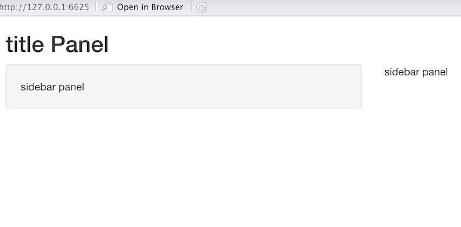
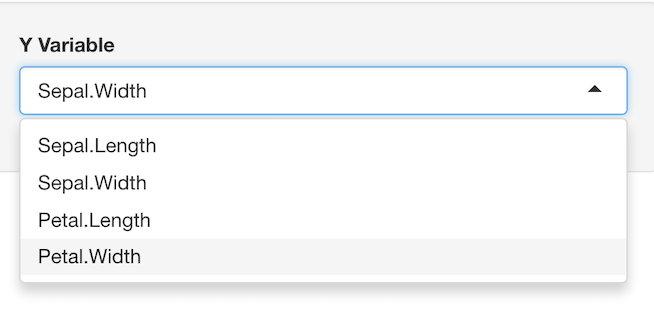

# Introduction to Shiny Web Apps

Wenxi Zhang

```{r , include=FALSE}
knitr::opts_chunk$set(echo = TRUE)
```

## Introduction

Shiny is an R package from R studio that makes it easy to build interactive web apps straight with R. Shhiny allows you to create highly effective data reports and visualization where user can explore the data set by specifying data subset.

## How to host

There are multiple way to host a shiny app.

- Install shiny server on a computer that you own
- Upload your app to https://www.shinyapps.io/
  - Each month you have 25 free active hours
  - Maximum 5 apps for free
- Google Cloud Run: https://code.markedmondson.me/shiny-cloudrun/

## Create your first Shiny app

Here we only focus on creating a Shiny app in Rstudio.
There are several ways to do:

- File -> New File -> Shiny Web App
  - Single file ( What this tutorial uses)
  - Multiple files 
- File -> New File -> R Markdown -> Shiny
- File -> New File -> R Markdown -> From Template -> Flex Dashboard

## Basic Struture

Shiny applications are divided into three parts: 
- User Interface (UI) 
- Server
- a call to the shinyApp function
The user interface (ui)  is responsible for the app presentation, while the server is responsible for the app logic. Finally the shinyApp() function creates Shiny app objects from an explicit UI/server pair.

UI controls the lay out of components and what are being displayed on the application page, like text, plots, and widgets that take user input.
The server controls the data being displayed in UI. It's where you load and wrangle data, transforming input from UI to outputs.

Below is a simple example  


```{r,eval=FALSE}

library(shiny)
ui <- fluidPage(
  # controls the layout and content of the application
)
server <- function(input, output) {
   # controls the interaction, modify output based on user input
}
#run app
shinyApp(ui = ui, server = server)
```


## The UI

You may lay out the user interface of your app by placing elements in the fluidPage function. Elements can be seperated to inputs and outputs function.

Next we will create a visualization tool to display k-means clustering of Iris dataset. To do this, we need to define the UI panel and return a scatterplot. 
Iris data set contains 3 classes of 50 instances each, where each class refers to a type of iris plant. The feature set contains "Sepal.Length", "Sepal.Width", "Petal.Length", "Petal.Width" 


### layout

First, let's create the UI panel above on the left side. We will need to define three panels: title, sidebar for users' input, and main for where all of our visualization work will go.

`titlePanel` and `sidebarLayout` are two popular elements to create layout.

`sidebarLayout` has two arguments: `sidebarPanel` and `mainPanel`, which place content at sidebar or main panels as shown below in example1.

```{r, eval=FALSE}
ui <- fluidPage(
  titlePanel("title panel"),

  sidebarLayout(
    sidebarPanel("sidebar panel"),
    mainPanel("main panel")
  )
)
```


### Input functions

We can also add control widgets to provide a way for users to send messages to the Shiny app. Shiny widgets collect a value from your user. When a user changes the widget, the value will change as well.There are many input functions to create widgets. Below are some examples of basic widgets.


Next I will introduce a common input function `selectInput()` that shows a box with choices to select from. 

`selectInput()` has 3 required arguments:
inputId: The input name to access the value (for internal ues)  
label: Label shown in the UI,  NULL for no label.  
choices: List of values to select from.

We can also use `selected` to set initial selected value if user not specify. 
```{r,eval=FALSE}
selectInput(inputID='ycol', label='Y Variable', 
            choices=names(iris)[1:4],#"Sepal.Length" "Sepal.Width"  "Petal.Length" "Petal.Width" 
      selected = names(iris)[[2]])# set "Petal.Length" to be default
```


Here I include the select widget that allows the user to select the y variable of out plot. I also define the variables to choose from are attributes from the feature set, and set the default choice to be 'Sepal.Width'. Similarly, we can define the selection box for x variable and a numeric Input box that user can define cluster numbers.

### Output functions
To display output, we add output function to fluidPage() with an *Output() function. Below is a list of output functions that turn R objects into a specific type of output  

Output            function	Creates  
-------           ----------------
dataTableOutput	     DataTable  
htmlOutput	         raw HTML  
imageOutput	         image  
plotOutput	         plot  
tableOutput	         table  
textOutput	         text  
uiOutput	           raw HTML  
verbatimTextOutput	  text  


Just like other elements in ui, we can add output to the user interface inside `sidebarPanel` or `mainPanel`.
In our example, we place the output in the `mainPanel` and the output is a scatter plot with user defined x, y variables. We may add `plotOutput('plot')` to the `mainPanel` to create the plot object, where `"plot"` is the name given to the output plot.


Below is the complete ui portion for our Iris clustering problem.
```{r, eval=FALSE}
ui <- fluidPage(
  headerPanel('Iris k-means clustering'),
  sidebarPanel(
    selectInput('xcol', 'X Variable', names(iris)[1:4]),
    selectInput('ycol', 'Y Variable', names(iris)[1:4],
                selected = names(iris)[[2]]),
    numericInput('clusters', 'Cluster count', value=3,#value: initial value
                 min = 1, max = 9)#Minimum allowed value, Maximum allowed value
  ),
  mainPanel(
    plotOutput('plot')
  )
)
```


## The Server

After adding the output object in ui, we need to tell Shiny how to build the object in the server function. To do this, we need to  

1. Access input values with `input$` (In our example, we have `input$xcol`, `input$ycol`, `input$clusters`)  

2. builds a list-like object named `output` that contains all of the code needed to update the R objects in the app. (Save objects to display to `output$`. In our case output is `output$plot`)  

3. Define text/charts/plots in the server function (Build objects to display with `render*()`)  

Each entry to output should contain the output of one of Shiny’s `render*` functions. These functions capture an R expression and do some light pre-processing on the expression. `render*()` function creates the type of output you wish to make.  Shiny will re-run the function every time it needs to update your object.  
Below are some common render functions and their descriptions.  


render function	            creates
-----------------         -------------------------------------------
renderDataTable	            DataTable
renderImage	                images (saved as a link to a source file)
renderPlot	                plots
renderPrint	                 any printed output
renderTable	                 data frame, matrix, other table like structures
renderText	                 character strings
renderUI	                    a Shiny tag object or HTML

By following the rules above, reactivity automatically occurs whenever you use an input value to build rendered Outputs.

### Reactivity

We know that the input value changes whenever a user changes the input. The input values notify `render*` functions and R expression inside the `render*()` when input changes. When notified that input changes, the object created by a `render*()` function will return the entire code block to update itself.  

However, it could be computational costy if we update all R expression inside the `render*()` whenever an input updates. For example, if we want to use the same modified input several times, the duplicate R expressions for modifying input could slows the program. Thus it is better to save the reusable R expressions that modifies input to a function. Luckily, `reactive()` function in shiny does this job!

`reactive()` builds a reactive object that will respond to every input value in the code. We can save the R expressions what modifies input values in `reactive()` and call the reactive expression like a function. 

In our example, we can save the user specified two feature columns of Iris dataset as `selectedData` and calculate k-mans model `clusters` base on `selectedData` and user specified cluster numbers.
Moreover, `selectedData` won't change if `input$xcol` and `input$ycol` aren't changed. We can avoid unnecessary computation by not putting all these expressions in the final `render*()` function, in which case `iris[, c(input$xcol, input$ycol)]` need to update whenever `input$clusters` changes.

```{r, eval=FALSE}
  selectedData <- reactive({
    iris[, c(input$xcol, input$ycol)]
  })

  clusters <- reactive({
    kmeans(selectedData(), input$clusters)
  })
```


### Display output with render*()

In our example, we need to define a plot as output. Thus we use the render function `renderPlot()` here. 

As discussed before, `renderPlot()` will respond to every reactive value in the code, which are `selectedData()` and `clusters()`. We use these two functions as the input data in `renderPlot()`. When any of the two functions change, `renderPlot()` will rerun the r expressions inside.

```{r, eval=FALSE}
  output$plot <- renderPlot({
    par(mar = c(5.1, 4.1, 0, 1))
    plot(selectedData(),
         col = clusters()$cluster,
         pch = 20, cex = 3)
    points(clusters()$centers, pch = 4, cex = 4, lwd = 4)
  })
```

Now everything is connected! The overall server section looks like below. Finally, we need one more statement to have our app running -->`shinyApp(ui = ui, server = server)`

```{r, eval = FALSE}
server <- function(input, output) {

  selectedData <- reactive({
    iris[, c(input$xcol, input$ycol)]
  })

  clusters <- reactive({
    kmeans(selectedData(), input$clusters)
  })

  output$plot <- renderPlot({
    par(mar = c(5.1, 4.1, 0, 1))
    plot(selectedData(),
         col = clusters()$cluster,
         pch = 20, cex = 3)
    points(clusters()$centers, pch = 4, cex = 4, lwd = 4)
  })


}
```

## Conclusion

Functions introduced above are some most used functions in shiny. There are more powerful and interesting aspects of shiny app like customizing appearance and other reactions. 
I highly recommend you to visit https://shiny.rstudio.com/ for the documentation and gallery.

## Reference

https://towardsdatascience.com/beginners-guide-to-creating-an-r-shiny-app-1664387d95b3

https://shiny.rstudio.com/tutorial/


