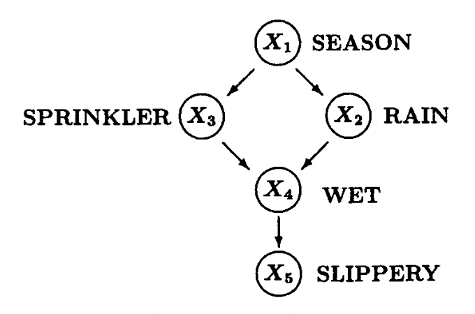
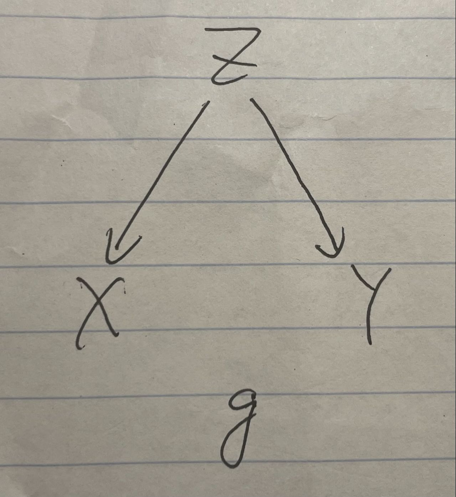
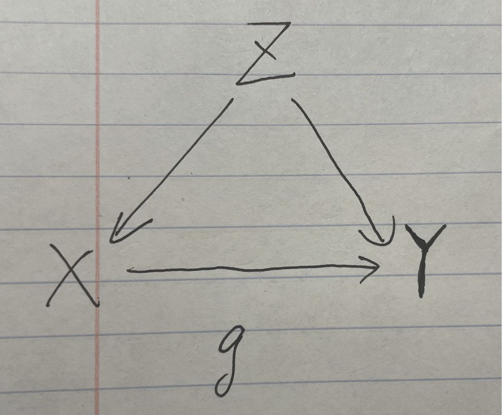
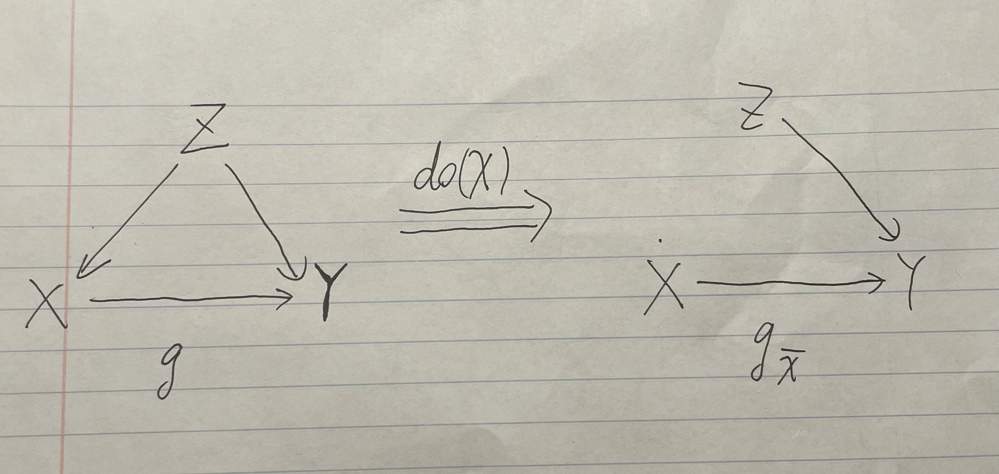

# Causal Inference Tutorial: A Quick Glance at Interventional Treatment and Simpson's Paradox

Yizhan Niu 

```{r, include=FALSE}
knitr::opts_chunk$set(echo = TRUE,warning = FALSE, message = FALSE) 
```


```{r}
# remotes::install_github("allisonhorst/palmerpenguins")
library(palmerpenguins)
# remotes::install_github("hrbrmstr/hrbrthemes")
library(hrbrthemes)

library(gridExtra)
library(tidyverse)
library(ggplot2)
library(dplyr)


```

## Motivation

Causal inference has been more and more recognized in the data science world. One primary reason is that data scientists would like to analyze and estimate the causal effect on an event (Y) from another event (X), while mere statistics can hardly be capable of satisfying such need to find out causal effects. This short tutorial aims at giving readers a quick glance at some applications of causal inference in interpreting and analyzing the data. I chose one tool in causal inference called intervention treatment and a famous problem, Simpson's Paradox, to show how causal inference can be applied to practice to solve problems using R.

## Intro to Causal Graphs

To represent causal effects between pairs of different observed variables, we need some mathematical language to describe these causal relationships. In this case, graph theory becomes the best candidate. Typically, a directed acyclic graph (DAG) will be our choice for representing causality among multiple variables. A famous example is as shown following:   



This example is famous both as a Bayesian Network and as a DAG for representing causal relationships. It describes the relationships among the season (X1), whether the rain fall (X2), whether the sprinkler is turned on (X3), whether the floor is wet (X4), and whether the floor is slippery (X5). 

In the context of causal inference, each causal graph like this will induce a probability distribution, i.e., a joint distribution of all observed variables, which we call observations. One of our goals is to use these observations to determine the causal effects between one variable and the other. The causal effects can be accomplished by intervening on the variable (X) we would like to test, which will be elaborated on below.

## Intro to Interventional 

We may hear from time to time the sentence that "correlation is not causation." With the increase in ice cream consumption (X), the shark attacks (Y) also rise. It seems they have some correlation, but it is hard to imagine any causal effects of eating ice cream on shark attacks. 

One explanation is that hot weather (Z) causes people to eat ice cream and also causes people to go to the beaches, increasing the possibility of being attacked by sharks. Here, hot weather is a common cause of both ice cream consumption and shark attacks, but there are intuitively no causal relationships between the two variables we are curious about.

To eliminate the effects of that common cause, one thing we can do is intervene on people's ice cream consumption. We can choose a group of people to have them not consume ice cream and observe whether the shark attack rate rises in that period, leaving any other variable the same. It is one example of intervention, as we are deliberately intervening on one variable to see how the other variable will behave. Even though this intervention is not realistic all the time, we have other techniques such as back-door adjustment and do-calculus using non-experimental data, while we will not elaborate on them here. 

We will then show some examples below which connects causal diagrams and intervention operation.

### First Causal Graph Example




This causal graph represents the ice cream and shark attack case, where Z is the hot weather, X is the ice cream consumption, and Y is the shark attack rate.

```{r}
set.seed(1)

n <- 1000
z <- rnorm(n, 0, 1)
x <- z + rnorm(n, 0, 0.1)
y <- z  + rnorm(n, 0, 0.1)

data <- cbind(x,y,z)

corr_xy <- cor(x, y, method = "pearson")
corr_xz <- cor(x, z, method = "pearson")
corr_yz <- cor(y, z, method = "pearson")

par(mfrow = c(1, 3))
scatter.smooth(x,y)
scatter.smooth(z,y)
scatter.smooth(z,x)


```

We can easily find out that these variables are all highly correlated with each other. We would like to test the causal effects of intervening on people's ice cream consumption. 

### First Causal Graph After Intervention


The right hand side shows the graph after intervention. (Z has no effects on X, because we already have people to eat a fixed number of ice creams.)  

```{r}
# Simulate data from the SCM where do(X = x)
intervene_x <- function(x, n = 1000) {
  z <- rnorm(n, 0, 1)
  y <- z  + rnorm(n, 0, 0.1)
  cbind(x, y, z)
}

set.seed(1)
x_do1 <- intervene_x(x=2022)

par(mfrow = c(1, 3))
hist(
  y, xlab = 'Y', breaks = 30,
  xlim = c(-6, 6), col = 'gray76', main = 'P(Y)'
)

hist(
  x_do1[, 2], xlab = 'Y', breaks = 20,
  xlim = c(-6, 6), col = 'gray76', main = 'P(Y | do(X = 2022))'
)

```

As we can see from the two graphs, having people eating 2022 ice creams during the period does not affect the distribution of the likelihood of their being attacked by sharks. Thus, if it were done in the real world, we can conclude that ice cream consumption has some correlations with shark attacks but has no causation on that event.

### Second Causal Graph Example

It is still the example of ice cream consumption and shark attacks, but we imagine a world where ice cream can make people smell more delicious, thus causes sharks to attack people. 



We can find that there is an arrow from X to Y now. 

```{r}
set.seed(1)

n <- 1000
z <- rnorm(n, 0, 1)
x <- z + rnorm(n, 0, 0.1)
y <- x + z  + rnorm(n, 0, 0.1)

data <- cbind(x,y,z)

corr_xy <- cor(x, y, method = "pearson")
corr_xz <- cor(x, z, method = "pearson")
corr_yz <- cor(y, z, method = "pearson")

par(mfrow = c(1, 3))
scatter.smooth(x,y)
scatter.smooth(z,y)
scatter.smooth(z,x)


```

Still, we would like to test on the causal effects of intervening on people's ice cream consumption, which causes the following graph.

### Second Causal Graph After Intervention




```{r}

# Simulate data from the SCM where do(X = x)
intervene_x <- function(x, n = 1000) {
  z <- rnorm(n, 0, 1)
  y <- x + z  + rnorm(n, 0, 0.1)
  cbind(x, y, z)
}

set.seed(1)
x_do1 <- intervene_x(x=2)

par(mfrow = c(1, 3))
hist(
  y, xlab = 'Y', breaks = 30,
  xlim = c(-6, 6), col = 'gray76', main = 'P(Y)'
)

hist(
  x_do1[, 2], xlab = 'Y', breaks = 20,
  xlim = c(-6, 6), col = 'gray76', main = 'P(Y | do(X = 2))'
)


```


Now, even though we let people eat 2 ice creams, do(X=2) , which is slightly more than their previous consumption of zero ice creams, the probability distribution shifts to the right, and sharks are more likely to attack people who consumer more ice creams. In this case, we cannot eliminate the causality between ice cream consumption and shark attack rate.  


## Intro to Simpson's Paradox

Now, I would like you to shift our mind to another famous topic in statistics: Simpson's Paradox. Basically, Simpson's Paradox describes a situation where data shows some positive (or negative) correlations, but this correlation flips to negative (or positive) if we separate the data based on another variable. We will use the Palmer Penguins dataset to show the occurrence of Simpson's Paradox and how we use causal inference to interpret this phenomenon.

### Example of Palmer Penguins Dataset


The dataset was collected and published by Dr. Kristen Gorman and the Palmer Station, Antarctica LTER, which was originally for species research purposes. This dataset has different features of a penguin in each row: species, island, bill_length_mm, bill_depth_mm, flipper_length_, body_mass_g, sex, and so on. In our case, we will only look at bill lengths (X), bill depths (Y), and species (Z), as Simpson's Paradox was found among these three variables.

Here is a brief overview of what the dataset looks like.

```{r}


set.seed(9450)

penguin_df<- 
  palmerpenguins::penguins %>%
  na.omit()


DT::datatable(head(penguin_df))


```

### Relationship Between Bill Length (X) And Bill Depth (Y)

First, not taking species into consideration, we would like to see the correlation between bill lengths and bill depths of penguins in the whole dataset. 

```{r}

#typeof(as.numeric(df["bill_length_mm"][[1]]))

lin_reg <- lm(bill_depth_mm ~ bill_length_mm, data=penguin_df)

penguin_df %>%
  ggplot(aes(x=bill_length_mm, y=bill_depth_mm)) +
  geom_point() +
  geom_abline(slope = lin_reg$coefficients[[2]],
              intercept = lin_reg$coefficients[[1]], 
              color="red") +
  labs(x="Length", y="Depth",
       title="Regression of Depth as a function of Length") +
  theme_classic()


```


We found a clear negative correlation shown by the red line.

### Relationship Between Bill Length (X) And Bill Depth (Y) Separated By Species

Now, if we separated these data into three species, Adelie, Chinstrap, and Gentoo, we will find something different. 

```{r}
chin<-
  penguin_df %>%
  filter(species == "Chinstrap")
adelie<-
  penguin_df %>%
  filter(species == "Adelie")
gentoo<-
  penguin_df %>%
  filter(species == "Gentoo")

lm_chin<- lm(data=chin, bill_depth_mm ~ bill_length_mm)
lm_adelie<- lm(data=adelie, bill_depth_mm ~ bill_length_mm)
lm_gentoo<- lm(data=gentoo, bill_depth_mm ~ bill_length_mm)

penguin_df %>%
  ggplot(aes(x=bill_length_mm, y=bill_depth_mm, 
             color=species)) +
  geom_point() +
  geom_abline(slope = lm_chin$coefficients[[2]],
              intercept = lm_chin$coefficients[[1]], 
              color="black") +
  geom_abline(slope = lm_adelie$coefficients[[2]],
              intercept = lm_adelie$coefficients[[1]], 
              color="black") +
  geom_abline(slope = lm_gentoo$coefficients[[2]],
              intercept = lm_gentoo$coefficients[[1]], 
              color="black") +
  labs(x="Length", y="Depth",
       title="Regression of Depth as a function of Length") +
  theme_classic()

```


Surprisingly, the negative correlation on aggregated data flipped if we separated these data by species. It shows a case of Simpson's Paradox here. 


The following graphs are plotted separately based on different species. 
```{r}


# Given the same Z, there exists some positive correlation to X and Y.

lin_reg_adelie <- lm(bill_depth_mm ~ bill_length_mm, data=adelie)
std_adelie <- sd(adelie$bill_depth_mm)

adelie_plot <- adelie %>%
  ggplot(aes(x=bill_length_mm, y=bill_depth_mm)) +
  geom_point(color="red") +
  geom_abline(slope = lin_reg_adelie$coefficients[[2]],
              intercept = lin_reg_adelie$coefficients[[1]], 
              color="red") +
  labs(x="Length", y="Depth",
       title="Regression of Depth as a function of Length (Adelie)") +
  theme_classic()

lin_reg_chin <- lm(bill_depth_mm ~ bill_length_mm, data=chin)
std_chin <- sd(chin$bill_depth_mm)

chin_plot <- chin %>%
  ggplot(aes(x=bill_length_mm, y=bill_depth_mm)) +
  geom_point(color="green") +
  geom_abline(slope = lin_reg_chin$coefficients[[2]],
              intercept = lin_reg_chin$coefficients[[1]], 
              color="red") +
  labs(x="Length", y="Depth",
       title="Regression of Depth as a function of Length (Chin)") +
  theme_classic()

lin_reg_gentoo <- lm(bill_depth_mm ~ bill_length_mm, data=gentoo)
std_gentoo <- sd(gentoo$bill_depth_mm)

gentoo_plot <- gentoo %>%
  ggplot(aes(x=bill_length_mm, y=bill_depth_mm)) +
  geom_point(color="blue") +
  geom_abline(slope = lin_reg_gentoo$coefficients[[2]],
              intercept = lin_reg_gentoo$coefficients[[1]], 
              color="red") +
  labs(x="Length", y="Depth",
       title="Regression of Depth as a function of Length (Gentoo)") +
  theme_classic()

grid.arrange(adelie_plot, chin_plot, gentoo_plot, nrow=3, ncol = 1,widths = 1,heights=unit(c(1.5,1.5,1.5),c("in","in","in")))


```


### Take a closer look at the distribution given X = 41 and X = 42.

Now, to better understand the patterns of the data, we now take a closer look at the distribution of bill depths, given a certain bill length. We choose the bill lengths of 41 and 42 millimeters. 

```{r}

a = 40
b = 41.9

c = 42
d = 43.9

adelie_x0  <- adelie %>%
  filter(between(adelie$bill_length_mm,a,b))

chin_x0  <- chin %>%
  filter(between(chin$bill_length_mm,a,b))

gentoo_x0  <- gentoo %>%
  filter(between(gentoo$bill_length_mm,a,b))

adelie_x1  <- adelie %>%
  filter(between(adelie$bill_length_mm,c,d))

chin_x1  <- chin %>%
  filter(between(chin$bill_length_mm,c,d))

gentoo_x1  <- gentoo %>%
  filter(between(gentoo$bill_length_mm,c,d))

data_x0 <- data.frame(
  type = c( rep("Adelie_x0", count(adelie_x0)), rep("Chin_x0", count(chin_x0)),rep("Gentoo_x0", count(gentoo_x0))),
  value = c( adelie_x0$bill_depth_mm, chin_x0$bill_depth_mm , gentoo_x0$bill_depth_mm)
)

data_x1 <- data.frame(
  type = c( rep("Adelie_x1", count(adelie_x1)), rep("Chin_x1", count(chin_x1)),rep("Gentoo_x1", count(gentoo_x1))),
  value = c( adelie_x1$bill_depth_mm, chin_x1$bill_depth_mm , gentoo_x1$bill_depth_mm)
)


p1 <- data_x0 %>%
  ggplot( aes(x=value, fill=type)) +
    geom_histogram( color="#e9ecef", alpha=0.6, position = 'identity') +
    scale_fill_manual(values=c("#69b3a2", "#404080","#add61d")) +
    theme_ipsum() +
    scale_x_continuous(limits = c(13, 22))+
    geom_vline(aes(xintercept = mean(value)),col='red',size=2)+
    labs(fill="")

p2 <- data_x1 %>%
  ggplot( aes(x=value, fill=type)) +
    geom_histogram( color="#e9ecef", alpha=0.6, position = 'identity') +
    scale_fill_manual(values=c("#69b3a2", "#404080","#add61d")) +
    theme_ipsum() +
    scale_x_continuous(limits = c(13, 22))+
    geom_vline(aes(xintercept = mean(value)),col='red',size=2)+
    labs(fill="")


grid.arrange(p1, p2, ncol = 1)


```

X0: bill_length_mm between 40 and 41.9
X1: bill_length_mm between 42 and 43.9

With these two histograms, we can somehow guess how Simpson's Paradox occurs based on the data distribution.  

Given a certain species such as Gentoo, the data is not balanced in the two graphs. This imbalance of data within one specie may directly lead to the occurrence of Simpson's paradox. Even though a lower bill length of 41 millimeters leads to a higher average bill depth of penguins, it is because more penguins in the 41-mm group are Adelie, who have deeper bills than other penguins, while more penguins in the 42-mm group are Gentoo, who have shallower bills.

Thus, such imbalanced data among different species makes the data aggregation less reliable if we do not taking the species type into account.


### Connecting Palmer Penguins Example With Causal Intervention

Now it is necessary to think about the intervention operation we just learned before. 

We are assuming that the causal graph follows that X <- Z -> Y, where there are no causal effects from X to Y.

We can use the back-door adjustment to calculate the do(X=X0) to avoid the necessity to directly intervene on penguin's bills, which will not be elaborated in this tutorial.

We now need to find a way to represent a data generating function to formulate the results after the intervention operation. Based on the linear regression, we conducted before and the back-door adjustment equation we have, we can write out the data generating function. Also, I assume there exists some random noise on penguin's bill lengths and depths, where the error follows the normal distribution. 


```{r}

n <- dim(penguin_df)[1]

prior_adelie <- sum(penguin_df$species=="Adelie")/n

prior_chin <- sum(penguin_df$species=="Chinstrap")/n

prior_gentoo <- sum(penguin_df$species=="Gentoo")/n


intervene_x <- function(x, n = 300) {
    y <- (lin_reg_adelie$coefficients[2]*x+lin_reg_adelie$coefficients[1] + rnorm(n, 0, std_adelie))*prior_adelie+(lin_reg_chin$coefficients[2]*x+lin_reg_chin$coefficients[1] + rnorm(n, 0, std_chin))*prior_chin+(lin_reg_gentoo$coefficients[2]*x+lin_reg_gentoo$coefficients[1] + rnorm(n, 0, std_gentoo))*prior_gentoo
    cbind(x, y)
}

set.seed(1)
x_do1 <- intervene_x(x=mean(penguin_df$bill_length_mm))
x_do2 <- intervene_x(x=60)

par(mfrow = c(1, 3))
hist(
  penguin_df$bill_depth_mm, xlab = 'Y', breaks = 20,
  xlim = c(10, 25), col = 'gray76', main = 'P(Y)',
  prob = TRUE
)
lines(density(penguin_df$bill_depth_mm), col="red", lwd=2) # add a density estimate with defaults
abline(v=mean(penguin_df$bill_depth_mm),col="blue",lwd=2)


hist(
  x_do1[, 2], xlab = 'Y', breaks = 20,
  xlim = c(10, 25), col = 'gray76', main = 'P(Y | do(X = 44))',
  prob = TRUE
)
lines(density(x_do1[,2]), col="red", lwd=2)
abline(v=mean(x_do1[,2]),col="blue",lwd=2)


hist(
  x_do2[, 2], xlab = 'Y', breaks = 20,
  xlim = c(10, 25), col = 'gray76', main = 'P(Y | do(X = 60))',
  prob = TRUE
)
lines(density(x_do2[,2]), col="red", lwd=2)
abline(v=mean(x_do2[,2]),col="blue",lwd=2)

```

There are three deductions we can make based on these graphs: 

(1). After we plot the histogram for the bill depths of penguins based on its original distribution, distribution after intervening the bill length to be 44, and distribution after intervening the bill length to be 60, we find out that the result varies as we intervening on the bill length, i.e., do(X=x). It implies some causal relationship exists between the bill length and the bill depth of those penguins.

(2). Looking at the blue line in the graphs, we know Y has a positive correlation with X rather than what we initially thought. This discovery also proved our assumption that the variable species determines both the penguins' bill lengths and their bill depths. (Species (Z) is a confounder!)

(3). Finally, we can return to our original causal graph assumption. As we found some correlation between bill length and bill depth even after our intervention, we can say there should be some causal relationship between bill length and bill depth, represented as a direct path. The corrected graph is shown below:


## Final Sentences: 

The causal inference is increasingly recognized in the industry and academia of data science. It is valuable and meaningful to learn some causal inference techniques to broaden our skill sets. 

Even though I am still taking the course, I would like to share with you some knowledge of what I have just learned. There might also be some typos in the tutorial, but the concepts in causality such as intervention and causal diagrams are very interesting. If you would like to learn more about such content, please read the works by Pearl. Books such as "Causality" and "The book of Why" are really good materials to learn more about causal inference.


## Reference: 
1. An introduction to Causal inference: https://www.r-bloggers.com/2019/11/an-introduction-to-causal-inference/

2. Simpson's Paradox by RStudio: https://rpubs.com/shampjeff/blog_post_2

3. Pearl, J., Glymour, M., &amp; Jewell, N. P. (2019). Causal inference in statistics: A Primer. John Wiley &amp; Sons. 

4. Pearl, J. (2009). Causality. Cambridge University Press. 

5. Bareinboim, E., Correa, J. D., Ibeling, D., &amp; Icard, T. (2022). On Pearl’s hierarchy and the foundations of causal inference. Probabilistic and Causal Inference, 507–556. https://doi.org/10.1145/3501714.3501743 

6. Gorman KB, Williams TD, Fraser WR (2014). Ecological sexual dimorphism and environmental variability within a community of Antarctic penguins (genus Pygoscelis). PLoS ONE 9(3):e90081. https://doi.org/10.1371/journal.pone.0090081

7. palmerpenguins dataset: https://cran.r-project.org/web/packages/palmerpenguins/readme/README.html
