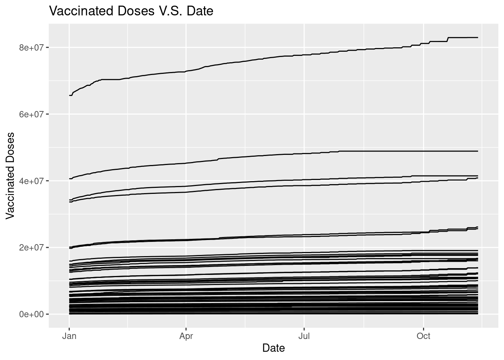
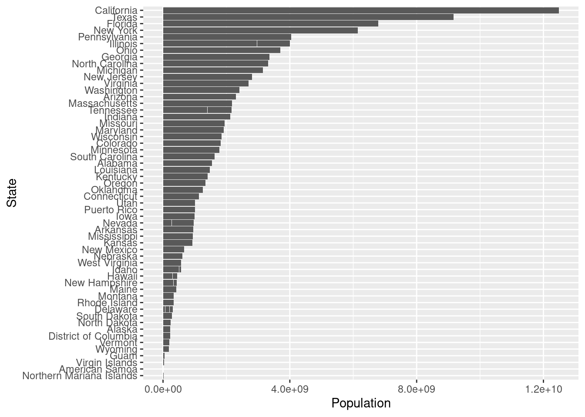

# (PART) Tutorials

# Preprocessing and Visualization of Time Series Data

Siyuan Ding

In this tutorial, we will learn how to visualize a time series data. When reaching a time series data, it is always not as organized as we want, so we need to do some preprocessing first before visualize it. We will use a time series dataset on Covid-19 vaccination from 2020-12-14 to 2022-10-30 as our example in this tutorial, the dataset is available on https://raw.githubusercontent.com/govex/COVID-19/master/data_tables/vaccine_data/us_data/time_series/time_series_covid19_vaccine_doses_admin_US.csv and our goal is to visualize the relationship between vaccinated doses for each state in 2022, that is from 2022-01-01.


We will use three packages in this tutorial: `dplyr`, `lubridate` and `tidyr` to manipulate our dataset and do preprocessing, and `ggplot2` to do visualization.


```r
# The packages can be installed by command: install.packages()
library(dplyr) 
library(lubridate)
library(ggplot2)
library(tidyr)
```

## Preprocess on a Time Series Data

In this part, we will first work on transforming the original data downloaded online to a data frame that we could work with. Then we will look into the data to see whether there are any problem data points with discipline of Time Series Data. And Finally we will deal with the missing values. With all these preprocessings done, our data would be good to visualize and analyze.

### Transform DataSet


```r
# load data
vaccination_all <- read.csv("https://raw.githubusercontent.com/govex/COVID-19/master/data_tables/vaccine_data/us_data/time_series/time_series_covid19_vaccine_doses_admin_US.csv")
colnames(vaccination_all)[1:15]
```

```
##  [1] "UID"            "iso2"           "iso3"           "code3"         
##  [5] "FIPS"           "Admin2"         "Province_State" "Country_Region"
##  [9] "Lat"            "Long_"          "Combined_Key"   "Population"    
## [13] "X2020.12.14"    "X2020.12.15"    "X2020.12.16"
```

```r
colnames(vaccination_all)[(ncol(vaccination_all)-5):ncol(vaccination_all)]
```

```
## [1] "X2022.11.07" "X2022.11.08" "X2022.11.09" "X2022.11.10" "X2022.11.11"
## [6] "X2022.11.12"
```

We first load and get a overall look of the dataset, and find the data has 61 rows with 698 columns. To visualize the relationship between vaccinated doses for each state, we only need three things: state name, state population and state vaccination population for each day. To achieve this, we can use `select` in `dplyr` package in r. We will focus on the data in 2022 as our example here.


```r
vaccination_df <- vaccination_all %>% select(Province_State, Population, `X2022.01.01`:tail(names(vaccination_all),1))
colnames(vaccination_df)[1:15]
```

```
##  [1] "Province_State" "Population"     "X2022.01.01"    "X2022.01.02"   
##  [5] "X2022.01.03"    "X2022.01.04"    "X2022.01.05"    "X2022.01.06"   
##  [9] "X2022.01.07"    "X2022.01.08"    "X2022.01.09"    "X2022.01.10"   
## [13] "X2022.01.11"    "X2022.01.12"    "X2022.01.13"
```

```r
colnames(vaccination_df)[(ncol(vaccination_df)-5):ncol(vaccination_df)]
```

```
## [1] "X2022.11.07" "X2022.11.08" "X2022.11.09" "X2022.11.10" "X2022.11.11"
## [6] "X2022.11.12"
```

Now, we have a table with 305 columns, and to make the dataframe works better, we woule like there only be four columns as `Province_State`, `Population`, `Date`, and `Vaccination_Doses` where `Date` comes from the colnames of the table and the `Vaccination_Doses` which is the number of population for each state at each date comes from the original entries of the date columns. To achieve this, we can temporarily ignore the `Population` column since it is identical to each state, so we can just full join it later and work on the vaccination population first. Then we will duplicate the state name for number of dates times, and build a matrix to store value for the vaccination dose for each state at each day by extracting them from original dataset using `subset` in `dplyr` and transform the dataframe by putting them together.


```r
vaccination_df <- vaccination_df[,-2]
# Find number of States
state <- vaccination_df$Province_State
State_num <- length(state)
# Find number of Days
date <- colnames(vaccination_df)[c(-1)]
time_window <- dim(vaccination_df)[2]-1
# Then in the transformed dataframe, each state should occur for time_window times
State <- rep(state, each = time_window)
# Then in the transformed dataframe, each date should occur for State_num times
Date <- rep(date, State_num)
# Build a matrix to contain the vaccination doses
vac_matrix <- matrix()
# We select the daily vaccination doses for each state and store them in a Matrix
for (i in 1:State_num){
  vac_matrix <- rbind(vac_matrix,matrix(unlist(vaccination_df%>%subset(Province_State==state[i]))[-1]))
}
# Drop the first column, which is NA
vac_matrix <- vac_matrix[2:length(vac_matrix)]
# Get the transformed dataset
Vac_DF <- cbind.data.frame(State, Date, vac_matrix)
colnames(Vac_DF) <- c("State", "Date", "Vaccinated Doses")
Vac_DF$`Vaccinated Doses` = as.numeric(Vac_DF$`Vaccinated Doses`)
head(Vac_DF)
```

```
##     State        Date Vaccinated Doses
## 1 Alabama X2022.01.01          5624234
## 2 Alabama X2022.01.02          5624234
## 3 Alabama X2022.01.03          5624234
## 4 Alabama X2022.01.04          5678299
## 5 Alabama X2022.01.05          5681793
## 6 Alabama X2022.01.06          5695747
```

Now having the transformed dataframe with vaccinated doses, we can full join it with Population for each state. And there are some province have no available population data, to deal with this, we can use `drop_na` function in `tidyr`. This functino let us drop rows according to column na values.


```r
state_pop <- vaccination_all %>% select(Province_State, Population)
Vac_DF <- Vac_DF %>% full_join(state_pop, by = c ("State" = "Province_State"))
Vac_DF <- Vac_DF %>% drop_na(Population)
head(Vac_DF)
```

```
##     State        Date Vaccinated Doses Population
## 1 Alabama X2022.01.01          5624234    4903185
## 2 Alabama X2022.01.02          5624234    4903185
## 3 Alabama X2022.01.03          5624234    4903185
## 4 Alabama X2022.01.04          5678299    4903185
## 5 Alabama X2022.01.05          5681793    4903185
## 6 Alabama X2022.01.06          5695747    4903185
```

```r
state <- unique(Vac_DF$State)
State_num <- length(state)
date <- unique(Vac_DF$Date)
time_window <- length(date)
```

At this time, we have got a transformed dataframe with all information needed, but remember, this is a time series dataset, so we need to be more careful with the `Date` column! We must check whether the entries there are in date type because we will need to sort the date for visualization so the date cannot be in other type like string.


```r
# Check data type of the Date column
class(Vac_DF$Date)
```

```
## [1] "character"
```

We found the data type is not date here! Now, we need to transform it into date type using `lubridate` package. With `lubridate`, we can manipulate dates easily, there are many functions in the packages. When we have a string with daymonthyear, for example "12032000", we can use `dmy()` and it will return a date format as "2000-03-12"; Similarly, when we have a string with monthdayyear format, we can use `mdy()`, and we can use `ymd()` when our data is in yearmonthday format. Just remember m represents month, d represents day, y represents year and you will be able to find the correct function you need. In our example case, our entries in `Date` are now string in yearmonthday format, so we will use `ymd()` here. To use this function, we will first need to remove the 'X' character at the beginning of each date, and we can achieve this by `substring` function.


```r
# We first remove the 'X' before the date
Vac_DF$Date <- substring(Vac_DF$Date,2)
Vac_DF$Date <- ymd(Vac_DF$Date )
head(Vac_DF)
```

```
##     State       Date Vaccinated Doses Population
## 1 Alabama 2022-01-01          5624234    4903185
## 2 Alabama 2022-01-02          5624234    4903185
## 3 Alabama 2022-01-03          5624234    4903185
## 4 Alabama 2022-01-04          5678299    4903185
## 5 Alabama 2022-01-05          5681793    4903185
## 6 Alabama 2022-01-06          5695747    4903185
```

We can double check the data type, and find it is in date format now. And our dataframe is transformed and good to use.


```r
class(Vac_DF$Date)
```

```
## [1] "Date"
```

### Deal with Missing Values

Before moving on, we first check on the missing values.


```r
sum(is.na(Vac_DF$`Vaccinated Doses`))
```

```
## [1] 0
```

We found there are no missing values, so we do not need to worry about missing values in this case.

If we have missing values in our example case, we would have two choices, either impute the missing values or remove them. And to make our future analysis more accurate, we would better try to impute them. Since our data is a time series data, then the vaccinated doses at day 1 cannot be greater than the the doses at day 2, conversely, the vaccinated doses at day 2 cannot be less than the doses at day 1, so we could impute our missing value by the closest non missing value, and this could be achieve by `fill` function in `tidyr` package. This function will impute the missing value by its previous or next value, and there is an argument `.direction` by which we can define in which direction to impute.

Since we do not have missing values, we can move on to deal with problematic data.

### Deal with Problematic Data Points

Before moving further on visualization or analysis, we need to be very careful on whether the data is cumulative or not! If the data is cumulative, then the value most be monotonically, in our example case, since the data is the vaccination doses for each state at each day, then the vaccinated doses in day 2 cannot be less than the value in day 1. So we need to check whether there are data that at day 2 has smaller value than at day 1, if so we assign the value at day 2 by the value at day 1.


```r
for (i in 1:length(state)){
  for (j in 2:time_window){
    if ((Vac_DF %>% subset(State == state[i]) %>% select(`Vaccinated Doses`))[j,] < 
        (Vac_DF %>% subset(State == state[i]) %>% select(`Vaccinated Doses`))[j-1,]){
      Vac_DF["Vaccinated Doses"][Vac_DF["State"] == state[i]][j] <- Vac_DF["Vaccinated Doses"][Vac_DF["State"] == state[i]][j-1]
    }
  }
}
```

Now we have finished our preprocessings. In brief conclusion, when we find a dataset online, we first load it and transform it into a usable dataframe. This usually requires functions in `dplyr` and when working on a time series data, we will also need functions in `lubridate` to make our date as a date type variable instead of character so that we can order it later for visualization. And when imputing the missing values, `tidyr` is a popular package to use since it could impute the missing value by the value nearest to that date. Then we need look into the data points, deal with the problematic data points according to the dataset itself, for example in our case, we are working on vaccinated doses along time, so this must be a monotonically increasing variable. After finishing these steps, we could move on visualizing our data.

## Visualize a Time Series Data

When visualize a time series data, we mainly focus on the trend. That is we want to see how the data changes over time, so we would like to `geom_line` in `ggplot2` to show the changes over time in each state.


```r
ggplot(data = Vac_DF, mapping = aes(x = Date, y = `Vaccinated Doses`, group = State)) +
  geom_line() +
  ggtitle("Vaccinated Doses V.S. Date")
```



The graph does not give us much informaiton because we cannot tell the state, so we could make the graph varries in color according to states with command `color = State`.


```r
ggplot(data = Vac_DF, mapping = aes(x = Date, y = `Vaccinated Doses`, group = State, color = State)) +
  geom_line() +
  ggtitle("Vaccinated Doses V.S. Date")
```


The graph looks much better now because we can find the line corresponded for each state by the color. And we can easily find the state with highest vaccinated doses is California. But since California has too large vaccinated doses, the range of the plot is great and make the trend not so clear. So we may want to check about the states' population. To get a deeper insight, we can visualize the population for each state using `geom_bar`.


```r
ggplot(data = Vac_DF, mapping = aes(x= Population, y = State)) + 
  geom_bar(stat="identity")
```


This bar plot cannot give much insights without ordering, in order to easily find the populatioin order for each state, we can order the plot using `factor()`.


```r
order <- unique(Vac_DF %>% select(Population, State) %>% arrange(Population) %>% mutate(State = factor(State)))
Pop_Order_DF <- Vac_DF %>% mutate(State = factor(State, levels = order$State, ordered = TRUE))
ggplot(data = Pop_Order_DF, mapping = aes(x= Population, y = State)) + 
  geom_bar(stat="identity")
```



After ordering the barplot, we find the California is with highest population among all the states so the result that the vaccinated doses has greatest amount in California does not give much information because California has great population itself. So in order to get a deeper insights, we can visualize the vaccinated doses rate, that is divide the vaccinated doses by population. Since we would like to see the trends over time and difference between each state, we could use `geom_line()` again and `color` by state.


```r
Vac_Rate_DF <- Vac_DF %>% mutate(`Vaccinated Doses Rate` = `Vaccinated Doses`/Population)

ggplot(data = Vac_Rate_DF, mapping = aes(x = Date, y = `Vaccinated Doses Rate`, group = State, color = State)) +
  geom_line() +
  ggtitle("Vaccinated Doses Rate V.S. Date")
```


Now we can get a better look and find District of Columbia has highest vaccinated doses rate and this proves that it is important for us to look into the vaccinated doses rate instead of absolute vaccinated doses since population does affect the results.Now we have got a great visualization of this time series data. 

## Conclusion

In conclusion, when dealing with a time series data, we need to spend time on preprocessing, including transforming date into usable dataframe using `dplyr` and `tidyr`package, dealing with the missing values, and the problematic data. And when transforming data, it is important to watch the date type! We need it to be as date class instead of character, so that we can order it when visualizing, the date format can be converted by functions in `lubridate` package. After finish theses preprocessing works, we can start our visualization part using `ggplot2`, and we should try to remove potential affecting factors in order to get a clear look at the data trend over time.
