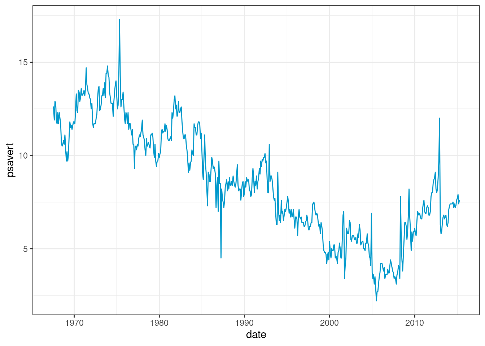
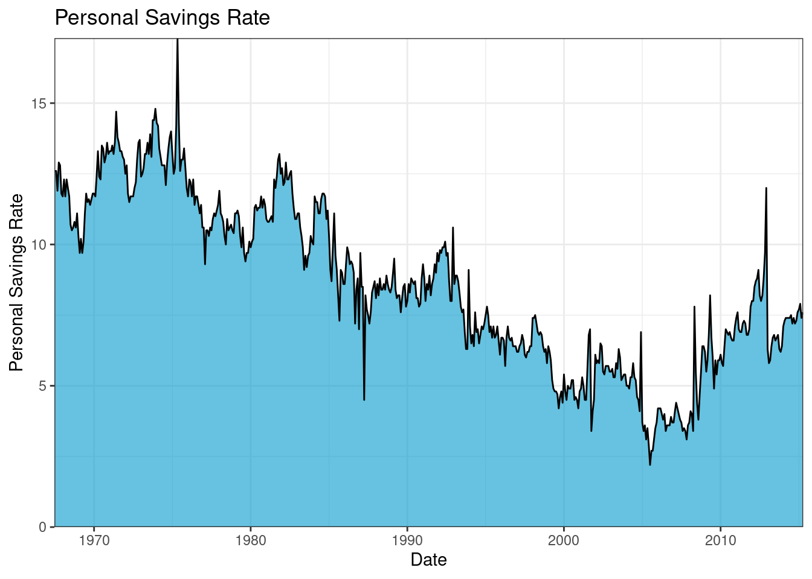

# Time series visualization with R

Runnan Jiang


```r
library(tidyverse)
#library(ggplot2)
#library(dplyr)
library(openintro)
library(plotrix)
library(zoo)
library(gcookbook)
library(xts)
library(dygraphs)
```

### 1. Introduction

A time series is a sequence of data points that occur in successive order over some period of time. Time series is very important in many industries. In this tutorial, we collect and organize useful methods to create and customize time series visualizations from R. We hope this tutorial could help us visualize time series data effectively and efficiently in the future. The main packages used are `tidyverse` and `dygraphs`. `ggplot2` has already offered great features when it comes to visualize time series: date can be recognized automatically and result in neat X axis labels; `scale_x_data()` makes it easy to customize those labels. Besides, there are packages including `dygraphs`,`plotly` that can create interactive plots of time series.

### 2 Line Plots

For this section, we use `economics` dataset from ggplot2 package. This dataset was produced from US economic time series data available from [the Federal Reserve Bank of St. Louis](https://fred.stlouisfed.org/). It contains information on personal consumption expenditures, total population, personal savings rate and unemployment with respect to the year and month.


```r
economics %>% glimpse()
```

```
## Rows: 574
## Columns: 6
## $ date     <date> 1967-07-01, 1967-08-01, 1967-09-01, 1967-10-01, 1967-11-01, …
## $ pce      <dbl> 506.7, 509.8, 515.6, 512.2, 517.4, 525.1, 530.9, 533.6, 544.3…
## $ pop      <dbl> 198712, 198911, 199113, 199311, 199498, 199657, 199808, 19992…
## $ psavert  <dbl> 12.6, 12.6, 11.9, 12.9, 12.8, 11.8, 11.7, 12.3, 11.7, 12.3, 1…
## $ uempmed  <dbl> 4.5, 4.7, 4.6, 4.9, 4.7, 4.8, 5.1, 4.5, 4.1, 4.6, 4.4, 4.4, 4…
## $ unemploy <dbl> 2944, 2945, 2958, 3143, 3066, 3018, 2878, 3001, 2877, 2709, 2…
```

Line plots are commonly used to plot time series data.

```r
economics %>%
  ggplot(aes(date,psavert)) +
  geom_line(color="#0099CC") +
  theme_bw()
```



We can use `scale_x_date()` to control the x-axis breaks, limits, and labels; use `scale_y_continuous()` to control the y-axis breaks, limits, and labels; use `geom_vline()` with `annotate()` to mark specific events in a time series.


```r
economics %>%
  ggplot(aes(x=date,y=psavert)) +
  geom_line(color="#0099CC") +
  scale_x_date(date_breaks = "5 years", date_labels = "%Y-%m") +
  scale_y_continuous(breaks = seq(2,20,2)) +
  geom_vline(xintercept=as.Date("2007-12-01"), color="#FF6666") +
  annotate("text", x=as.Date("2009-01-01"), y=12, label="Global Recession", angle=90, size=3, color="#FF6666") +
  ggtitle("Personal Savings Rate Time Series") +
  theme_bw()
```


Sometimes multiple indicators that change along time are incomparable. At this time, the data should not be drawn in the same coordinate system. Generally, multiple slices can be drawn and aligned up and down according to the time axis. `facet_wrap()` can be used for faceting.

```r
economics_facet <- economics %>%
  pivot_longer(c(pce, psavert),
               names_to = "index", 
               values_to = "value")
economics_facet %>%
  ggplot(aes(date,value)) + 
  geom_line(color="#0099CC") + 
  facet_wrap(~index, ncol = 1, scales = "free_y") +
  theme_bw()
```


We can use `rollmean()` in Zoo package to compute rolling means.

```r
economics_rolling <- economics %>%
  mutate(roll_mean = rollmean(economics$psavert,k=12,align="right",fill = NA))

economics_rolling <- gather(economics_rolling, key=Metric, value = psavert, 
                            c("psavert","roll_mean"))

ggplot(economics_rolling) +
  geom_line(aes(x=date,y=psavert,group=Metric,color=Metric)) +
  theme_bw()
```


#### 3 Bar Plots

We can also use barplot to visualize time series data.

```r
ggplot(economics) +
  geom_bar(aes(x = date, y = psavert, fill = pop), stat = 'identity') +
  labs(title = "Personal Savings Rate and Total Population Time Series") +
  theme_bw()
```


```r
economics.grouped <-
  economics %>%
  mutate(year=format(date,"%Y")) %>%
  group_by(year) %>%
  summarise(mean_pop_by_year=mean(pce))

economics.grouped <-
  economics.grouped %>%
  filter(year > '2000')

ggplot(economics.grouped) + 
  geom_bar(aes(x = year, y = mean_pop_by_year), stat = 'identity', fill="#0099CC",color='black',alpha=0.6) +
  labs(title = "Total Population Yearly Average") +
  theme_bw()
```


### 4. Area Plots

#### 4.1 Areas Under a Single Time Series


```r
ggplot(economics, aes(x = date, y = psavert)) +
  geom_area(fill="#0099CC",color='black',alpha=0.6) +
  labs(title = "Personal Savings Rate",
       x = "Date",
       y = "Personal Savings Rate") +
  scale_x_date(expand = c(0,0)) +
  scale_y_continuous(expand = c(0,0)) +
  theme_bw()
```



#### 4.2 Stacked Polygons

A stacked area chart can be used to show differences between groups over time. In this section, we use `uspopage` dataset from `gcookbook` package. We will plot the age distribution of the US population from 1900 to 2002.

```r
data(uspopage, package = "gcookbook")
uspopage %>% glimpse()
```

```
## Rows: 824
## Columns: 3
## $ Year      <int> 1900, 1900, 1900, 1900, 1900, 1900, 1900, 1900, 1901, 1901, …
## $ AgeGroup  <fct> <5, 5-14, 15-24, 25-34, 35-44, 45-54, 55-64, >64, <5, 5-14, …
## $ Thousands <int> 9181, 16966, 14951, 12161, 9273, 6437, 4026, 3099, 9336, 171…
```

To create stacked polygons (area plots), we use function `stackpoly()` from `plotrix` package. 

```r
ggplot(uspopage, aes(x = Year,
                     y = Thousands, 
                     fill = AgeGroup)) +
  geom_area(alpha=0.6 , size=.5, colour="white") +
  ggtitle("US Population by age") +
  theme_bw()
```


We could define a appropriate order of stack by ourselves.

```r
# Give a specific order
uspopage$AgeGroup <- factor(uspopage$AgeGroup, 
                   levels=c(">64","55-64","45-54","35-44","25-34","15-24","5-14","<5"))

ggplot(uspopage, aes(x=Year,y=Thousands,fill=AgeGroup)) + 
    geom_area(alpha=0.6 , size=.5, colour="white") + 
    ggtitle("US Population by age") +
    theme_bw()
```


When the variable is a percentage and the sum of each year is always equal to a hundred, we could use a proportional stacked area graph to visualize the data.

```r
uspopage_percentage <- uspopage  %>%
  group_by(Year, AgeGroup) %>%
  summarise(n = sum(Thousands)) %>%
  mutate(percentage = n / sum(n))

ggplot(uspopage_percentage, aes(x=Year, y=percentage, fill=AgeGroup)) + 
    geom_area(alpha=0.6 , size=1, colour="white") +
    ggtitle("US Population Proportion by age") +
    theme_bw()
```


### 5. Interactive Time Series

`dygraphs` is a package for visualizing time series data. With `dygraphs`, we can easily implement zooming, hovering, minimaps and much more visualizations.

```r
str(economics)
```

```
## spc_tbl_ [574 × 6] (S3: spec_tbl_df/tbl_df/tbl/data.frame)
##  $ date    : Date[1:574], format: "1967-07-01" "1967-08-01" ...
##  $ pce     : num [1:574] 507 510 516 512 517 ...
##  $ pop     : num [1:574] 198712 198911 199113 199311 199498 ...
##  $ psavert : num [1:574] 12.6 12.6 11.9 12.9 12.8 11.8 11.7 12.3 11.7 12.3 ...
##  $ uempmed : num [1:574] 4.5 4.7 4.6 4.9 4.7 4.8 5.1 4.5 4.1 4.6 ...
##  $ unemploy: num [1:574] 2944 2945 2958 3143 3066 ...
```

```r
don <- xts(x = economics$psavert, order.by = economics$date)
p <- dygraphs::dygraph(don) %>%
  dyOptions(colors="#0099CC")
p
```

```{=html}
<div id="htmlwidget-2114080596b463692ad0" style="width:80%;height:480px;" class="dygraphs html-widget"></div>
<script type="application/json" data-for="htmlwidget-2114080596b463692ad0">{"x":{"attrs":{"labels":["month","V1"],"legend":"auto","retainDateWindow":false,"axes":{"x":{"pixelsPerLabel":60,"drawAxis":true},"y":{"drawAxis":true}},"stackedGraph":false,"fillGraph":false,"fillAlpha":0.15,"stepPlot":false,"drawPoints":false,"pointSize":1,"drawGapEdgePoints":false,"connectSeparatedPoints":false,"strokeWidth":1,"strokeBorderColor":"white","colors":["#0099CC"],"colorValue":0.5,"colorSaturation":1,"includeZero":false,"drawAxesAtZero":false,"logscale":false,"axisTickSize":3,"axisLineColor":"black","axisLineWidth":0.3,"axisLabelColor":"black","axisLabelFontSize":14,"axisLabelWidth":60,"drawGrid":true,"gridLineWidth":0.3,"rightGap":5,"digitsAfterDecimal":2,"labelsKMB":false,"labelsKMG2":false,"labelsUTC":false,"maxNumberWidth":6,"animatedZooms":false,"mobileDisableYTouch":true,"disableZoom":false},"scale":"monthly","annotations":[],"shadings":[],"events":[],"format":"date","data":[["1967-07-01T00:00:00.000Z","1967-08-01T00:00:00.000Z","1967-09-01T00:00:00.000Z","1967-10-01T00:00:00.000Z","1967-11-01T00:00:00.000Z","1967-12-01T00:00:00.000Z","1968-01-01T00:00:00.000Z","1968-02-01T00:00:00.000Z","1968-03-01T00:00:00.000Z","1968-04-01T00:00:00.000Z","1968-05-01T00:00:00.000Z","1968-06-01T00:00:00.000Z","1968-07-01T00:00:00.000Z","1968-08-01T00:00:00.000Z","1968-09-01T00:00:00.000Z","1968-10-01T00:00:00.000Z","1968-11-01T00:00:00.000Z","1968-12-01T00:00:00.000Z","1969-01-01T00:00:00.000Z","1969-02-01T00:00:00.000Z","1969-03-01T00:00:00.000Z","1969-04-01T00:00:00.000Z","1969-05-01T00:00:00.000Z","1969-06-01T00:00:00.000Z","1969-07-01T00:00:00.000Z","1969-08-01T00:00:00.000Z","1969-09-01T00:00:00.000Z","1969-10-01T00:00:00.000Z","1969-11-01T00:00:00.000Z","1969-12-01T00:00:00.000Z","1970-01-01T00:00:00.000Z","1970-02-01T00:00:00.000Z","1970-03-01T00:00:00.000Z","1970-04-01T00:00:00.000Z","1970-05-01T00:00:00.000Z","1970-06-01T00:00:00.000Z","1970-07-01T00:00:00.000Z","1970-08-01T00:00:00.000Z","1970-09-01T00:00:00.000Z","1970-10-01T00:00:00.000Z","1970-11-01T00:00:00.000Z","1970-12-01T00:00:00.000Z","1971-01-01T00:00:00.000Z","1971-02-01T00:00:00.000Z","1971-03-01T00:00:00.000Z","1971-04-01T00:00:00.000Z","1971-05-01T00:00:00.000Z","1971-06-01T00:00:00.000Z","1971-07-01T00:00:00.000Z","1971-08-01T00:00:00.000Z","1971-09-01T00:00:00.000Z","1971-10-01T00:00:00.000Z","1971-11-01T00:00:00.000Z","1971-12-01T00:00:00.000Z","1972-01-01T00:00:00.000Z","1972-02-01T00:00:00.000Z","1972-03-01T00:00:00.000Z","1972-04-01T00:00:00.000Z","1972-05-01T00:00:00.000Z","1972-06-01T00:00:00.000Z","1972-07-01T00:00:00.000Z","1972-08-01T00:00:00.000Z","1972-09-01T00:00:00.000Z","1972-10-01T00:00:00.000Z","1972-11-01T00:00:00.000Z","1972-12-01T00:00:00.000Z","1973-01-01T00:00:00.000Z","1973-02-01T00:00:00.000Z","1973-03-01T00:00:00.000Z","1973-04-01T00:00:00.000Z","1973-05-01T00:00:00.000Z","1973-06-01T00:00:00.000Z","1973-07-01T00:00:00.000Z","1973-08-01T00:00:00.000Z","1973-09-01T00:00:00.000Z","1973-10-01T00:00:00.000Z","1973-11-01T00:00:00.000Z","1973-12-01T00:00:00.000Z","1974-01-01T00:00:00.000Z","1974-02-01T00:00:00.000Z","1974-03-01T00:00:00.000Z","1974-04-01T00:00:00.000Z","1974-05-01T00:00:00.000Z","1974-06-01T00:00:00.000Z","1974-07-01T00:00:00.000Z","1974-08-01T00:00:00.000Z","1974-09-01T00:00:00.000Z","1974-10-01T00:00:00.000Z","1974-11-01T00:00:00.000Z","1974-12-01T00:00:00.000Z","1975-01-01T00:00:00.000Z","1975-02-01T00:00:00.000Z","1975-03-01T00:00:00.000Z","1975-04-01T00:00:00.000Z","1975-05-01T00:00:00.000Z","1975-06-01T00:00:00.000Z","1975-07-01T00:00:00.000Z","1975-08-01T00:00:00.000Z","1975-09-01T00:00:00.000Z","1975-10-01T00:00:00.000Z","1975-11-01T00:00:00.000Z","1975-12-01T00:00:00.000Z","1976-01-01T00:00:00.000Z","1976-02-01T00:00:00.000Z","1976-03-01T00:00:00.000Z","1976-04-01T00:00:00.000Z","1976-05-01T00:00:00.000Z","1976-06-01T00:00:00.000Z","1976-07-01T00:00:00.000Z","1976-08-01T00:00:00.000Z","1976-09-01T00:00:00.000Z","1976-10-01T00:00:00.000Z","1976-11-01T00:00:00.000Z","1976-12-01T00:00:00.000Z","1977-01-01T00:00:00.000Z","1977-02-01T00:00:00.000Z","1977-03-01T00:00:00.000Z","1977-04-01T00:00:00.000Z","1977-05-01T00:00:00.000Z","1977-06-01T00:00:00.000Z","1977-07-01T00:00:00.000Z","1977-08-01T00:00:00.000Z","1977-09-01T00:00:00.000Z","1977-10-01T00:00:00.000Z","1977-11-01T00:00:00.000Z","1977-12-01T00:00:00.000Z","1978-01-01T00:00:00.000Z","1978-02-01T00:00:00.000Z","1978-03-01T00:00:00.000Z","1978-04-01T00:00:00.000Z","1978-05-01T00:00:00.000Z","1978-06-01T00:00:00.000Z","1978-07-01T00:00:00.000Z","1978-08-01T00:00:00.000Z","1978-09-01T00:00:00.000Z","1978-10-01T00:00:00.000Z","1978-11-01T00:00:00.000Z","1978-12-01T00:00:00.000Z","1979-01-01T00:00:00.000Z","1979-02-01T00:00:00.000Z","1979-03-01T00:00:00.000Z","1979-04-01T00:00:00.000Z","1979-05-01T00:00:00.000Z","1979-06-01T00:00:00.000Z","1979-07-01T00:00:00.000Z","1979-08-01T00:00:00.000Z","1979-09-01T00:00:00.000Z","1979-10-01T00:00:00.000Z","1979-11-01T00:00:00.000Z","1979-12-01T00:00:00.000Z","1980-01-01T00:00:00.000Z","1980-02-01T00:00:00.000Z","1980-03-01T00:00:00.000Z","1980-04-01T00:00:00.000Z","1980-05-01T00:00:00.000Z","1980-06-01T00:00:00.000Z","1980-07-01T00:00:00.000Z","1980-08-01T00:00:00.000Z","1980-09-01T00:00:00.000Z","1980-10-01T00:00:00.000Z","1980-11-01T00:00:00.000Z","1980-12-01T00:00:00.000Z","1981-01-01T00:00:00.000Z","1981-02-01T00:00:00.000Z","1981-03-01T00:00:00.000Z","1981-04-01T00:00:00.000Z","1981-05-01T00:00:00.000Z","1981-06-01T00:00:00.000Z","1981-07-01T00:00:00.000Z","1981-08-01T00:00:00.000Z","1981-09-01T00:00:00.000Z","1981-10-01T00:00:00.000Z","1981-11-01T00:00:00.000Z","1981-12-01T00:00:00.000Z","1982-01-01T00:00:00.000Z","1982-02-01T00:00:00.000Z","1982-03-01T00:00:00.000Z","1982-04-01T00:00:00.000Z","1982-05-01T00:00:00.000Z","1982-06-01T00:00:00.000Z","1982-07-01T00:00:00.000Z","1982-08-01T00:00:00.000Z","1982-09-01T00:00:00.000Z","1982-10-01T00:00:00.000Z","1982-11-01T00:00:00.000Z","1982-12-01T00:00:00.000Z","1983-01-01T00:00:00.000Z","1983-02-01T00:00:00.000Z","1983-03-01T00:00:00.000Z","1983-04-01T00:00:00.000Z","1983-05-01T00:00:00.000Z","1983-06-01T00:00:00.000Z","1983-07-01T00:00:00.000Z","1983-08-01T00:00:00.000Z","1983-09-01T00:00:00.000Z","1983-10-01T00:00:00.000Z","1983-11-01T00:00:00.000Z","1983-12-01T00:00:00.000Z","1984-01-01T00:00:00.000Z","1984-02-01T00:00:00.000Z","1984-03-01T00:00:00.000Z","1984-04-01T00:00:00.000Z","1984-05-01T00:00:00.000Z","1984-06-01T00:00:00.000Z","1984-07-01T00:00:00.000Z","1984-08-01T00:00:00.000Z","1984-09-01T00:00:00.000Z","1984-10-01T00:00:00.000Z","1984-11-01T00:00:00.000Z","1984-12-01T00:00:00.000Z","1985-01-01T00:00:00.000Z","1985-02-01T00:00:00.000Z","1985-03-01T00:00:00.000Z","1985-04-01T00:00:00.000Z","1985-05-01T00:00:00.000Z","1985-06-01T00:00:00.000Z","1985-07-01T00:00:00.000Z","1985-08-01T00:00:00.000Z","1985-09-01T00:00:00.000Z","1985-10-01T00:00:00.000Z","1985-11-01T00:00:00.000Z","1985-12-01T00:00:00.000Z","1986-01-01T00:00:00.000Z","1986-02-01T00:00:00.000Z","1986-03-01T00:00:00.000Z","1986-04-01T00:00:00.000Z","1986-05-01T00:00:00.000Z","1986-06-01T00:00:00.000Z","1986-07-01T00:00:00.000Z","1986-08-01T00:00:00.000Z","1986-09-01T00:00:00.000Z","1986-10-01T00:00:00.000Z","1986-11-01T00:00:00.000Z","1986-12-01T00:00:00.000Z","1987-01-01T00:00:00.000Z","1987-02-01T00:00:00.000Z","1987-03-01T00:00:00.000Z","1987-04-01T00:00:00.000Z","1987-05-01T00:00:00.000Z","1987-06-01T00:00:00.000Z","1987-07-01T00:00:00.000Z","1987-08-01T00:00:00.000Z","1987-09-01T00:00:00.000Z","1987-10-01T00:00:00.000Z","1987-11-01T00:00:00.000Z","1987-12-01T00:00:00.000Z","1988-01-01T00:00:00.000Z","1988-02-01T00:00:00.000Z","1988-03-01T00:00:00.000Z","1988-04-01T00:00:00.000Z","1988-05-01T00:00:00.000Z","1988-06-01T00:00:00.000Z","1988-07-01T00:00:00.000Z","1988-08-01T00:00:00.000Z","1988-09-01T00:00:00.000Z","1988-10-01T00:00:00.000Z","1988-11-01T00:00:00.000Z","1988-12-01T00:00:00.000Z","1989-01-01T00:00:00.000Z","1989-02-01T00:00:00.000Z","1989-03-01T00:00:00.000Z","1989-04-01T00:00:00.000Z","1989-05-01T00:00:00.000Z","1989-06-01T00:00:00.000Z","1989-07-01T00:00:00.000Z","1989-08-01T00:00:00.000Z","1989-09-01T00:00:00.000Z","1989-10-01T00:00:00.000Z","1989-11-01T00:00:00.000Z","1989-12-01T00:00:00.000Z","1990-01-01T00:00:00.000Z","1990-02-01T00:00:00.000Z","1990-03-01T00:00:00.000Z","1990-04-01T00:00:00.000Z","1990-05-01T00:00:00.000Z","1990-06-01T00:00:00.000Z","1990-07-01T00:00:00.000Z","1990-08-01T00:00:00.000Z","1990-09-01T00:00:00.000Z","1990-10-01T00:00:00.000Z","1990-11-01T00:00:00.000Z","1990-12-01T00:00:00.000Z","1991-01-01T00:00:00.000Z","1991-02-01T00:00:00.000Z","1991-03-01T00:00:00.000Z","1991-04-01T00:00:00.000Z","1991-05-01T00:00:00.000Z","1991-06-01T00:00:00.000Z","1991-07-01T00:00:00.000Z","1991-08-01T00:00:00.000Z","1991-09-01T00:00:00.000Z","1991-10-01T00:00:00.000Z","1991-11-01T00:00:00.000Z","1991-12-01T00:00:00.000Z","1992-01-01T00:00:00.000Z","1992-02-01T00:00:00.000Z","1992-03-01T00:00:00.000Z","1992-04-01T00:00:00.000Z","1992-05-01T00:00:00.000Z","1992-06-01T00:00:00.000Z","1992-07-01T00:00:00.000Z","1992-08-01T00:00:00.000Z","1992-09-01T00:00:00.000Z","1992-10-01T00:00:00.000Z","1992-11-01T00:00:00.000Z","1992-12-01T00:00:00.000Z","1993-01-01T00:00:00.000Z","1993-02-01T00:00:00.000Z","1993-03-01T00:00:00.000Z","1993-04-01T00:00:00.000Z","1993-05-01T00:00:00.000Z","1993-06-01T00:00:00.000Z","1993-07-01T00:00:00.000Z","1993-08-01T00:00:00.000Z","1993-09-01T00:00:00.000Z","1993-10-01T00:00:00.000Z","1993-11-01T00:00:00.000Z","1993-12-01T00:00:00.000Z","1994-01-01T00:00:00.000Z","1994-02-01T00:00:00.000Z","1994-03-01T00:00:00.000Z","1994-04-01T00:00:00.000Z","1994-05-01T00:00:00.000Z","1994-06-01T00:00:00.000Z","1994-07-01T00:00:00.000Z","1994-08-01T00:00:00.000Z","1994-09-01T00:00:00.000Z","1994-10-01T00:00:00.000Z","1994-11-01T00:00:00.000Z","1994-12-01T00:00:00.000Z","1995-01-01T00:00:00.000Z","1995-02-01T00:00:00.000Z","1995-03-01T00:00:00.000Z","1995-04-01T00:00:00.000Z","1995-05-01T00:00:00.000Z","1995-06-01T00:00:00.000Z","1995-07-01T00:00:00.000Z","1995-08-01T00:00:00.000Z","1995-09-01T00:00:00.000Z","1995-10-01T00:00:00.000Z","1995-11-01T00:00:00.000Z","1995-12-01T00:00:00.000Z","1996-01-01T00:00:00.000Z","1996-02-01T00:00:00.000Z","1996-03-01T00:00:00.000Z","1996-04-01T00:00:00.000Z","1996-05-01T00:00:00.000Z","1996-06-01T00:00:00.000Z","1996-07-01T00:00:00.000Z","1996-08-01T00:00:00.000Z","1996-09-01T00:00:00.000Z","1996-10-01T00:00:00.000Z","1996-11-01T00:00:00.000Z","1996-12-01T00:00:00.000Z","1997-01-01T00:00:00.000Z","1997-02-01T00:00:00.000Z","1997-03-01T00:00:00.000Z","1997-04-01T00:00:00.000Z","1997-05-01T00:00:00.000Z","1997-06-01T00:00:00.000Z","1997-07-01T00:00:00.000Z","1997-08-01T00:00:00.000Z","1997-09-01T00:00:00.000Z","1997-10-01T00:00:00.000Z","1997-11-01T00:00:00.000Z","1997-12-01T00:00:00.000Z","1998-01-01T00:00:00.000Z","1998-02-01T00:00:00.000Z","1998-03-01T00:00:00.000Z","1998-04-01T00:00:00.000Z","1998-05-01T00:00:00.000Z","1998-06-01T00:00:00.000Z","1998-07-01T00:00:00.000Z","1998-08-01T00:00:00.000Z","1998-09-01T00:00:00.000Z","1998-10-01T00:00:00.000Z","1998-11-01T00:00:00.000Z","1998-12-01T00:00:00.000Z","1999-01-01T00:00:00.000Z","1999-02-01T00:00:00.000Z","1999-03-01T00:00:00.000Z","1999-04-01T00:00:00.000Z","1999-05-01T00:00:00.000Z","1999-06-01T00:00:00.000Z","1999-07-01T00:00:00.000Z","1999-08-01T00:00:00.000Z","1999-09-01T00:00:00.000Z","1999-10-01T00:00:00.000Z","1999-11-01T00:00:00.000Z","1999-12-01T00:00:00.000Z","2000-01-01T00:00:00.000Z","2000-02-01T00:00:00.000Z","2000-03-01T00:00:00.000Z","2000-04-01T00:00:00.000Z","2000-05-01T00:00:00.000Z","2000-06-01T00:00:00.000Z","2000-07-01T00:00:00.000Z","2000-08-01T00:00:00.000Z","2000-09-01T00:00:00.000Z","2000-10-01T00:00:00.000Z","2000-11-01T00:00:00.000Z","2000-12-01T00:00:00.000Z","2001-01-01T00:00:00.000Z","2001-02-01T00:00:00.000Z","2001-03-01T00:00:00.000Z","2001-04-01T00:00:00.000Z","2001-05-01T00:00:00.000Z","2001-06-01T00:00:00.000Z","2001-07-01T00:00:00.000Z","2001-08-01T00:00:00.000Z","2001-09-01T00:00:00.000Z","2001-10-01T00:00:00.000Z","2001-11-01T00:00:00.000Z","2001-12-01T00:00:00.000Z","2002-01-01T00:00:00.000Z","2002-02-01T00:00:00.000Z","2002-03-01T00:00:00.000Z","2002-04-01T00:00:00.000Z","2002-05-01T00:00:00.000Z","2002-06-01T00:00:00.000Z","2002-07-01T00:00:00.000Z","2002-08-01T00:00:00.000Z","2002-09-01T00:00:00.000Z","2002-10-01T00:00:00.000Z","2002-11-01T00:00:00.000Z","2002-12-01T00:00:00.000Z","2003-01-01T00:00:00.000Z","2003-02-01T00:00:00.000Z","2003-03-01T00:00:00.000Z","2003-04-01T00:00:00.000Z","2003-05-01T00:00:00.000Z","2003-06-01T00:00:00.000Z","2003-07-01T00:00:00.000Z","2003-08-01T00:00:00.000Z","2003-09-01T00:00:00.000Z","2003-10-01T00:00:00.000Z","2003-11-01T00:00:00.000Z","2003-12-01T00:00:00.000Z","2004-01-01T00:00:00.000Z","2004-02-01T00:00:00.000Z","2004-03-01T00:00:00.000Z","2004-04-01T00:00:00.000Z","2004-05-01T00:00:00.000Z","2004-06-01T00:00:00.000Z","2004-07-01T00:00:00.000Z","2004-08-01T00:00:00.000Z","2004-09-01T00:00:00.000Z","2004-10-01T00:00:00.000Z","2004-11-01T00:00:00.000Z","2004-12-01T00:00:00.000Z","2005-01-01T00:00:00.000Z","2005-02-01T00:00:00.000Z","2005-03-01T00:00:00.000Z","2005-04-01T00:00:00.000Z","2005-05-01T00:00:00.000Z","2005-06-01T00:00:00.000Z","2005-07-01T00:00:00.000Z","2005-08-01T00:00:00.000Z","2005-09-01T00:00:00.000Z","2005-10-01T00:00:00.000Z","2005-11-01T00:00:00.000Z","2005-12-01T00:00:00.000Z","2006-01-01T00:00:00.000Z","2006-02-01T00:00:00.000Z","2006-03-01T00:00:00.000Z","2006-04-01T00:00:00.000Z","2006-05-01T00:00:00.000Z","2006-06-01T00:00:00.000Z","2006-07-01T00:00:00.000Z","2006-08-01T00:00:00.000Z","2006-09-01T00:00:00.000Z","2006-10-01T00:00:00.000Z","2006-11-01T00:00:00.000Z","2006-12-01T00:00:00.000Z","2007-01-01T00:00:00.000Z","2007-02-01T00:00:00.000Z","2007-03-01T00:00:00.000Z","2007-04-01T00:00:00.000Z","2007-05-01T00:00:00.000Z","2007-06-01T00:00:00.000Z","2007-07-01T00:00:00.000Z","2007-08-01T00:00:00.000Z","2007-09-01T00:00:00.000Z","2007-10-01T00:00:00.000Z","2007-11-01T00:00:00.000Z","2007-12-01T00:00:00.000Z","2008-01-01T00:00:00.000Z","2008-02-01T00:00:00.000Z","2008-03-01T00:00:00.000Z","2008-04-01T00:00:00.000Z","2008-05-01T00:00:00.000Z","2008-06-01T00:00:00.000Z","2008-07-01T00:00:00.000Z","2008-08-01T00:00:00.000Z","2008-09-01T00:00:00.000Z","2008-10-01T00:00:00.000Z","2008-11-01T00:00:00.000Z","2008-12-01T00:00:00.000Z","2009-01-01T00:00:00.000Z","2009-02-01T00:00:00.000Z","2009-03-01T00:00:00.000Z","2009-04-01T00:00:00.000Z","2009-05-01T00:00:00.000Z","2009-06-01T00:00:00.000Z","2009-07-01T00:00:00.000Z","2009-08-01T00:00:00.000Z","2009-09-01T00:00:00.000Z","2009-10-01T00:00:00.000Z","2009-11-01T00:00:00.000Z","2009-12-01T00:00:00.000Z","2010-01-01T00:00:00.000Z","2010-02-01T00:00:00.000Z","2010-03-01T00:00:00.000Z","2010-04-01T00:00:00.000Z","2010-05-01T00:00:00.000Z","2010-06-01T00:00:00.000Z","2010-07-01T00:00:00.000Z","2010-08-01T00:00:00.000Z","2010-09-01T00:00:00.000Z","2010-10-01T00:00:00.000Z","2010-11-01T00:00:00.000Z","2010-12-01T00:00:00.000Z","2011-01-01T00:00:00.000Z","2011-02-01T00:00:00.000Z","2011-03-01T00:00:00.000Z","2011-04-01T00:00:00.000Z","2011-05-01T00:00:00.000Z","2011-06-01T00:00:00.000Z","2011-07-01T00:00:00.000Z","2011-08-01T00:00:00.000Z","2011-09-01T00:00:00.000Z","2011-10-01T00:00:00.000Z","2011-11-01T00:00:00.000Z","2011-12-01T00:00:00.000Z","2012-01-01T00:00:00.000Z","2012-02-01T00:00:00.000Z","2012-03-01T00:00:00.000Z","2012-04-01T00:00:00.000Z","2012-05-01T00:00:00.000Z","2012-06-01T00:00:00.000Z","2012-07-01T00:00:00.000Z","2012-08-01T00:00:00.000Z","2012-09-01T00:00:00.000Z","2012-10-01T00:00:00.000Z","2012-11-01T00:00:00.000Z","2012-12-01T00:00:00.000Z","2013-01-01T00:00:00.000Z","2013-02-01T00:00:00.000Z","2013-03-01T00:00:00.000Z","2013-04-01T00:00:00.000Z","2013-05-01T00:00:00.000Z","2013-06-01T00:00:00.000Z","2013-07-01T00:00:00.000Z","2013-08-01T00:00:00.000Z","2013-09-01T00:00:00.000Z","2013-10-01T00:00:00.000Z","2013-11-01T00:00:00.000Z","2013-12-01T00:00:00.000Z","2014-01-01T00:00:00.000Z","2014-02-01T00:00:00.000Z","2014-03-01T00:00:00.000Z","2014-04-01T00:00:00.000Z","2014-05-01T00:00:00.000Z","2014-06-01T00:00:00.000Z","2014-07-01T00:00:00.000Z","2014-08-01T00:00:00.000Z","2014-09-01T00:00:00.000Z","2014-10-01T00:00:00.000Z","2014-11-01T00:00:00.000Z","2014-12-01T00:00:00.000Z","2015-01-01T00:00:00.000Z","2015-02-01T00:00:00.000Z","2015-03-01T00:00:00.000Z","2015-04-01T00:00:00.000Z"],[12.6,12.6,11.9,12.9,12.8,11.8,11.7,12.3,11.7,12.3,12,11.7,10.7,10.5,10.6,10.8,10.6,11.1,10.3,9.7,10.2,9.7,10.1,11.1,11.8,11.5,11.6,11.4,11.6,11.8,11.8,11.7,12.4,13.3,12.4,12.3,13.5,13.4,12.9,13.1,13.6,13.2,13.3,13.3,13.5,13.2,13.6,14.7,13.8,13.6,13.3,13.3,13.1,13,12.5,12.8,11.8,11.5,11.7,11.7,11.7,12,12.2,13,13.6,13.7,12.4,12.5,12.7,13.2,13.2,13.6,13.2,13.9,13.1,14.4,14.4,14.8,14.3,14.2,13.4,13.1,12.8,12.8,12.8,12.1,12.9,13.4,13.8,14,13.2,12.5,12.7,14.2,17.3,14.3,12.6,13,13,13.4,12.7,12,11.7,12.3,12.2,11.7,12.3,11.4,11.7,11.7,11.4,11.1,11.4,10.6,10.6,9.3,10.5,10.5,10.3,10.6,10.5,10.9,11.1,11,11.2,11.4,11.9,11.1,11,10.8,10.3,10,10.9,10.5,10.6,10.7,10.5,10.4,11.1,11.1,11.2,11,10.3,9.9,10.6,9.7,9.4,9.7,9.7,10.1,9.9,10.1,10.2,11.3,11.4,11.2,11.3,11.3,11.7,11.3,11.6,11.4,10.9,10.8,10.8,10.9,11,10.8,12.3,12,12.4,13,13.2,12.5,12.7,12.1,12.2,12.9,12.3,12.3,12.5,12.6,11.8,11.3,10.9,10.9,11.1,11.1,10.6,10.3,9.9,9.1,9.6,9.2,9.6,9.7,10.3,10.1,10,11.7,11.5,11.5,11.1,11.1,11.6,11.8,11.8,11.7,10.9,11.2,10.3,9.1,8.7,9.9,11.1,9.6,9.1,8.2,7.3,9.1,9,8.6,8.6,9.3,9.9,9.7,9.3,9.4,9.3,9,7.2,8.4,8.8,7,9.7,8.5,8.5,4.5,8.2,7.7,7.5,7.2,7.6,8.3,8.5,8.7,8.1,8.6,8.2,8.8,8.4,8.4,8.6,8.4,8.9,8.6,8.4,8.3,8.5,9,9.5,8.4,8.1,8.2,8.2,7.6,8.1,8.5,8.6,7.8,8,8.6,8.3,8.8,8.7,8.6,8.7,8.1,8.1,7.8,7.9,8.8,9.3,8.8,8,8.6,8.4,8.9,8.2,8.6,8.8,9.3,9,9.7,9.4,9.8,9.7,9.9,9.9,10.1,9.6,9.7,8.7,8,8,10.6,8.6,8.9,8.9,8.7,8.3,7.8,7.6,7.7,6.9,6.3,6.3,9.1,7.1,6.5,6.8,6.4,7.6,6.9,7,6.5,6.8,7.1,7,7.2,7.5,7.8,7.5,6.9,7.1,6.7,7.1,6.7,6.8,7.1,6.6,6.1,6.7,6.7,6.6,5.7,6.7,7.1,6.7,6.6,6.7,6.4,6.4,6.4,6.2,6.2,6.4,6.5,6.8,6.6,6.1,6,6.2,6.2,6.4,6.4,7.4,7.4,7.5,7.2,6.9,6.8,6.9,6.8,6.4,6.2,6.3,5.8,6.4,6.2,5.9,5.2,4.9,4.8,4.8,4.7,4.2,4.6,4.8,4.4,5.4,4.8,4.5,5,4.9,4.9,5.2,5.2,4.5,4.6,4.5,4.2,4.8,4.9,5.3,5,4.5,4.5,5.6,6.8,7,3.4,4.1,4.5,6.1,5.8,5.9,5.8,6.5,6.4,5.5,5.4,5.7,5.7,5.7,5.5,5.5,5.6,5.3,5.3,5.8,5.6,6.3,6,5.2,5.3,5.4,5.4,5,5,4.9,5.3,5.3,5.8,5.3,5.2,4.6,4.5,4.1,6.9,3.7,3.4,3.6,3.1,3.5,2.9,2.2,2.7,2.7,3.1,3.5,3.7,4.2,4.2,4.2,4,3.8,4,3.4,3.6,3.6,3.6,3.9,3.7,3.7,4.1,4.4,4.2,4,3.8,3.7,3.4,3.5,3.4,3.1,3.6,3.7,4.1,4,3.4,7.8,5.5,4.4,3.8,4.7,5.5,6.4,6.4,6.2,5.5,5.9,6.8,8.2,6.7,6,4.9,5.9,5.4,5.9,5.9,6.1,5.8,5.7,6.4,7,6.9,6.8,6.9,6.7,6.6,6.6,7.1,7.4,7.6,7,6.9,6.9,7.2,7.3,7.2,6.8,6.8,7,7.8,8,8,8.5,8.7,8.8,9.1,8.2,8,8.2,8.8,9.7,12,6.3,5.8,5.9,6.4,6.7,6.8,6.6,6.7,6.8,6.3,6.2,6.4,7.1,7.3,7.4,7.4,7.4,7.4,7.5,7.2,7.4,7.2,7.3,7.6,7.7,7.9,7.4,7.6]],"fixedtz":false,"tzone":"UTC"},"evals":[],"jsHooks":[]}</script>
```


```r
p <- dygraph(don) %>%
  dyOptions(labelsUTC = TRUE, fillGraph=TRUE, fillAlpha=0.1, drawGrid = FALSE,colors = "#0099CC") %>%
  dyRangeSelector() %>%
  dyCrosshair(direction = "vertical") %>%
  dyHighlight(highlightCircleSize = 5, highlightSeriesBackgroundAlpha = 0.2, hideOnMouseOut = FALSE)  %>%
  dyRoller(rollPeriod = 1)
p
```

```{=html}
<div id="htmlwidget-3dfe8fafb2cfc3ce8d1b" style="width:80%;height:480px;" class="dygraphs html-widget"></div>
<script type="application/json" data-for="htmlwidget-3dfe8fafb2cfc3ce8d1b">{"x":{"attrs":{"labels":["month","V1"],"legend":"auto","retainDateWindow":false,"axes":{"x":{"pixelsPerLabel":60,"drawAxis":true},"y":{"drawAxis":true}},"stackedGraph":false,"fillGraph":true,"fillAlpha":0.1,"stepPlot":false,"drawPoints":false,"pointSize":1,"drawGapEdgePoints":false,"connectSeparatedPoints":false,"strokeWidth":1,"strokeBorderColor":"white","colors":["#0099CC"],"colorValue":0.5,"colorSaturation":1,"includeZero":false,"drawAxesAtZero":false,"logscale":false,"axisTickSize":3,"axisLineColor":"black","axisLineWidth":0.3,"axisLabelColor":"black","axisLabelFontSize":14,"axisLabelWidth":60,"drawGrid":false,"gridLineWidth":0.3,"rightGap":5,"digitsAfterDecimal":2,"labelsKMB":false,"labelsKMG2":false,"labelsUTC":true,"maxNumberWidth":6,"animatedZooms":false,"mobileDisableYTouch":true,"disableZoom":false,"showRangeSelector":true,"rangeSelectorHeight":40,"rangeSelectorPlotFillColor":" #A7B1C4","rangeSelectorPlotStrokeColor":"#808FAB","interactionModel":"Dygraph.Interaction.defaultModel","highlightCircleSize":5,"highlightSeriesBackgroundAlpha":0.2,"highlightSeriesOpts":[],"hideOverlayOnMouseOut":false,"showRoller":true,"rollPeriod":1},"scale":"monthly","annotations":[],"shadings":[],"events":[],"format":"date","data":[["1967-07-01T00:00:00.000Z","1967-08-01T00:00:00.000Z","1967-09-01T00:00:00.000Z","1967-10-01T00:00:00.000Z","1967-11-01T00:00:00.000Z","1967-12-01T00:00:00.000Z","1968-01-01T00:00:00.000Z","1968-02-01T00:00:00.000Z","1968-03-01T00:00:00.000Z","1968-04-01T00:00:00.000Z","1968-05-01T00:00:00.000Z","1968-06-01T00:00:00.000Z","1968-07-01T00:00:00.000Z","1968-08-01T00:00:00.000Z","1968-09-01T00:00:00.000Z","1968-10-01T00:00:00.000Z","1968-11-01T00:00:00.000Z","1968-12-01T00:00:00.000Z","1969-01-01T00:00:00.000Z","1969-02-01T00:00:00.000Z","1969-03-01T00:00:00.000Z","1969-04-01T00:00:00.000Z","1969-05-01T00:00:00.000Z","1969-06-01T00:00:00.000Z","1969-07-01T00:00:00.000Z","1969-08-01T00:00:00.000Z","1969-09-01T00:00:00.000Z","1969-10-01T00:00:00.000Z","1969-11-01T00:00:00.000Z","1969-12-01T00:00:00.000Z","1970-01-01T00:00:00.000Z","1970-02-01T00:00:00.000Z","1970-03-01T00:00:00.000Z","1970-04-01T00:00:00.000Z","1970-05-01T00:00:00.000Z","1970-06-01T00:00:00.000Z","1970-07-01T00:00:00.000Z","1970-08-01T00:00:00.000Z","1970-09-01T00:00:00.000Z","1970-10-01T00:00:00.000Z","1970-11-01T00:00:00.000Z","1970-12-01T00:00:00.000Z","1971-01-01T00:00:00.000Z","1971-02-01T00:00:00.000Z","1971-03-01T00:00:00.000Z","1971-04-01T00:00:00.000Z","1971-05-01T00:00:00.000Z","1971-06-01T00:00:00.000Z","1971-07-01T00:00:00.000Z","1971-08-01T00:00:00.000Z","1971-09-01T00:00:00.000Z","1971-10-01T00:00:00.000Z","1971-11-01T00:00:00.000Z","1971-12-01T00:00:00.000Z","1972-01-01T00:00:00.000Z","1972-02-01T00:00:00.000Z","1972-03-01T00:00:00.000Z","1972-04-01T00:00:00.000Z","1972-05-01T00:00:00.000Z","1972-06-01T00:00:00.000Z","1972-07-01T00:00:00.000Z","1972-08-01T00:00:00.000Z","1972-09-01T00:00:00.000Z","1972-10-01T00:00:00.000Z","1972-11-01T00:00:00.000Z","1972-12-01T00:00:00.000Z","1973-01-01T00:00:00.000Z","1973-02-01T00:00:00.000Z","1973-03-01T00:00:00.000Z","1973-04-01T00:00:00.000Z","1973-05-01T00:00:00.000Z","1973-06-01T00:00:00.000Z","1973-07-01T00:00:00.000Z","1973-08-01T00:00:00.000Z","1973-09-01T00:00:00.000Z","1973-10-01T00:00:00.000Z","1973-11-01T00:00:00.000Z","1973-12-01T00:00:00.000Z","1974-01-01T00:00:00.000Z","1974-02-01T00:00:00.000Z","1974-03-01T00:00:00.000Z","1974-04-01T00:00:00.000Z","1974-05-01T00:00:00.000Z","1974-06-01T00:00:00.000Z","1974-07-01T00:00:00.000Z","1974-08-01T00:00:00.000Z","1974-09-01T00:00:00.000Z","1974-10-01T00:00:00.000Z","1974-11-01T00:00:00.000Z","1974-12-01T00:00:00.000Z","1975-01-01T00:00:00.000Z","1975-02-01T00:00:00.000Z","1975-03-01T00:00:00.000Z","1975-04-01T00:00:00.000Z","1975-05-01T00:00:00.000Z","1975-06-01T00:00:00.000Z","1975-07-01T00:00:00.000Z","1975-08-01T00:00:00.000Z","1975-09-01T00:00:00.000Z","1975-10-01T00:00:00.000Z","1975-11-01T00:00:00.000Z","1975-12-01T00:00:00.000Z","1976-01-01T00:00:00.000Z","1976-02-01T00:00:00.000Z","1976-03-01T00:00:00.000Z","1976-04-01T00:00:00.000Z","1976-05-01T00:00:00.000Z","1976-06-01T00:00:00.000Z","1976-07-01T00:00:00.000Z","1976-08-01T00:00:00.000Z","1976-09-01T00:00:00.000Z","1976-10-01T00:00:00.000Z","1976-11-01T00:00:00.000Z","1976-12-01T00:00:00.000Z","1977-01-01T00:00:00.000Z","1977-02-01T00:00:00.000Z","1977-03-01T00:00:00.000Z","1977-04-01T00:00:00.000Z","1977-05-01T00:00:00.000Z","1977-06-01T00:00:00.000Z","1977-07-01T00:00:00.000Z","1977-08-01T00:00:00.000Z","1977-09-01T00:00:00.000Z","1977-10-01T00:00:00.000Z","1977-11-01T00:00:00.000Z","1977-12-01T00:00:00.000Z","1978-01-01T00:00:00.000Z","1978-02-01T00:00:00.000Z","1978-03-01T00:00:00.000Z","1978-04-01T00:00:00.000Z","1978-05-01T00:00:00.000Z","1978-06-01T00:00:00.000Z","1978-07-01T00:00:00.000Z","1978-08-01T00:00:00.000Z","1978-09-01T00:00:00.000Z","1978-10-01T00:00:00.000Z","1978-11-01T00:00:00.000Z","1978-12-01T00:00:00.000Z","1979-01-01T00:00:00.000Z","1979-02-01T00:00:00.000Z","1979-03-01T00:00:00.000Z","1979-04-01T00:00:00.000Z","1979-05-01T00:00:00.000Z","1979-06-01T00:00:00.000Z","1979-07-01T00:00:00.000Z","1979-08-01T00:00:00.000Z","1979-09-01T00:00:00.000Z","1979-10-01T00:00:00.000Z","1979-11-01T00:00:00.000Z","1979-12-01T00:00:00.000Z","1980-01-01T00:00:00.000Z","1980-02-01T00:00:00.000Z","1980-03-01T00:00:00.000Z","1980-04-01T00:00:00.000Z","1980-05-01T00:00:00.000Z","1980-06-01T00:00:00.000Z","1980-07-01T00:00:00.000Z","1980-08-01T00:00:00.000Z","1980-09-01T00:00:00.000Z","1980-10-01T00:00:00.000Z","1980-11-01T00:00:00.000Z","1980-12-01T00:00:00.000Z","1981-01-01T00:00:00.000Z","1981-02-01T00:00:00.000Z","1981-03-01T00:00:00.000Z","1981-04-01T00:00:00.000Z","1981-05-01T00:00:00.000Z","1981-06-01T00:00:00.000Z","1981-07-01T00:00:00.000Z","1981-08-01T00:00:00.000Z","1981-09-01T00:00:00.000Z","1981-10-01T00:00:00.000Z","1981-11-01T00:00:00.000Z","1981-12-01T00:00:00.000Z","1982-01-01T00:00:00.000Z","1982-02-01T00:00:00.000Z","1982-03-01T00:00:00.000Z","1982-04-01T00:00:00.000Z","1982-05-01T00:00:00.000Z","1982-06-01T00:00:00.000Z","1982-07-01T00:00:00.000Z","1982-08-01T00:00:00.000Z","1982-09-01T00:00:00.000Z","1982-10-01T00:00:00.000Z","1982-11-01T00:00:00.000Z","1982-12-01T00:00:00.000Z","1983-01-01T00:00:00.000Z","1983-02-01T00:00:00.000Z","1983-03-01T00:00:00.000Z","1983-04-01T00:00:00.000Z","1983-05-01T00:00:00.000Z","1983-06-01T00:00:00.000Z","1983-07-01T00:00:00.000Z","1983-08-01T00:00:00.000Z","1983-09-01T00:00:00.000Z","1983-10-01T00:00:00.000Z","1983-11-01T00:00:00.000Z","1983-12-01T00:00:00.000Z","1984-01-01T00:00:00.000Z","1984-02-01T00:00:00.000Z","1984-03-01T00:00:00.000Z","1984-04-01T00:00:00.000Z","1984-05-01T00:00:00.000Z","1984-06-01T00:00:00.000Z","1984-07-01T00:00:00.000Z","1984-08-01T00:00:00.000Z","1984-09-01T00:00:00.000Z","1984-10-01T00:00:00.000Z","1984-11-01T00:00:00.000Z","1984-12-01T00:00:00.000Z","1985-01-01T00:00:00.000Z","1985-02-01T00:00:00.000Z","1985-03-01T00:00:00.000Z","1985-04-01T00:00:00.000Z","1985-05-01T00:00:00.000Z","1985-06-01T00:00:00.000Z","1985-07-01T00:00:00.000Z","1985-08-01T00:00:00.000Z","1985-09-01T00:00:00.000Z","1985-10-01T00:00:00.000Z","1985-11-01T00:00:00.000Z","1985-12-01T00:00:00.000Z","1986-01-01T00:00:00.000Z","1986-02-01T00:00:00.000Z","1986-03-01T00:00:00.000Z","1986-04-01T00:00:00.000Z","1986-05-01T00:00:00.000Z","1986-06-01T00:00:00.000Z","1986-07-01T00:00:00.000Z","1986-08-01T00:00:00.000Z","1986-09-01T00:00:00.000Z","1986-10-01T00:00:00.000Z","1986-11-01T00:00:00.000Z","1986-12-01T00:00:00.000Z","1987-01-01T00:00:00.000Z","1987-02-01T00:00:00.000Z","1987-03-01T00:00:00.000Z","1987-04-01T00:00:00.000Z","1987-05-01T00:00:00.000Z","1987-06-01T00:00:00.000Z","1987-07-01T00:00:00.000Z","1987-08-01T00:00:00.000Z","1987-09-01T00:00:00.000Z","1987-10-01T00:00:00.000Z","1987-11-01T00:00:00.000Z","1987-12-01T00:00:00.000Z","1988-01-01T00:00:00.000Z","1988-02-01T00:00:00.000Z","1988-03-01T00:00:00.000Z","1988-04-01T00:00:00.000Z","1988-05-01T00:00:00.000Z","1988-06-01T00:00:00.000Z","1988-07-01T00:00:00.000Z","1988-08-01T00:00:00.000Z","1988-09-01T00:00:00.000Z","1988-10-01T00:00:00.000Z","1988-11-01T00:00:00.000Z","1988-12-01T00:00:00.000Z","1989-01-01T00:00:00.000Z","1989-02-01T00:00:00.000Z","1989-03-01T00:00:00.000Z","1989-04-01T00:00:00.000Z","1989-05-01T00:00:00.000Z","1989-06-01T00:00:00.000Z","1989-07-01T00:00:00.000Z","1989-08-01T00:00:00.000Z","1989-09-01T00:00:00.000Z","1989-10-01T00:00:00.000Z","1989-11-01T00:00:00.000Z","1989-12-01T00:00:00.000Z","1990-01-01T00:00:00.000Z","1990-02-01T00:00:00.000Z","1990-03-01T00:00:00.000Z","1990-04-01T00:00:00.000Z","1990-05-01T00:00:00.000Z","1990-06-01T00:00:00.000Z","1990-07-01T00:00:00.000Z","1990-08-01T00:00:00.000Z","1990-09-01T00:00:00.000Z","1990-10-01T00:00:00.000Z","1990-11-01T00:00:00.000Z","1990-12-01T00:00:00.000Z","1991-01-01T00:00:00.000Z","1991-02-01T00:00:00.000Z","1991-03-01T00:00:00.000Z","1991-04-01T00:00:00.000Z","1991-05-01T00:00:00.000Z","1991-06-01T00:00:00.000Z","1991-07-01T00:00:00.000Z","1991-08-01T00:00:00.000Z","1991-09-01T00:00:00.000Z","1991-10-01T00:00:00.000Z","1991-11-01T00:00:00.000Z","1991-12-01T00:00:00.000Z","1992-01-01T00:00:00.000Z","1992-02-01T00:00:00.000Z","1992-03-01T00:00:00.000Z","1992-04-01T00:00:00.000Z","1992-05-01T00:00:00.000Z","1992-06-01T00:00:00.000Z","1992-07-01T00:00:00.000Z","1992-08-01T00:00:00.000Z","1992-09-01T00:00:00.000Z","1992-10-01T00:00:00.000Z","1992-11-01T00:00:00.000Z","1992-12-01T00:00:00.000Z","1993-01-01T00:00:00.000Z","1993-02-01T00:00:00.000Z","1993-03-01T00:00:00.000Z","1993-04-01T00:00:00.000Z","1993-05-01T00:00:00.000Z","1993-06-01T00:00:00.000Z","1993-07-01T00:00:00.000Z","1993-08-01T00:00:00.000Z","1993-09-01T00:00:00.000Z","1993-10-01T00:00:00.000Z","1993-11-01T00:00:00.000Z","1993-12-01T00:00:00.000Z","1994-01-01T00:00:00.000Z","1994-02-01T00:00:00.000Z","1994-03-01T00:00:00.000Z","1994-04-01T00:00:00.000Z","1994-05-01T00:00:00.000Z","1994-06-01T00:00:00.000Z","1994-07-01T00:00:00.000Z","1994-08-01T00:00:00.000Z","1994-09-01T00:00:00.000Z","1994-10-01T00:00:00.000Z","1994-11-01T00:00:00.000Z","1994-12-01T00:00:00.000Z","1995-01-01T00:00:00.000Z","1995-02-01T00:00:00.000Z","1995-03-01T00:00:00.000Z","1995-04-01T00:00:00.000Z","1995-05-01T00:00:00.000Z","1995-06-01T00:00:00.000Z","1995-07-01T00:00:00.000Z","1995-08-01T00:00:00.000Z","1995-09-01T00:00:00.000Z","1995-10-01T00:00:00.000Z","1995-11-01T00:00:00.000Z","1995-12-01T00:00:00.000Z","1996-01-01T00:00:00.000Z","1996-02-01T00:00:00.000Z","1996-03-01T00:00:00.000Z","1996-04-01T00:00:00.000Z","1996-05-01T00:00:00.000Z","1996-06-01T00:00:00.000Z","1996-07-01T00:00:00.000Z","1996-08-01T00:00:00.000Z","1996-09-01T00:00:00.000Z","1996-10-01T00:00:00.000Z","1996-11-01T00:00:00.000Z","1996-12-01T00:00:00.000Z","1997-01-01T00:00:00.000Z","1997-02-01T00:00:00.000Z","1997-03-01T00:00:00.000Z","1997-04-01T00:00:00.000Z","1997-05-01T00:00:00.000Z","1997-06-01T00:00:00.000Z","1997-07-01T00:00:00.000Z","1997-08-01T00:00:00.000Z","1997-09-01T00:00:00.000Z","1997-10-01T00:00:00.000Z","1997-11-01T00:00:00.000Z","1997-12-01T00:00:00.000Z","1998-01-01T00:00:00.000Z","1998-02-01T00:00:00.000Z","1998-03-01T00:00:00.000Z","1998-04-01T00:00:00.000Z","1998-05-01T00:00:00.000Z","1998-06-01T00:00:00.000Z","1998-07-01T00:00:00.000Z","1998-08-01T00:00:00.000Z","1998-09-01T00:00:00.000Z","1998-10-01T00:00:00.000Z","1998-11-01T00:00:00.000Z","1998-12-01T00:00:00.000Z","1999-01-01T00:00:00.000Z","1999-02-01T00:00:00.000Z","1999-03-01T00:00:00.000Z","1999-04-01T00:00:00.000Z","1999-05-01T00:00:00.000Z","1999-06-01T00:00:00.000Z","1999-07-01T00:00:00.000Z","1999-08-01T00:00:00.000Z","1999-09-01T00:00:00.000Z","1999-10-01T00:00:00.000Z","1999-11-01T00:00:00.000Z","1999-12-01T00:00:00.000Z","2000-01-01T00:00:00.000Z","2000-02-01T00:00:00.000Z","2000-03-01T00:00:00.000Z","2000-04-01T00:00:00.000Z","2000-05-01T00:00:00.000Z","2000-06-01T00:00:00.000Z","2000-07-01T00:00:00.000Z","2000-08-01T00:00:00.000Z","2000-09-01T00:00:00.000Z","2000-10-01T00:00:00.000Z","2000-11-01T00:00:00.000Z","2000-12-01T00:00:00.000Z","2001-01-01T00:00:00.000Z","2001-02-01T00:00:00.000Z","2001-03-01T00:00:00.000Z","2001-04-01T00:00:00.000Z","2001-05-01T00:00:00.000Z","2001-06-01T00:00:00.000Z","2001-07-01T00:00:00.000Z","2001-08-01T00:00:00.000Z","2001-09-01T00:00:00.000Z","2001-10-01T00:00:00.000Z","2001-11-01T00:00:00.000Z","2001-12-01T00:00:00.000Z","2002-01-01T00:00:00.000Z","2002-02-01T00:00:00.000Z","2002-03-01T00:00:00.000Z","2002-04-01T00:00:00.000Z","2002-05-01T00:00:00.000Z","2002-06-01T00:00:00.000Z","2002-07-01T00:00:00.000Z","2002-08-01T00:00:00.000Z","2002-09-01T00:00:00.000Z","2002-10-01T00:00:00.000Z","2002-11-01T00:00:00.000Z","2002-12-01T00:00:00.000Z","2003-01-01T00:00:00.000Z","2003-02-01T00:00:00.000Z","2003-03-01T00:00:00.000Z","2003-04-01T00:00:00.000Z","2003-05-01T00:00:00.000Z","2003-06-01T00:00:00.000Z","2003-07-01T00:00:00.000Z","2003-08-01T00:00:00.000Z","2003-09-01T00:00:00.000Z","2003-10-01T00:00:00.000Z","2003-11-01T00:00:00.000Z","2003-12-01T00:00:00.000Z","2004-01-01T00:00:00.000Z","2004-02-01T00:00:00.000Z","2004-03-01T00:00:00.000Z","2004-04-01T00:00:00.000Z","2004-05-01T00:00:00.000Z","2004-06-01T00:00:00.000Z","2004-07-01T00:00:00.000Z","2004-08-01T00:00:00.000Z","2004-09-01T00:00:00.000Z","2004-10-01T00:00:00.000Z","2004-11-01T00:00:00.000Z","2004-12-01T00:00:00.000Z","2005-01-01T00:00:00.000Z","2005-02-01T00:00:00.000Z","2005-03-01T00:00:00.000Z","2005-04-01T00:00:00.000Z","2005-05-01T00:00:00.000Z","2005-06-01T00:00:00.000Z","2005-07-01T00:00:00.000Z","2005-08-01T00:00:00.000Z","2005-09-01T00:00:00.000Z","2005-10-01T00:00:00.000Z","2005-11-01T00:00:00.000Z","2005-12-01T00:00:00.000Z","2006-01-01T00:00:00.000Z","2006-02-01T00:00:00.000Z","2006-03-01T00:00:00.000Z","2006-04-01T00:00:00.000Z","2006-05-01T00:00:00.000Z","2006-06-01T00:00:00.000Z","2006-07-01T00:00:00.000Z","2006-08-01T00:00:00.000Z","2006-09-01T00:00:00.000Z","2006-10-01T00:00:00.000Z","2006-11-01T00:00:00.000Z","2006-12-01T00:00:00.000Z","2007-01-01T00:00:00.000Z","2007-02-01T00:00:00.000Z","2007-03-01T00:00:00.000Z","2007-04-01T00:00:00.000Z","2007-05-01T00:00:00.000Z","2007-06-01T00:00:00.000Z","2007-07-01T00:00:00.000Z","2007-08-01T00:00:00.000Z","2007-09-01T00:00:00.000Z","2007-10-01T00:00:00.000Z","2007-11-01T00:00:00.000Z","2007-12-01T00:00:00.000Z","2008-01-01T00:00:00.000Z","2008-02-01T00:00:00.000Z","2008-03-01T00:00:00.000Z","2008-04-01T00:00:00.000Z","2008-05-01T00:00:00.000Z","2008-06-01T00:00:00.000Z","2008-07-01T00:00:00.000Z","2008-08-01T00:00:00.000Z","2008-09-01T00:00:00.000Z","2008-10-01T00:00:00.000Z","2008-11-01T00:00:00.000Z","2008-12-01T00:00:00.000Z","2009-01-01T00:00:00.000Z","2009-02-01T00:00:00.000Z","2009-03-01T00:00:00.000Z","2009-04-01T00:00:00.000Z","2009-05-01T00:00:00.000Z","2009-06-01T00:00:00.000Z","2009-07-01T00:00:00.000Z","2009-08-01T00:00:00.000Z","2009-09-01T00:00:00.000Z","2009-10-01T00:00:00.000Z","2009-11-01T00:00:00.000Z","2009-12-01T00:00:00.000Z","2010-01-01T00:00:00.000Z","2010-02-01T00:00:00.000Z","2010-03-01T00:00:00.000Z","2010-04-01T00:00:00.000Z","2010-05-01T00:00:00.000Z","2010-06-01T00:00:00.000Z","2010-07-01T00:00:00.000Z","2010-08-01T00:00:00.000Z","2010-09-01T00:00:00.000Z","2010-10-01T00:00:00.000Z","2010-11-01T00:00:00.000Z","2010-12-01T00:00:00.000Z","2011-01-01T00:00:00.000Z","2011-02-01T00:00:00.000Z","2011-03-01T00:00:00.000Z","2011-04-01T00:00:00.000Z","2011-05-01T00:00:00.000Z","2011-06-01T00:00:00.000Z","2011-07-01T00:00:00.000Z","2011-08-01T00:00:00.000Z","2011-09-01T00:00:00.000Z","2011-10-01T00:00:00.000Z","2011-11-01T00:00:00.000Z","2011-12-01T00:00:00.000Z","2012-01-01T00:00:00.000Z","2012-02-01T00:00:00.000Z","2012-03-01T00:00:00.000Z","2012-04-01T00:00:00.000Z","2012-05-01T00:00:00.000Z","2012-06-01T00:00:00.000Z","2012-07-01T00:00:00.000Z","2012-08-01T00:00:00.000Z","2012-09-01T00:00:00.000Z","2012-10-01T00:00:00.000Z","2012-11-01T00:00:00.000Z","2012-12-01T00:00:00.000Z","2013-01-01T00:00:00.000Z","2013-02-01T00:00:00.000Z","2013-03-01T00:00:00.000Z","2013-04-01T00:00:00.000Z","2013-05-01T00:00:00.000Z","2013-06-01T00:00:00.000Z","2013-07-01T00:00:00.000Z","2013-08-01T00:00:00.000Z","2013-09-01T00:00:00.000Z","2013-10-01T00:00:00.000Z","2013-11-01T00:00:00.000Z","2013-12-01T00:00:00.000Z","2014-01-01T00:00:00.000Z","2014-02-01T00:00:00.000Z","2014-03-01T00:00:00.000Z","2014-04-01T00:00:00.000Z","2014-05-01T00:00:00.000Z","2014-06-01T00:00:00.000Z","2014-07-01T00:00:00.000Z","2014-08-01T00:00:00.000Z","2014-09-01T00:00:00.000Z","2014-10-01T00:00:00.000Z","2014-11-01T00:00:00.000Z","2014-12-01T00:00:00.000Z","2015-01-01T00:00:00.000Z","2015-02-01T00:00:00.000Z","2015-03-01T00:00:00.000Z","2015-04-01T00:00:00.000Z"],[12.6,12.6,11.9,12.9,12.8,11.8,11.7,12.3,11.7,12.3,12,11.7,10.7,10.5,10.6,10.8,10.6,11.1,10.3,9.7,10.2,9.7,10.1,11.1,11.8,11.5,11.6,11.4,11.6,11.8,11.8,11.7,12.4,13.3,12.4,12.3,13.5,13.4,12.9,13.1,13.6,13.2,13.3,13.3,13.5,13.2,13.6,14.7,13.8,13.6,13.3,13.3,13.1,13,12.5,12.8,11.8,11.5,11.7,11.7,11.7,12,12.2,13,13.6,13.7,12.4,12.5,12.7,13.2,13.2,13.6,13.2,13.9,13.1,14.4,14.4,14.8,14.3,14.2,13.4,13.1,12.8,12.8,12.8,12.1,12.9,13.4,13.8,14,13.2,12.5,12.7,14.2,17.3,14.3,12.6,13,13,13.4,12.7,12,11.7,12.3,12.2,11.7,12.3,11.4,11.7,11.7,11.4,11.1,11.4,10.6,10.6,9.3,10.5,10.5,10.3,10.6,10.5,10.9,11.1,11,11.2,11.4,11.9,11.1,11,10.8,10.3,10,10.9,10.5,10.6,10.7,10.5,10.4,11.1,11.1,11.2,11,10.3,9.9,10.6,9.7,9.4,9.7,9.7,10.1,9.9,10.1,10.2,11.3,11.4,11.2,11.3,11.3,11.7,11.3,11.6,11.4,10.9,10.8,10.8,10.9,11,10.8,12.3,12,12.4,13,13.2,12.5,12.7,12.1,12.2,12.9,12.3,12.3,12.5,12.6,11.8,11.3,10.9,10.9,11.1,11.1,10.6,10.3,9.9,9.1,9.6,9.2,9.6,9.7,10.3,10.1,10,11.7,11.5,11.5,11.1,11.1,11.6,11.8,11.8,11.7,10.9,11.2,10.3,9.1,8.7,9.9,11.1,9.6,9.1,8.2,7.3,9.1,9,8.6,8.6,9.3,9.9,9.7,9.3,9.4,9.3,9,7.2,8.4,8.8,7,9.7,8.5,8.5,4.5,8.2,7.7,7.5,7.2,7.6,8.3,8.5,8.7,8.1,8.6,8.2,8.8,8.4,8.4,8.6,8.4,8.9,8.6,8.4,8.3,8.5,9,9.5,8.4,8.1,8.2,8.2,7.6,8.1,8.5,8.6,7.8,8,8.6,8.3,8.8,8.7,8.6,8.7,8.1,8.1,7.8,7.9,8.8,9.3,8.8,8,8.6,8.4,8.9,8.2,8.6,8.8,9.3,9,9.7,9.4,9.8,9.7,9.9,9.9,10.1,9.6,9.7,8.7,8,8,10.6,8.6,8.9,8.9,8.7,8.3,7.8,7.6,7.7,6.9,6.3,6.3,9.1,7.1,6.5,6.8,6.4,7.6,6.9,7,6.5,6.8,7.1,7,7.2,7.5,7.8,7.5,6.9,7.1,6.7,7.1,6.7,6.8,7.1,6.6,6.1,6.7,6.7,6.6,5.7,6.7,7.1,6.7,6.6,6.7,6.4,6.4,6.4,6.2,6.2,6.4,6.5,6.8,6.6,6.1,6,6.2,6.2,6.4,6.4,7.4,7.4,7.5,7.2,6.9,6.8,6.9,6.8,6.4,6.2,6.3,5.8,6.4,6.2,5.9,5.2,4.9,4.8,4.8,4.7,4.2,4.6,4.8,4.4,5.4,4.8,4.5,5,4.9,4.9,5.2,5.2,4.5,4.6,4.5,4.2,4.8,4.9,5.3,5,4.5,4.5,5.6,6.8,7,3.4,4.1,4.5,6.1,5.8,5.9,5.8,6.5,6.4,5.5,5.4,5.7,5.7,5.7,5.5,5.5,5.6,5.3,5.3,5.8,5.6,6.3,6,5.2,5.3,5.4,5.4,5,5,4.9,5.3,5.3,5.8,5.3,5.2,4.6,4.5,4.1,6.9,3.7,3.4,3.6,3.1,3.5,2.9,2.2,2.7,2.7,3.1,3.5,3.7,4.2,4.2,4.2,4,3.8,4,3.4,3.6,3.6,3.6,3.9,3.7,3.7,4.1,4.4,4.2,4,3.8,3.7,3.4,3.5,3.4,3.1,3.6,3.7,4.1,4,3.4,7.8,5.5,4.4,3.8,4.7,5.5,6.4,6.4,6.2,5.5,5.9,6.8,8.2,6.7,6,4.9,5.9,5.4,5.9,5.9,6.1,5.8,5.7,6.4,7,6.9,6.8,6.9,6.7,6.6,6.6,7.1,7.4,7.6,7,6.9,6.9,7.2,7.3,7.2,6.8,6.8,7,7.8,8,8,8.5,8.7,8.8,9.1,8.2,8,8.2,8.8,9.7,12,6.3,5.8,5.9,6.4,6.7,6.8,6.6,6.7,6.8,6.3,6.2,6.4,7.1,7.3,7.4,7.4,7.4,7.4,7.5,7.2,7.4,7.2,7.3,7.6,7.7,7.9,7.4,7.6]],"fixedtz":false,"tzone":"UTC","plugins":{"Crosshair":{"direction":"vertical"}}},"evals":["attrs.interactionModel"],"jsHooks":[]}</script>
```

### 6. Conclusion

In this tutorial, we collect and organize useful methods to create and customize time series visualizations from R. We hope this tutorial could help us visualize time series data effectively and efficiently in the future. The main packages used are `tidyverse` and `dygraphs`. `ggplot2` has already offered great features when it comes to visualize time series: date can be recognized automatically and result in neat X axis labels; `scale_x_data()` makes it easy to customize those labels. Besides, there are packages including `dygraphs`,`plotly` that can create interactive plots of time series.

### 7. Reference
* R documentation: [R documentation](https://www.rdocumentation.org/)
* dygraphs package: [dygraphs for R](https://dygraphs.com/)
* searching for useful R packages: [R Graph Gallery](https://r-graph-gallery.com/index.html)
