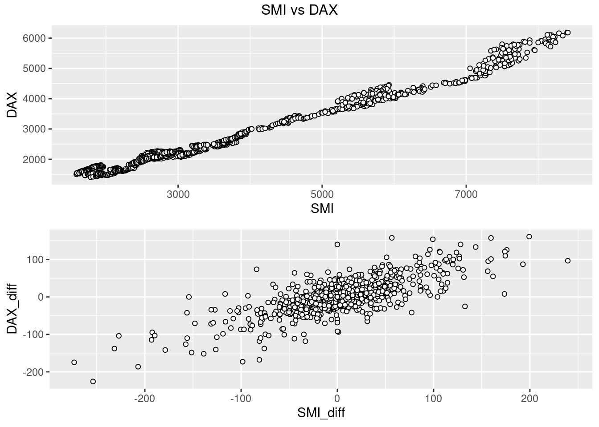
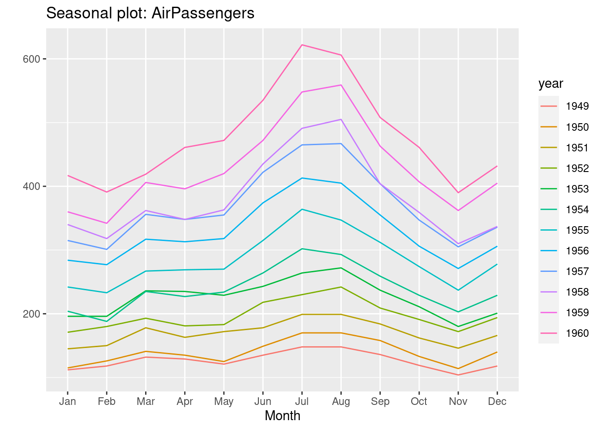

# Visualizing Time Series Data

Kate Lassiter


#### Starting Point
Same exploratory questions as with any new data set:\

* Strongly correlated columns
* Variable means 
* Sample variance, etc.\

Use familiar techniques:\

* Summary statistics
* Histograms
* Scatter plots, etc.

Be very careful of lookahead!\

* Incorporating information from the future into past smoothing, prediction, etc. when you shouldn't know it yet
* Can happen when time-shifting, smoothing, imputing data
* Can bias your model and make predictions worthless


#### Working with time series (ts) objects
Integration of ts() objects with ggplot2:\

* ggfortify package
  * autoplot()
  * All the same customizations as ggplot2
  * Don't have to convert from ts to dataframe format
* gridExtra package
  * Arrange the 4 ggplot plots as a 4-panel grid
* grid package
  * Add title to the grid arrangement


```r
dax=autoplot(EuStockMarkets[,"DAX"])+
  ylab("Price")+
  xlab("Time")

cac=autoplot(EuStockMarkets[,"CAC"])+
  ylab("Price")+
  xlab("Time")

smi=autoplot(EuStockMarkets[,"SMI"])+
  ylab("Price")+
  xlab("Time")

ftse=autoplot(EuStockMarkets[,"FTSE"])+
  ylab("Price")+
  xlab("Time")
grid.arrange(dax,cac,smi,ftse,top=textGrob("Stock market prices"))
```


#### Time series relevant plotting:\
Working with the data:

* Directly transforming ts() objects for use with ggplot2:\
  * complete.cases() to easily remove NA rows - prevent ggplot warning
  * avoid irritations of working with ts objects

Looking at changes over time:

* Plot differenced values
  * Histogram/scatter plot of the lagged data
  * Shows change in values, how values change together 
  * Trend can hide true relationship, make two series appear highly predictive of one another when they move together
  * Use base package diff(), calculates difference between point at time _t_ and _t+1_

```r
new=as.data.frame(EuStockMarkets)
new$SMI_diff=c(NA,diff(new$SMI))
new$DAX_diff=c(NA,diff(new$DAX))

p1 <- ggplot(new, aes(SMI,DAX))+
  geom_point(shape = 21, colour = "black", fill = "white")
p2 <- ggplot(new[complete.cases(new),], aes(SMI_diff,DAX_diff))+
  geom_point(shape = 21, colour = "black", fill = "white")

grid.arrange(p1,p2,top=textGrob("SMI vs DAX"))
```



Exploring Time Lags:

* Lagged differences:\
  * Time series analysis: focused on predicting future values from past
  * Concerned whether a change in one variable at time _t_ predicts change in another variable at time _t+1_
  * lag() to shift forward by one
  * Showing density using alpha

```r
new$SMI_lag_diff=c(NA,lag(diff(new$SMI),1))
ggplot(new[complete.cases(new),], aes(SMI_lag_diff,DAX_diff))+
  geom_point(shape = 21, colour = "black", fill = "white",alpha=0.4,size=2)
```


Now there is no apparent relationship: positive change in SMI today won't predict positive change in DAX tomorrow. There is a positive trend over the long term, but this does little to predict in the short term

Observations:\

* Careful with time series data: use same techniques, but reshape data
* Change in values from one time to another is vital concept 

### Dynamics of Time Series Data
#### Seasonality, Cycle, Trend

Three aspects of time series data:

* Seasonal: 
  * Recurs over a fixed period 
* Cycle:
  * Recurrent behaviors, variable time period
* Trend: 
  * Overall drift to higher/lower values over a long time period\

These can be gathered through visual inspection:\

* Line plot
  * Clear trend
    * Consider log transform or differencing
  * Increasing variance
  * Multiplicative seasonality
    * Seasonal swings grow along with overall values

```r
autoplot(AirPassengers)+
  xlab("Year")+
  ylab("Passengers")
```


* Time series decomposition:
  * Break data into seasonal, trend, and remainder components
  * Seasonal component: 
    * LOESS smoothing of all January values, February values, etc. 
    * Moving window estimate of smoothed value based on point's neighbors 
  * stats package
    * stl()\
    

```r
autoplot(stl(AirPassengers, s.window = 'periodic'), ts.colour = 'red')+
  xlab("Year")
```


  \
  
  * Observations
    * Clear rising trend
    * Obvious seasonality
    * Difference between the two methods:
      * This particular decomposition shows additive, not multiplicative seasonality
        * But start and end time series have highest residuals
        * Settled on the average seasonal variance
    * Both reveal information on patterns that need to be identified and potentially dealt with before                forecasting can occur
      
#### Plotting: exploiting the temporal axis
##### Gannt charts
  * Shows overlapping time periods, duration of event relative to others
  * timevis package

```r
dates=sample(seq(as.Date('1998-01-01'), as.Date('2000-01-01'), by="day"), 16)
dates=dates[order(dates)]
projects = paste0("Project ",seq(1,8)) 

data <- data.frame(content = projects, 
                    start = dates[1:8],
                    end = dates[9:16])
timevis(data)
```

```{=html}
<div id="htmlwidget-78c74cb3ac41c755bdb8" class="timevis html-widget" style="width:80%;height:480px;">
<div class="btn-group zoom-menu">
<button type="button" class="btn btn-default btn-lg zoom-in" title="Zoom in">+</button>
<button type="button" class="btn btn-default btn-lg zoom-out" title="Zoom out">-</button>
</div>
</div>
<script type="application/json" data-for="htmlwidget-78c74cb3ac41c755bdb8">{"x":{"items":[{"content":"Project 1","start":"1998-01-15","end":"1998-11-09"},{"content":"Project 2","start":"1998-03-07","end":"1998-12-31"},{"content":"Project 3","start":"1998-05-04","end":"1999-03-30"},{"content":"Project 4","start":"1998-05-08","end":"1999-05-02"},{"content":"Project 5","start":"1998-05-16","end":"1999-07-08"},{"content":"Project 6","start":"1998-05-21","end":"1999-07-17"},{"content":"Project 7","start":"1998-09-19","end":"1999-09-03"},{"content":"Project 8","start":"1998-10-24","end":"1999-12-26"}],"groups":null,"showZoom":true,"zoomFactor":0.5,"fit":true,"options":[],"height":null,"timezone":null,"api":[]},"evals":[],"jsHooks":[]}</script>
```
##### Using month and year creatively in line plots
  * forecast package
    * ggseasonplot()
    * ggmonthplot()
    * suppressMessages() prevents printing information outputted when loading a package
    

```r
ggseasonplot(AirPassengers)
```



```r
ggmonthplot(AirPassengers)
```


  * Observations
    * Some months increased more over time than others
    * Passenger numbers peak in July or August
    * Local peak in March most years
    * Overall increase across months over the years
    * Growth trend increasing (rate of increase increasing)\
\

##### 3-D Visualizations: plotly package\

  * Convert to a format plotly will understand
    * Avoid using ts() object
    * Dataframe with datetime, numeric columns
    * lubridate package for date manipulation

```r
new = data.frame(AirPassengers)
new$year=year(seq(as.Date("1949-01-01"),as.Date("1960-12-01"),by="month"))
new$month=lubridate::month(seq(as.Date("1949-01-01"),as.Date("1960-12-01"),by="month"),label=TRUE)
plot_ly(new, x = ~month, y = ~year, z = ~AirPassengers, 
             color = ~as.factor(month)) %>%
    add_markers() %>%
    layout(scene = list(xaxis = list(title = 'Month'),
                        yaxis = list(title = 'Year'),
                        zaxis = list(title = 'Passenger Count')))
```

```{=html}
<div id="htmlwidget-94f77a795f2c7b06aaee" style="width:80%;height:480px;" class="plotly html-widget"></div>
<script type="application/json" data-for="htmlwidget-94f77a795f2c7b06aaee">{"x":{"visdat":{"3ecc19e20a35":["function () ","plotlyVisDat"]},"cur_data":"3ecc19e20a35","attrs":{"3ecc19e20a35":{"x":{},"y":{},"z":{},"color":{},"alpha_stroke":1,"sizes":[10,100],"spans":[1,20],"type":"scatter3d","mode":"markers","inherit":true}},"layout":{"margin":{"b":40,"l":60,"t":25,"r":10},"scene":{"xaxis":{"title":"Month"},"yaxis":{"title":"Year"},"zaxis":{"title":"Passenger Count"}},"xaxis":{"type":"category","categoryorder":"array","categoryarray":["Jan","Feb","Mar","Apr","May","Jun","Jul","Aug","Sep","Oct","Nov","Dec"]},"hovermode":"closest","showlegend":true},"source":"A","config":{"modeBarButtonsToAdd":["hoverclosest","hovercompare"],"showSendToCloud":false},"data":[{"x":["Dec","Dec","Dec","Dec","Dec","Dec","Dec","Dec","Dec","Dec","Dec","Dec"],"y":[1949,1950,1951,1952,1953,1954,1955,1956,1957,1958,1959,1960],"z":[118,140,166,194,201,229,278,306,336,337,405,432],"type":"scatter3d","mode":"markers","name":"Dec","marker":{"color":"rgba(253,231,37,1)","line":{"color":"rgba(253,231,37,1)"}},"textfont":{"color":"rgba(253,231,37,1)"},"error_y":{"color":"rgba(253,231,37,1)"},"error_x":{"color":"rgba(253,231,37,1)"},"line":{"color":"rgba(253,231,37,1)"},"frame":null},{"x":["Nov","Nov","Nov","Nov","Nov","Nov","Nov","Nov","Nov","Nov","Nov","Nov"],"y":[1949,1950,1951,1952,1953,1954,1955,1956,1957,1958,1959,1960],"z":[104,114,146,172,180,203,237,271,305,310,362,390],"type":"scatter3d","mode":"markers","name":"Nov","marker":{"color":"rgba(194,223,35,1)","line":{"color":"rgba(194,223,35,1)"}},"textfont":{"color":"rgba(194,223,35,1)"},"error_y":{"color":"rgba(194,223,35,1)"},"error_x":{"color":"rgba(194,223,35,1)"},"line":{"color":"rgba(194,223,35,1)"},"frame":null},{"x":["Oct","Oct","Oct","Oct","Oct","Oct","Oct","Oct","Oct","Oct","Oct","Oct"],"y":[1949,1950,1951,1952,1953,1954,1955,1956,1957,1958,1959,1960],"z":[119,133,162,191,211,229,274,306,347,359,407,461],"type":"scatter3d","mode":"markers","name":"Oct","marker":{"color":"rgba(133,213,74,1)","line":{"color":"rgba(133,213,74,1)"}},"textfont":{"color":"rgba(133,213,74,1)"},"error_y":{"color":"rgba(133,213,74,1)"},"error_x":{"color":"rgba(133,213,74,1)"},"line":{"color":"rgba(133,213,74,1)"},"frame":null},{"x":["Sep","Sep","Sep","Sep","Sep","Sep","Sep","Sep","Sep","Sep","Sep","Sep"],"y":[1949,1950,1951,1952,1953,1954,1955,1956,1957,1958,1959,1960],"z":[136,158,184,209,237,259,312,355,404,404,463,508],"type":"scatter3d","mode":"markers","name":"Sep","marker":{"color":"rgba(81,197,106,1)","line":{"color":"rgba(81,197,106,1)"}},"textfont":{"color":"rgba(81,197,106,1)"},"error_y":{"color":"rgba(81,197,106,1)"},"error_x":{"color":"rgba(81,197,106,1)"},"line":{"color":"rgba(81,197,106,1)"},"frame":null},{"x":["Aug","Aug","Aug","Aug","Aug","Aug","Aug","Aug","Aug","Aug","Aug","Aug"],"y":[1949,1950,1951,1952,1953,1954,1955,1956,1957,1958,1959,1960],"z":[148,170,199,242,272,293,347,405,467,505,559,606],"type":"scatter3d","mode":"markers","name":"Aug","marker":{"color":"rgba(43,176,127,1)","line":{"color":"rgba(43,176,127,1)"}},"textfont":{"color":"rgba(43,176,127,1)"},"error_y":{"color":"rgba(43,176,127,1)"},"error_x":{"color":"rgba(43,176,127,1)"},"line":{"color":"rgba(43,176,127,1)"},"frame":null},{"x":["Jul","Jul","Jul","Jul","Jul","Jul","Jul","Jul","Jul","Jul","Jul","Jul"],"y":[1949,1950,1951,1952,1953,1954,1955,1956,1957,1958,1959,1960],"z":[148,170,199,230,264,302,364,413,465,491,548,622],"type":"scatter3d","mode":"markers","name":"Jul","marker":{"color":"rgba(30,155,138,1)","line":{"color":"rgba(30,155,138,1)"}},"textfont":{"color":"rgba(30,155,138,1)"},"error_y":{"color":"rgba(30,155,138,1)"},"error_x":{"color":"rgba(30,155,138,1)"},"line":{"color":"rgba(30,155,138,1)"},"frame":null},{"x":["Jun","Jun","Jun","Jun","Jun","Jun","Jun","Jun","Jun","Jun","Jun","Jun"],"y":[1949,1950,1951,1952,1953,1954,1955,1956,1957,1958,1959,1960],"z":[135,149,178,218,243,264,315,374,422,435,472,535],"type":"scatter3d","mode":"markers","name":"Jun","marker":{"color":"rgba(37,133,142,1)","line":{"color":"rgba(37,133,142,1)"}},"textfont":{"color":"rgba(37,133,142,1)"},"error_y":{"color":"rgba(37,133,142,1)"},"error_x":{"color":"rgba(37,133,142,1)"},"line":{"color":"rgba(37,133,142,1)"},"frame":null},{"x":["May","May","May","May","May","May","May","May","May","May","May","May"],"y":[1949,1950,1951,1952,1953,1954,1955,1956,1957,1958,1959,1960],"z":[121,125,172,183,229,234,270,318,355,363,420,472],"type":"scatter3d","mode":"markers","name":"May","marker":{"color":"rgba(45,112,142,1)","line":{"color":"rgba(45,112,142,1)"}},"textfont":{"color":"rgba(45,112,142,1)"},"error_y":{"color":"rgba(45,112,142,1)"},"error_x":{"color":"rgba(45,112,142,1)"},"line":{"color":"rgba(45,112,142,1)"},"frame":null},{"x":["Apr","Apr","Apr","Apr","Apr","Apr","Apr","Apr","Apr","Apr","Apr","Apr"],"y":[1949,1950,1951,1952,1953,1954,1955,1956,1957,1958,1959,1960],"z":[129,135,163,181,235,227,269,313,348,348,396,461],"type":"scatter3d","mode":"markers","name":"Apr","marker":{"color":"rgba(56,89,140,1)","line":{"color":"rgba(56,89,140,1)"}},"textfont":{"color":"rgba(56,89,140,1)"},"error_y":{"color":"rgba(56,89,140,1)"},"error_x":{"color":"rgba(56,89,140,1)"},"line":{"color":"rgba(56,89,140,1)"},"frame":null},{"x":["Mar","Mar","Mar","Mar","Mar","Mar","Mar","Mar","Mar","Mar","Mar","Mar"],"y":[1949,1950,1951,1952,1953,1954,1955,1956,1957,1958,1959,1960],"z":[132,141,178,193,236,235,267,317,356,362,406,419],"type":"scatter3d","mode":"markers","name":"Mar","marker":{"color":"rgba(67,62,133,1)","line":{"color":"rgba(67,62,133,1)"}},"textfont":{"color":"rgba(67,62,133,1)"},"error_y":{"color":"rgba(67,62,133,1)"},"error_x":{"color":"rgba(67,62,133,1)"},"line":{"color":"rgba(67,62,133,1)"},"frame":null},{"x":["Feb","Feb","Feb","Feb","Feb","Feb","Feb","Feb","Feb","Feb","Feb","Feb"],"y":[1949,1950,1951,1952,1953,1954,1955,1956,1957,1958,1959,1960],"z":[118,126,150,180,196,188,233,277,301,318,342,391],"type":"scatter3d","mode":"markers","name":"Feb","marker":{"color":"rgba(72,33,115,1)","line":{"color":"rgba(72,33,115,1)"}},"textfont":{"color":"rgba(72,33,115,1)"},"error_y":{"color":"rgba(72,33,115,1)"},"error_x":{"color":"rgba(72,33,115,1)"},"line":{"color":"rgba(72,33,115,1)"},"frame":null},{"x":["Jan","Jan","Jan","Jan","Jan","Jan","Jan","Jan","Jan","Jan","Jan","Jan"],"y":[1949,1950,1951,1952,1953,1954,1955,1956,1957,1958,1959,1960],"z":[112,115,145,171,196,204,242,284,315,340,360,417],"type":"scatter3d","mode":"markers","name":"Jan","marker":{"color":"rgba(68,1,84,1)","line":{"color":"rgba(68,1,84,1)"}},"textfont":{"color":"rgba(68,1,84,1)"},"error_y":{"color":"rgba(68,1,84,1)"},"error_x":{"color":"rgba(68,1,84,1)"},"line":{"color":"rgba(68,1,84,1)"},"frame":null}],"highlight":{"on":"plotly_click","persistent":false,"dynamic":false,"selectize":false,"opacityDim":0.2,"selected":{"opacity":1},"debounce":0},"shinyEvents":["plotly_hover","plotly_click","plotly_selected","plotly_relayout","plotly_brushed","plotly_brushing","plotly_clickannotation","plotly_doubleclick","plotly_deselect","plotly_afterplot","plotly_sunburstclick"],"base_url":"https://plot.ly"},"evals":[],"jsHooks":[]}</script>
```
  * Allows a better view of the relationships between month and year 


#### Data Smoothing
* Usually need to smooth the data before starting analysis or visualization
    * Allows better storytelling
    * Irrelevant spikes dominate the narrative
* Methods:/
  * Moving average/median
    * Good for noisy data
    * Rolling mean reduces variance
      * Keep in mind: affects accuracy, R² statistics, etc.
      * Zoo package rollmean()
      * Prevent lookahead, use past values as the window (align="right")
      * k = 6  is a 6 month rolling window
      * gsub() substitute series names for the clearer legend
      * tidyr package gather()
        * Convert from wide to long, use this as color/group in ggplot


```r
new = data.frame(AirPassengers)
new$AirPassengers=as.numeric(new$AirPassengers)
new$year=seq(as.Date("1949-01-01"),as.Date("1960-12-01"),by="month")

new = new %>%
  mutate(roll_mean = rollmean(new$AirPassengers,k=6,align="right",fill = NA))

df <- gather(new, key = year, value = Rate, 
                            c("roll_mean", "AirPassengers"))
df$year=gsub("AirPassengers","series",df$year)
df$year=gsub("roll_mean","rolling mean",df$year)
df$date = rep(new$year,2)

ggplot(df, aes(x=date, y = Rate, group = year, colour = year)) + 
  geom_line()
```


  * Exponentially weighted moving averages 
    * Weigh long past values less than recent
  * Geometric mean 
    * Combats strong serial correlation
    * Good for series with data that compounds greatly as time goes on
