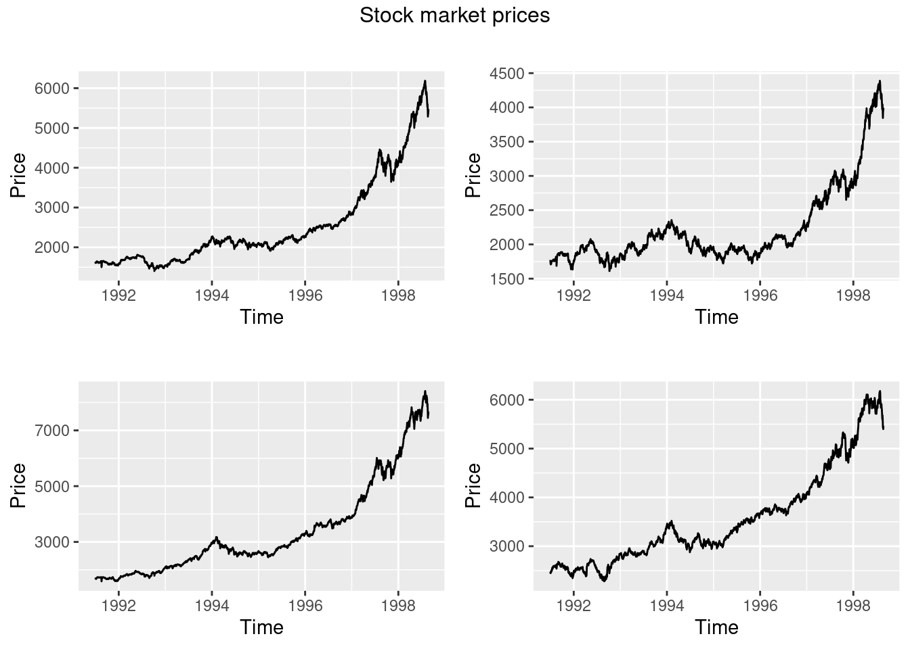
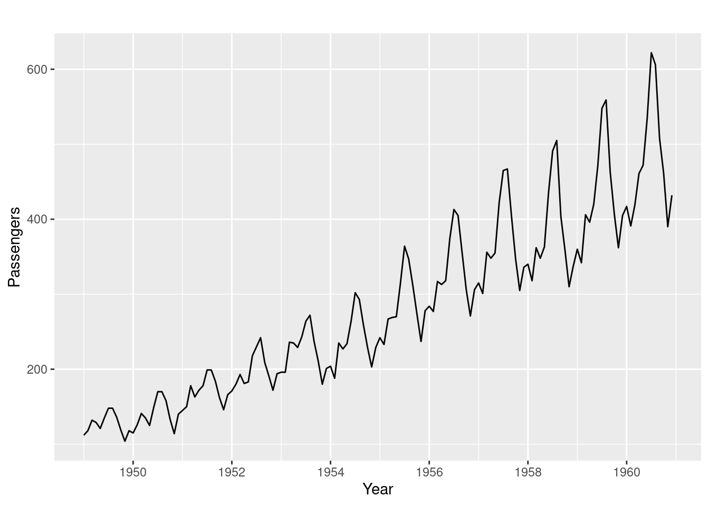
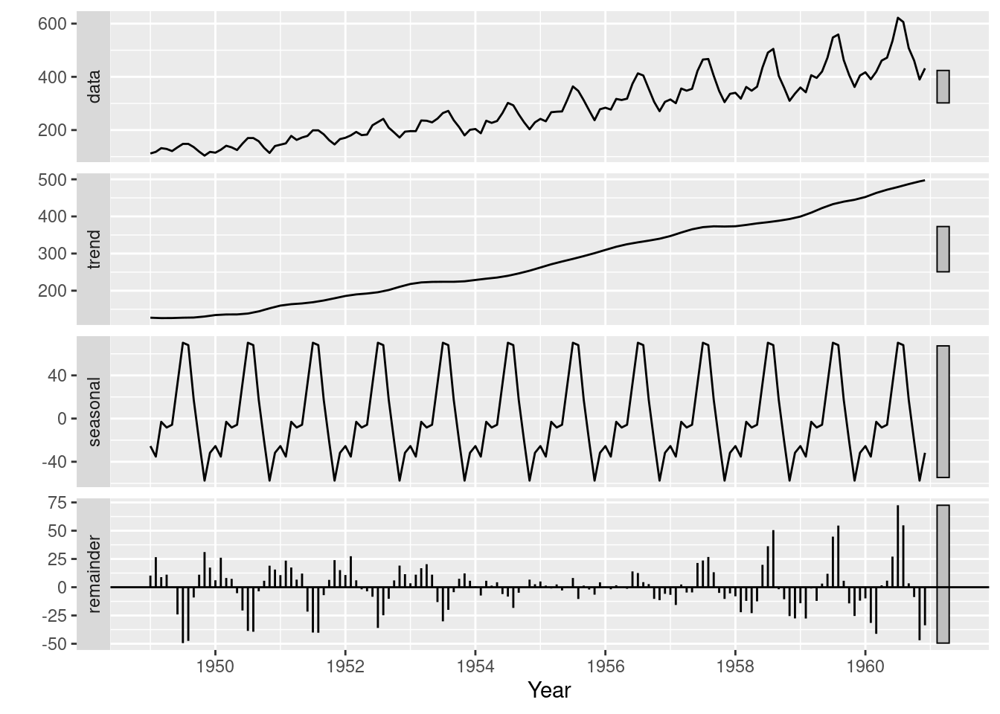
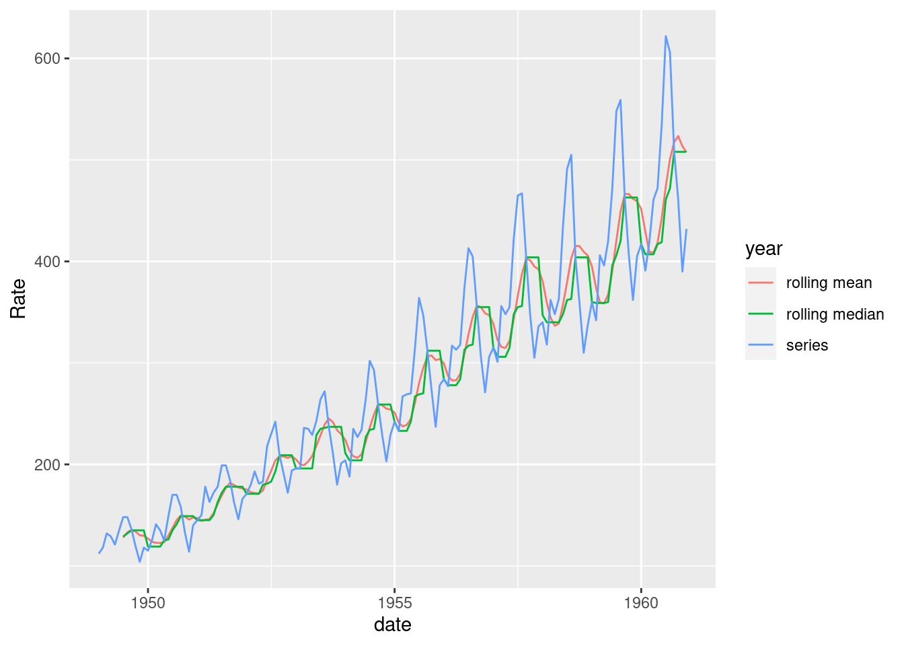

# Visualizing Time Series Data

Kate Lassiter


#### Starting Point
Same exploratory questions as with any new data set:\

* Strongly correlated columns
* Variable means 
* Sample variance, etc.\

Use familiar techniques:\

* Summary statistics
* Histograms
* Scatter plots, etc.

Be very careful of lookahead!\

* Incorporating information from the future into past smoothing, prediction, etc. when you shouldn't know it yet
* Can happen when time-shifting, smoothing, imputing data
* Can bias your model and make predictions worthless


#### Working with time series (ts) objects
Integration of ts() objects with ggplot2:\

* ggfortify package
  * autoplot()
  * All the same customizations as ggplot2
  * Don't have to convert from ts to dataframe format
* gridExtra package
  * Arrange the 4 ggplot plots as a 4-panel grid
* grid package
  * Add title to the grid arrangement


```r
dax=autoplot(EuStockMarkets[,"DAX"])+
  ylab("Price")+
  xlab("Time")

cac=autoplot(EuStockMarkets[,"CAC"])+
  ylab("Price")+
  xlab("Time")

smi=autoplot(EuStockMarkets[,"SMI"])+
  ylab("Price")+
  xlab("Time")

ftse=autoplot(EuStockMarkets[,"FTSE"])+
  ylab("Price")+
  xlab("Time")
grid.arrange(dax,cac,smi,ftse,top=textGrob("Stock market prices"))
```



#### Time series relevant plotting:\
Working with the data:

* Directly transforming ts() objects for use with ggplot2:\
  * complete.cases() to easily remove NA rows - prevent ggplot warning
  * avoid irritations of working with ts objects

Looking at changes over time:

* Plot differenced values
  * Histogram/scatter plot of the lagged data
  * Shows change in values, how values change together 
  * Trend can hide true relationship, make two series appear highly predictive of one another when they move together
  * Use base package diff(), calculates difference between point at time _t_ and _t+1_

```r
new=as.data.frame(EuStockMarkets)
new$SMI_diff=c(NA,diff(new$SMI))
new$DAX_diff=c(NA,diff(new$DAX))

p1 <- ggplot(new, aes(SMI,DAX))+
  geom_point(shape = 21, colour = "black", fill = "white")
p2 <- ggplot(new[complete.cases(new),], aes(SMI_diff,DAX_diff))+
  geom_point(shape = 21, colour = "black", fill = "white")

grid.arrange(p1,p2,top=textGrob("SMI vs DAX"))
```


Exploring Time Lags:

* Lagged differences:\
  * Time series analysis: focused on predicting future values from past
  * Concerned whether a change in one variable at time _t_ predicts change in another variable at time _t+1_
  * lag() to shift forward by one
  * Showing density using alpha

```r
new$SMI_lag_diff=c(NA,lag(diff(new$SMI),1))
ggplot(new[complete.cases(new),], aes(SMI_lag_diff,DAX_diff))+
  geom_point(shape = 21, colour = "black", fill = "white",alpha=0.4,size=2)
```


Now there is no apparent relationship: positive change in SMI today won't predict positive change in DAX tomorrow. There is a positive trend over the long term, but this does little to predict in the short term

Observations:\

* Be careful with time series data: use same techniques, but reshape data
* Change in values from one time to another is vital concept \

#### Dynamics of Time Series Data
Three aspects of time series data:

* Seasonal: 
  * Recurs over a fixed period 
* Cycle:
  * Recurrent behaviors, variable time period
* Trend: 
  * Overall drift to higher/lower values over a long time period\


##### Line plots

Discover patterns through visual inspection:

```r
autoplot(AirPassengers)+
  xlab("Year")+
  ylab("Passengers")
```



* Observations: 
  * Clear trend
    * Consider log transform or differencing
  * Increasing variance
    * Consider log or square root transform
  * Multiplicative seasonality
    * Seasonal swings grow along with overall values
    
##### Time series decomposition:
  * Break data into seasonal, trend, and remainder components
  * Seasonal component: 
    * LOESS smoothing of all January values, February values, etc. 
    * Moving window estimate of smoothed value based on point's neighbors 
  * stats package
    * stl()\
    

```r
autoplot(stl(AirPassengers, s.window = 'periodic'), ts.colour = 'red')+
  xlab("Year")
```


  \
  
  * Observations
    * Clear rising trend
    * Obvious seasonality
    * Difference between the two methods:
      * This particular decomposition shows additive, not multiplicative seasonality
        * But start and end time series have highest residuals
        * Settled on the average seasonal variance
    * Both reveal information on patterns that need to be identified and potentially dealt with before                forecasting can occur\
      
      
#### Plotting: Exploiting the Temporal Axis
##### Gannt charts
  * Shows overlapping time periods, duration of event relative to others
  * timevis package timevis()

```r
dates=sample(seq(as.Date('1998-01-01'), as.Date('2000-01-01'), by="day"), 16)
dates=dates[order(dates)]
projects = paste0("Project ",seq(1,8)) 

data <- data.frame(content = projects, 
                    start = dates[1:8],
                    end = dates[9:16])
timevis(data)
```

```{=html}
<div id="htmlwidget-af9dd8efd861f043ad6a" class="timevis html-widget" style="width:80%;height:480px;">
<div class="btn-group zoom-menu">
<button type="button" class="btn btn-default btn-lg zoom-in" title="Zoom in">+</button>
<button type="button" class="btn btn-default btn-lg zoom-out" title="Zoom out">-</button>
</div>
</div>
<script type="application/json" data-for="htmlwidget-af9dd8efd861f043ad6a">{"x":{"items":[{"content":"Project 1","start":"1998-05-25","end":"1998-11-26"},{"content":"Project 2","start":"1998-05-30","end":"1999-01-09"},{"content":"Project 3","start":"1998-06-10","end":"1999-05-04"},{"content":"Project 4","start":"1998-08-17","end":"1999-05-08"},{"content":"Project 5","start":"1998-09-26","end":"1999-07-21"},{"content":"Project 6","start":"1998-10-04","end":"1999-10-16"},{"content":"Project 7","start":"1998-10-07","end":"1999-11-01"},{"content":"Project 8","start":"1998-11-02","end":"1999-11-13"}],"groups":null,"showZoom":true,"zoomFactor":0.5,"fit":true,"options":[],"height":null,"timezone":null,"api":[]},"evals":[],"jsHooks":[]}</script>
```
##### Using month and year creatively in line plots
  * forecast package
    * ggseasonplot()
      * X axis is months
      * Y axis is the variable of interest 
      * Each line represents a year.
      * Shows if months exhibited similar/different seasonal patterns over the years
    * ggmonthplot()
      * X axis is months
      * Y axis is the variable of interest 
      * Blue line is mean of each season
      * Black line is the values for every year for a single month
    

```r
ggseasonplot(AirPassengers)
```


```r
ggmonthplot(AirPassengers)
```


  * Observations
    * Some months increased more over time than others
    * Passenger numbers peak in July or August
    * Local peak in March most years
    * Overall increase across months over the years
    * Growth trend increasing (rate of increase increasing)\
\

#### 3-D Visualizations: plotly package\

  * Convert to a format plotly will understand
    * Avoid using ts() object
    * Dataframe with datetime, numeric columns
    * lubridate package for date manipulation
      * year()
      * month()

```r
new = data.frame(AirPassengers)
new$year=year(seq(as.Date("1949-01-01"),as.Date("1960-12-01"),by="month"))
new$month=lubridate::month(seq(as.Date("1949-01-01"),as.Date("1960-12-01"),by="month"),label=TRUE)
plot_ly(new, x = ~month, y = ~year, z = ~AirPassengers, 
             color = ~as.factor(month)) %>%
    add_markers() %>%
    layout(scene = list(xaxis = list(title = 'Month'),
                        yaxis = list(title = 'Year'),
                        zaxis = list(title = 'Passenger Count')))
```

```{=html}
<div id="htmlwidget-6016f10079fe78a0357f" style="width:80%;height:480px;" class="plotly html-widget"></div>
<script type="application/json" data-for="htmlwidget-6016f10079fe78a0357f">{"x":{"visdat":{"3c5421368b78":["function () ","plotlyVisDat"]},"cur_data":"3c5421368b78","attrs":{"3c5421368b78":{"x":{},"y":{},"z":{},"color":{},"alpha_stroke":1,"sizes":[10,100],"spans":[1,20],"type":"scatter3d","mode":"markers","inherit":true}},"layout":{"margin":{"b":40,"l":60,"t":25,"r":10},"scene":{"xaxis":{"title":"Month"},"yaxis":{"title":"Year"},"zaxis":{"title":"Passenger Count"}},"xaxis":{"type":"category","categoryorder":"array","categoryarray":["Jan","Feb","Mar","Apr","May","Jun","Jul","Aug","Sep","Oct","Nov","Dec"]},"hovermode":"closest","showlegend":true},"source":"A","config":{"modeBarButtonsToAdd":["hoverclosest","hovercompare"],"showSendToCloud":false},"data":[{"x":["Dec","Dec","Dec","Dec","Dec","Dec","Dec","Dec","Dec","Dec","Dec","Dec"],"y":[1949,1950,1951,1952,1953,1954,1955,1956,1957,1958,1959,1960],"z":[118,140,166,194,201,229,278,306,336,337,405,432],"type":"scatter3d","mode":"markers","name":"Dec","marker":{"color":"rgba(253,231,37,1)","line":{"color":"rgba(253,231,37,1)"}},"textfont":{"color":"rgba(253,231,37,1)"},"error_y":{"color":"rgba(253,231,37,1)"},"error_x":{"color":"rgba(253,231,37,1)"},"line":{"color":"rgba(253,231,37,1)"},"frame":null},{"x":["Nov","Nov","Nov","Nov","Nov","Nov","Nov","Nov","Nov","Nov","Nov","Nov"],"y":[1949,1950,1951,1952,1953,1954,1955,1956,1957,1958,1959,1960],"z":[104,114,146,172,180,203,237,271,305,310,362,390],"type":"scatter3d","mode":"markers","name":"Nov","marker":{"color":"rgba(194,223,35,1)","line":{"color":"rgba(194,223,35,1)"}},"textfont":{"color":"rgba(194,223,35,1)"},"error_y":{"color":"rgba(194,223,35,1)"},"error_x":{"color":"rgba(194,223,35,1)"},"line":{"color":"rgba(194,223,35,1)"},"frame":null},{"x":["Oct","Oct","Oct","Oct","Oct","Oct","Oct","Oct","Oct","Oct","Oct","Oct"],"y":[1949,1950,1951,1952,1953,1954,1955,1956,1957,1958,1959,1960],"z":[119,133,162,191,211,229,274,306,347,359,407,461],"type":"scatter3d","mode":"markers","name":"Oct","marker":{"color":"rgba(133,213,74,1)","line":{"color":"rgba(133,213,74,1)"}},"textfont":{"color":"rgba(133,213,74,1)"},"error_y":{"color":"rgba(133,213,74,1)"},"error_x":{"color":"rgba(133,213,74,1)"},"line":{"color":"rgba(133,213,74,1)"},"frame":null},{"x":["Sep","Sep","Sep","Sep","Sep","Sep","Sep","Sep","Sep","Sep","Sep","Sep"],"y":[1949,1950,1951,1952,1953,1954,1955,1956,1957,1958,1959,1960],"z":[136,158,184,209,237,259,312,355,404,404,463,508],"type":"scatter3d","mode":"markers","name":"Sep","marker":{"color":"rgba(81,197,106,1)","line":{"color":"rgba(81,197,106,1)"}},"textfont":{"color":"rgba(81,197,106,1)"},"error_y":{"color":"rgba(81,197,106,1)"},"error_x":{"color":"rgba(81,197,106,1)"},"line":{"color":"rgba(81,197,106,1)"},"frame":null},{"x":["Aug","Aug","Aug","Aug","Aug","Aug","Aug","Aug","Aug","Aug","Aug","Aug"],"y":[1949,1950,1951,1952,1953,1954,1955,1956,1957,1958,1959,1960],"z":[148,170,199,242,272,293,347,405,467,505,559,606],"type":"scatter3d","mode":"markers","name":"Aug","marker":{"color":"rgba(43,176,127,1)","line":{"color":"rgba(43,176,127,1)"}},"textfont":{"color":"rgba(43,176,127,1)"},"error_y":{"color":"rgba(43,176,127,1)"},"error_x":{"color":"rgba(43,176,127,1)"},"line":{"color":"rgba(43,176,127,1)"},"frame":null},{"x":["Jul","Jul","Jul","Jul","Jul","Jul","Jul","Jul","Jul","Jul","Jul","Jul"],"y":[1949,1950,1951,1952,1953,1954,1955,1956,1957,1958,1959,1960],"z":[148,170,199,230,264,302,364,413,465,491,548,622],"type":"scatter3d","mode":"markers","name":"Jul","marker":{"color":"rgba(30,155,138,1)","line":{"color":"rgba(30,155,138,1)"}},"textfont":{"color":"rgba(30,155,138,1)"},"error_y":{"color":"rgba(30,155,138,1)"},"error_x":{"color":"rgba(30,155,138,1)"},"line":{"color":"rgba(30,155,138,1)"},"frame":null},{"x":["Jun","Jun","Jun","Jun","Jun","Jun","Jun","Jun","Jun","Jun","Jun","Jun"],"y":[1949,1950,1951,1952,1953,1954,1955,1956,1957,1958,1959,1960],"z":[135,149,178,218,243,264,315,374,422,435,472,535],"type":"scatter3d","mode":"markers","name":"Jun","marker":{"color":"rgba(37,133,142,1)","line":{"color":"rgba(37,133,142,1)"}},"textfont":{"color":"rgba(37,133,142,1)"},"error_y":{"color":"rgba(37,133,142,1)"},"error_x":{"color":"rgba(37,133,142,1)"},"line":{"color":"rgba(37,133,142,1)"},"frame":null},{"x":["May","May","May","May","May","May","May","May","May","May","May","May"],"y":[1949,1950,1951,1952,1953,1954,1955,1956,1957,1958,1959,1960],"z":[121,125,172,183,229,234,270,318,355,363,420,472],"type":"scatter3d","mode":"markers","name":"May","marker":{"color":"rgba(45,112,142,1)","line":{"color":"rgba(45,112,142,1)"}},"textfont":{"color":"rgba(45,112,142,1)"},"error_y":{"color":"rgba(45,112,142,1)"},"error_x":{"color":"rgba(45,112,142,1)"},"line":{"color":"rgba(45,112,142,1)"},"frame":null},{"x":["Apr","Apr","Apr","Apr","Apr","Apr","Apr","Apr","Apr","Apr","Apr","Apr"],"y":[1949,1950,1951,1952,1953,1954,1955,1956,1957,1958,1959,1960],"z":[129,135,163,181,235,227,269,313,348,348,396,461],"type":"scatter3d","mode":"markers","name":"Apr","marker":{"color":"rgba(56,89,140,1)","line":{"color":"rgba(56,89,140,1)"}},"textfont":{"color":"rgba(56,89,140,1)"},"error_y":{"color":"rgba(56,89,140,1)"},"error_x":{"color":"rgba(56,89,140,1)"},"line":{"color":"rgba(56,89,140,1)"},"frame":null},{"x":["Mar","Mar","Mar","Mar","Mar","Mar","Mar","Mar","Mar","Mar","Mar","Mar"],"y":[1949,1950,1951,1952,1953,1954,1955,1956,1957,1958,1959,1960],"z":[132,141,178,193,236,235,267,317,356,362,406,419],"type":"scatter3d","mode":"markers","name":"Mar","marker":{"color":"rgba(67,62,133,1)","line":{"color":"rgba(67,62,133,1)"}},"textfont":{"color":"rgba(67,62,133,1)"},"error_y":{"color":"rgba(67,62,133,1)"},"error_x":{"color":"rgba(67,62,133,1)"},"line":{"color":"rgba(67,62,133,1)"},"frame":null},{"x":["Feb","Feb","Feb","Feb","Feb","Feb","Feb","Feb","Feb","Feb","Feb","Feb"],"y":[1949,1950,1951,1952,1953,1954,1955,1956,1957,1958,1959,1960],"z":[118,126,150,180,196,188,233,277,301,318,342,391],"type":"scatter3d","mode":"markers","name":"Feb","marker":{"color":"rgba(72,33,115,1)","line":{"color":"rgba(72,33,115,1)"}},"textfont":{"color":"rgba(72,33,115,1)"},"error_y":{"color":"rgba(72,33,115,1)"},"error_x":{"color":"rgba(72,33,115,1)"},"line":{"color":"rgba(72,33,115,1)"},"frame":null},{"x":["Jan","Jan","Jan","Jan","Jan","Jan","Jan","Jan","Jan","Jan","Jan","Jan"],"y":[1949,1950,1951,1952,1953,1954,1955,1956,1957,1958,1959,1960],"z":[112,115,145,171,196,204,242,284,315,340,360,417],"type":"scatter3d","mode":"markers","name":"Jan","marker":{"color":"rgba(68,1,84,1)","line":{"color":"rgba(68,1,84,1)"}},"textfont":{"color":"rgba(68,1,84,1)"},"error_y":{"color":"rgba(68,1,84,1)"},"error_x":{"color":"rgba(68,1,84,1)"},"line":{"color":"rgba(68,1,84,1)"},"frame":null}],"highlight":{"on":"plotly_click","persistent":false,"dynamic":false,"selectize":false,"opacityDim":0.2,"selected":{"opacity":1},"debounce":0},"shinyEvents":["plotly_hover","plotly_click","plotly_selected","plotly_relayout","plotly_brushed","plotly_brushing","plotly_clickannotation","plotly_doubleclick","plotly_deselect","plotly_afterplot","plotly_sunburstclick"],"base_url":"https://plot.ly"},"evals":[],"jsHooks":[]}</script>
```
  * Allows a better view of the relationship between month, year, and number of passengers 


#### Data Smoothing
* Usually need to smooth the data before starting analysis or visualization
    * Allows better storytelling
    * Irrelevant spikes dominate the narrative
    
* Methods:
  * Moving average/median
    * Good for noisy data
    * Rolling mean reduces variance
      * Keep in mind: affects accuracy, R² statistics, etc.
      * Zoo package rollmean() and rollmedian()
        * k = 7  is a 7 month rolling window
    * Prevent lookahead, use past values as the window (align="right")
    * gsub() substitute series names for a clearer legend
    * tidyr package gather()
      * Convert from wide to long, use this as color/group in ggplot2 geom_line()\
  * Exponentially weighted moving average 
    * Weigh past values less than recent
    * pracma package movavg() function 
    * Useful when more recent data is more or less informative than the past
  * Geometric mean 
    * Combats strong serial correlation
    * Good for series with data that compounds greatly as time goes on
    * Base R exp(mean(log())) and zoo package rollapply()


```r
new = data.frame(AirPassengers)
new$AirPassengers=as.numeric(new$AirPassengers)
new$year=seq(as.Date("1949-01-01"),as.Date("1960-12-01"),by="month")

new = new %>%
  mutate(roll_mean = rollmean(new$AirPassengers,k=7,align="right",fill = NA),
         roll_median = rollmedian(new$AirPassengers,k=7,align="right",fill = NA))

df <- gather(new, key = year, value = Rate, 
                            c("roll_mean","roll_median", "AirPassengers"))
df$year=gsub("AirPassengers","series",df$year)
df$year=gsub("roll_mean","rolling mean",df$year)
df$year=gsub("roll_median","rolling median",df$year)
df$date = rep(new$year,3)

ggplot(df[complete.cases(df),], aes(x=date, y = Rate, group = year, colour = year)) + 
  geom_line()
```


\  

#### Checking Time Series Properties
##### Stationarity

* Many time series models rely on stationarity
  * Stable mean/variance/autocorrelation over time
  * Examine error term behavior
  * Can do this visually:
    * Look for seasonality, trend, increasing variance
  * Statistically:
    * Augmented Dickey–Fuller (ADF) test
      * Null hypothesis = unit root
      * Focuses on changing mean
      * tseries package adf.test()
  * Visual can be better:
    * ADF tests perform poorly on near unit roots, small sample size
    * Use both approaches
  * Remedies:
    * Difference the data to correct trend
    * Logarithm or square root to correct variance 
  

```r
new = data.frame(AirPassengers)
new$AirPassengers=as.numeric(new$AirPassengers)
new$date=seq(as.Date("1949-01-01"),as.Date("1960-12-01"),by="month")
new$diff_data=c(NA,diff(new$AirPassengers, differences=1))
new$diff_data2=c(NA,NA,diff(new$AirPassengers, differences=2))

g=ggplot(new , aes(date,AirPassengers))+
  geom_line(colour = "black")

g_diff=ggplot(new , aes(date,diff_data))+
  geom_line(colour = "red")+
  ylab("Difference Data")

g_diff2=ggplot(new , aes(date,diff_data2))+
  geom_line(colour = "blue")+
  ylab("2nd Difference Data")

grid.arrange(g,g_diff,g_diff2,top=textGrob("Airline Passengers"))
```


```r
adf.test(new$AirPassengers,alternative='stationary')
```

```
## 
## 	Augmented Dickey-Fuller Test
## 
## data:  new$AirPassengers
## Dickey-Fuller = -7.3186, Lag order = 5, p-value = 0.01
## alternative hypothesis: stationary
```

```r
adf.test(new[complete.cases(new$diff_data),3],alternative='stationary')
```

```
## 
## 	Augmented Dickey-Fuller Test
## 
## data:  new[complete.cases(new$diff_data), 3]
## Dickey-Fuller = -7.0177, Lag order = 5, p-value = 0.01
## alternative hypothesis: stationary
```

```r
adf.test(new[complete.cases(new$diff_data2),4],alternative='stationary')
```

```
## 
## 	Augmented Dickey-Fuller Test
## 
## data:  new[complete.cases(new$diff_data2), 4]
## Dickey-Fuller = -8.0516, Lag order = 5, p-value = 0.01
## alternative hypothesis: stationary
```

  * Observations:
    * The data has clear trend and increasing variance
    * By using differencing, the trend is dampened
    * There's still some increasing variance, so log transform might be the right choice
    * Things start getting muddied at second difference
    * ADF says that the original series is stationary based on small p-value
      * Visual inspection says otherwise
      
##### Normality:

  * Many time series models assume normality
  * This can be observed through a histogram or QQ plot
    * ggplot2 package geom_histogram()
    * stats package qqnorm() and qqline()
  * If it is not normal:
    * Box Cox transformation
      * MASS package boxcox()
    * Be careful with transformations! 
      * Are you preserving the important information?
    

```r
ggplot(new, aes(x=AirPassengers)) +
  geom_histogram(binwidth =20,fill = "mediumpurple") +             
  xlab("Passengers")
```


```r
qqnorm(new$AirPassengers, main="Airline Passengers", xlab="", ylab="", pch=16)
qqline(new$AirPassengers)
```


  * Observations:
    * Data does not look normal: it is skewed
    * Even though this doesn't capture the time aspect of the data, the input variable must be normal for many models

##### Lagged Correlations
* Autocorrelation Function
    * Correlation between two points in a time series in a fixed interval
    * Linear relationship between points as a function of their time difference
    * Common behaviors:
      * ACF of stationary series drops to zero quickly
      * For nonstationary series, value at lag 1 is large and positive
      * White noise will have 0 at all lags but 0
    * Significance of ACF estimate determined by “critical region” with bounds at +/–1.96 × sqrt(n)
    * forecast package Acf()
      * Y axis is the correlation
      * X axis is the time lag

```r
Acf(new$AirPassengers,main='Passengers Autcorrelation Function')
```


* Partial Autocorrelation Function:
  * The partial correlation of the series at time _t_ with the series at time _t-k_ given all the information between _t-k....t_
  * Same critical regions as ACF
  * ACF vs PACF:
    * Redundant correlations appear in ACF
    * PACF correlations show exactly how the kth lagged value is related to the current point
    * PACF helps you know how long a time series needs to be to capture dynamics you want to model
  * forecast package Pacf()


```r
Pacf(new$AirPassengers,main='Passengers Partial Autcorrelation Function')
```


* Observations:
  * The ACF fails to trail off after a certain lag, indicating clear trend
  * PACF shows strong significance at around lag 12, coinciding with Christmas, a seasonal peak that is to be expected. 
  * Behavior of the PACF and ACF vital in determining parameters for time series ARIMA models and many others.

Now you are ready to get started with time series data!

References

* https://www.statology.org/exponential-moving-average-in-r/
* https://www.itl.nist.gov/div898/handbook/pmc/section4/pmc442.htm
* https://learning.oreilly.com/library/view/practical-time-series/9781492041641/ch02.html
