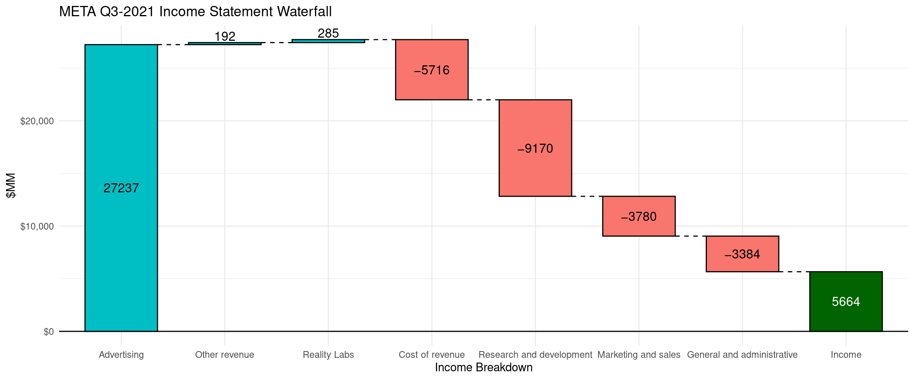

# Waterfall chart using meta income statement

Soheil Fakhrieh Kashan


```r
## loading needed libraries
library(waterfalls)
library(ggplot2)
library(scales)
library(readxl)
library(dplyr)
library(knitr)
library(plotly)
```

### Why to use Waterfall chart?

Waterfall chart is one of the most popular data visualizations in the Consulting and Finance presentations. The chart has a similar presentation as a bar chart but only highlights the positive or negative cumulative sequential impact variables. The purpose of a waterfall chart is mostly to explain how one number relates to another number through a series of variables or events. For example, we can effectively visualize how a company's revenue is changed from one year to the next and what factors positively or negatively contributed to it.

#### Data Source

In this short tutorial we will be exploring **META**'s quarterly income statement and use Waterfall charts to visualize their Q3 - 2022 financial statement.

META Quarterly Earnings reports: <https://investor.fb.com/financials/default.aspx>
  
  #### Data prep
  

```r
## downlaod the Q3-2022 META's Income Statement from the above link
## read the Excel file

META_IS <- read_excel('resources/waterfall_plot_meta_income_statement/Downloadable-PL-Q3-2022.xlsx')

## select relevant revenue lines for the waterfall chart
META_summary <- META_IS[c(10,11,12,13,40,41,43),]

## remove empty columns
remove_na <- function(x) any(!is.na(x))
META_summary <- 
  META_summary |> select(where(remove_na))

## renaming variables
colnames(META_summary) <- c('Breakdown','Q3-2020', 'Q4-2020', 'Q1-2021', 'Q2-2021',
                            'Q3-2021', 'Q4-2021', 'Q1-2022', 'Q2-2022', 'Q3-2022')
```

### Waterfall library

#### META Q3-2022 Income Statement

-   To use this library, the data frame must contain two columns. One with numeric values, and one with categorical variable showing the labels.

-   The order of the records on the label field will be the order on the graph. If that order is not desirable, you need to change the order of the records.


```r
# For this cahrt we are going to use Q3-2022
# Selecting the income statement breakdown and one quarter
waterfall(META[,c(1,3)])+
  ggtitle('META Q3-2022 Income Statement Waterfall')+
  labs(x='Income Breakdown', y='$MM')+
  theme_minimal()
```


#### Improving the chart

-   Add a total calculation to show the final summation: `calc_total = TRUE`
-   Change the text size to make it larger: `rect_text_size = 1.5`
-   Change the scale to show dollar: `scale_y_continuous(labels = dollar)`


```r
# 'META Q3-2021 Income Statement Waterfall chart
waterfall(
  META_cond[,c(1,3)],
  rect_text_size = 1.5,
  rect_text_labels_anchor = "centre",
  calc_total = TRUE, 
  fill_by_sign = TRUE,
  total_rect_color ='Dark Green',
  total_axis_text ='Income')+
  ggtitle('META Q3-2021 Income Statement Waterfall')+
  labs(x='Income Breakdown', y='$MM')+
  theme_minimal()+
  scale_y_continuous(labels = dollar)
```




#### How year-over-year quarterly income changed?

-   Create two new records. One for the Q3-2021 and one for Q3-2022.
-   For the income breakdown categories, calculate the delta between two periods

```r
kable(META_QoQ)
```


|breakdown                  | Amount|
|:--------------------------|------:|
|Income-Q3-2021             |  10423|
|Advertising                |  -1039|
|Other revenue              |     16|
|Reality Labs               |   -273|
|Cost of revenue            |     55|
|Research and development   |  -2854|
|Marketing and sales        |   -226|
|General and administrative |   -438|
|Income-Q3-2022             |   5664|


```r
# META Q3-2022 to Q4-2022 Income Waterfall chart
waterfall(META_QoQ,
          # changing the text size
          rect_text_size = 1.5,
          # selecting desired colors for each bar
          fill_colours = c("seagreen", "orangered2", "seagreen", "orangered2",
                           "seagreen", "orangered2","orangered2","orangered2",
                           "seagreen"),
          # changing the default fill by sign so we can assign individual color          
          fill_by_sign = FALSE)+
  ggtitle('META Q3-2022 to Q4-2022 Income')+
  labs(x='Income Breakdown', y='$MM')+
  theme_minimal()+
  scale_y_continuous(labels = dollar)
```


From the waterfall chart we can observe that Q3-2022 income is significantly lower 
than the last year. This is a mainly driven by the increase in expenses in research and 
development, and the decrease in revenue from advertising. 


##### Using plotly to create simple waterfall
Alternatively we can use plotly to create interactive waterfall charts.
https://plotly.com/r/waterfall-charts/ 
  

```r
wf <- plot_ly(
  META_cond[,c(1,3)], type = "waterfall",
  ## list the breakdown. if the list is not specified. plotly order the categories alphabetically.
  x = ~list('Advertising', 'Reality Labs', 'Other revenue',
            'Research and development', 'Cost of revenue',
            'Marketing and sales', 'General and administrative'), 
  textposition = "outside", y= ~META_cond$`Q3-2022`) 
wf <- wf %>%
  layout(title = "META Q3-2022 Income Statement Waterfall ",
         xaxis = list(title = "Income Breakdown"),
         yaxis = list(title = "$MM"),
         autosize = TRUE,
         showlegend = TRUE)

wf
```

```{=html}
<div id="htmlwidget-b2f34e65287272e1dd3b" style="width:80%;height:480px;" class="plotly html-widget"></div>
<script type="application/json" data-for="htmlwidget-b2f34e65287272e1dd3b">{"x":{"visdat":{"268780116ba":["function () ","plotlyVisDat"]},"cur_data":"268780116ba","attrs":{"268780116ba":{"x":{},"textposition":"outside","y":{},"alpha_stroke":1,"sizes":[10,100],"spans":[1,20],"type":"waterfall"}},"layout":{"margin":{"b":40,"l":60,"t":25,"r":10},"title":"META Q3-2022 Income Statement Waterfall ","xaxis":{"domain":[0,1],"automargin":true,"title":"Income Breakdown"},"yaxis":{"domain":[0,1],"automargin":true,"title":"$MM"},"autosize":true,"showlegend":true,"hovermode":"closest"},"source":"A","config":{"modeBarButtonsToAdd":["hoverclosest","hovercompare"],"showSendToCloud":false},"data":[{"x":["Advertising","Reality Labs","Other revenue","Research and development","Cost of revenue","Marketing and sales","General and administrative"],"textposition":["outside","outside","outside","outside","outside","outside","outside"],"y":[27237,192,285,-5716,-9170,-3780,-3384],"type":"waterfall","xaxis":"x","yaxis":"y","frame":null}],"highlight":{"on":"plotly_click","persistent":false,"dynamic":false,"selectize":false,"opacityDim":0.2,"selected":{"opacity":1},"debounce":0},"shinyEvents":["plotly_hover","plotly_click","plotly_selected","plotly_relayout","plotly_brushed","plotly_brushing","plotly_clickannotation","plotly_doubleclick","plotly_deselect","plotly_afterplot","plotly_sunburstclick"],"base_url":"https://plot.ly"},"evals":[],"jsHooks":[]}</script>
```
